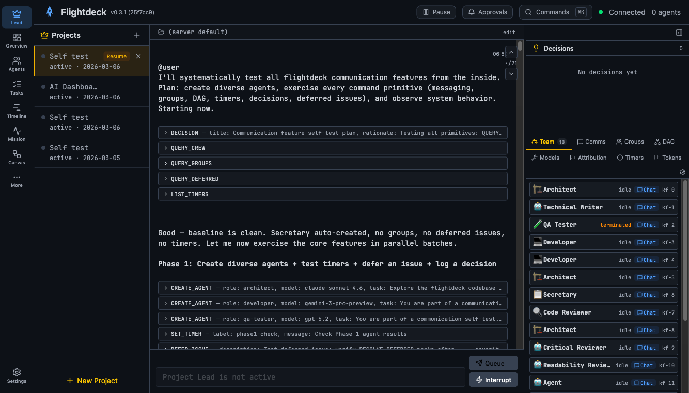
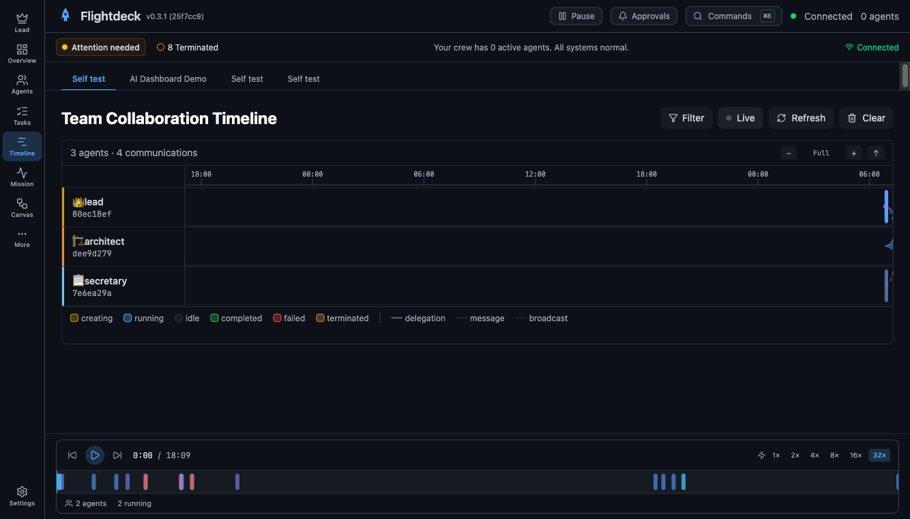

# Flightdeck — Multi-Agent Orchestration Platform

[](https://www.npmjs.com/package/@flightdeck-ai/flightdeck)
[](LICENSE)
[](https://nodejs.org)
[](https://www.typescriptlang.org/)
[](https://github.com/justinchuby/flightdeck/pulls)

**One command. A whole engineering crew.**

Flightdeck is the orchestration layer for AI coding agents. It coordinates crews of agents working in parallel on your codebase, each with a specialized role, its own context window, and structured communication channels.

```bash
npm install -g @flightdeck-ai/flightdeck
flightdeck
```

Give it a task, and a **Project Lead** agent breaks it down into a dependency graph, assembles the right specialists (developers, architects, reviewers, and more), and coordinates their parallel execution while you stay in the loop through a real-time web dashboard. Works with **GitHub Copilot**, **Claude Code**, **Gemini CLI**, **Codex**, **Cursor**, **OpenCode**, **Kimi**, and **Qwen Code** — mix and match providers in the same crew.

<!-- TODO: Replace with a demo GIF or link to a short video showing project creation → agents working → decision approval -->

### Why Flightdeck?

| | Single AI Agent | Flightdeck Crew |
|---|---|---|
| **Execution** | Sequential — one thing at a time | Parallel — 5+ agents work simultaneously |
| **Context** | One shared context window | Each agent has its own context |
| **Quality** | No built-in review | Reviewer catches issues while developer codes |
| **Knowledge** | Lost between sessions | Persistent knowledge base carries forward |
| **Providers** | Locked to one | Mix 8 providers in the same crew |
| **Oversight** | Manual intervention or full trust | Trust Dial: supervised → balanced → autonomous |

### Screenshots

<p align="center">
  
  <br /><em>Lead Dashboard — your home screen for tracking projects, agents, and progress</em>
</p>

<p align="center">
  
  <br /><em>Timeline — zoom, scroll, and replay agent activity with session scrubber</em>
</p>

<details>
<summary><strong>More screenshots</strong></summary>

| Command Palette | Canvas View |
|:-:|:-:|
|  |  |

| Mission Control | Analytics |
|:-:|:-:|
|  |  |

| Timeline | Overview |
|:-:|:-:|
|  |  |

| Batch Approval | New Project |
|:-:|:-:|
|  |  |

</details>

## Quick Start

### Prerequisites

- **Node.js 20+** — [Download](https://nodejs.org)
- **At least one AI coding CLI** — [GitHub Copilot](https://docs.github.com/en/copilot), [Claude Code](https://docs.anthropic.com/en/docs/agents-and-tools/claude-code/overview), [Gemini CLI](https://github.com/google-gemini/gemini-cli), [Codex](https://github.com/openai/codex), [Cursor](https://www.cursor.com/), [OpenCode](https://github.com/opencode-ai/opencode), [Kimi](https://github.com/MoonshotAI/kimi-cli), or [Qwen Code](https://github.com/QwenLM/qwen-code)

### Install & Run

```bash
npm install -g @flightdeck-ai/flightdeck
flightdeck
```

The dashboard opens at `http://localhost:3001`. That's it.

### What Happens Next

1. **Create a project** — Click **Create Project**, describe what you want built, and point it at your repo
2. **Watch the lead plan** — The Project Lead agent analyzes your task, breaks it into a task DAG, and assembles a crew
3. **Agents get to work** — Developers, reviewers, architects spin up in parallel — each in their own CLI session with your configured provider
4. **Stay in the loop** — Message any agent directly, approve decisions, and watch progress in real time

> **Example:** *"Refactor the auth module to use JWT tokens, add tests, and update the docs"* → The lead creates a developer (implementation), a code reviewer (quality), and a tech writer (docs), sets up dependencies so the reviewer waits for the developer, and coordinates the whole flow.

> **First time?** Flightdeck defaults to GitHub Copilot. Change the provider in Settings or in [`flightdeck.config.yaml`](flightdeck.config.example.yaml).

**CLI options:** `--port=4000` · `--host=0.0.0.0` · `--no-browser` · `-v` / `--version` · `-h` / `--help`

<details>
<summary><strong>Local development setup</strong></summary>

```bash
npm install
npm run build
npm start
```

For development with hot reload:

```bash
npm run dev
```

- **Server**: `http://localhost:3001`
- **Web UI**: `http://localhost:5173` (dev) or `http://localhost:3001` (production)

</details>

## Key Features

### 🎯 Multi-Agent Crew Orchestration
- **Project Lead** — Breaks down tasks, assembles a crew, creates a task DAG, delegates work, and synthesizes results
- **14 Specialized Roles** — Developer, Architect, Code Reviewer, Critical Reviewer, Readability Reviewer, Tech Writer, QA Tester, and more (see [Agent Roles](#agent-roles))
- **Task DAG** — Declarative task scheduling with dependencies; agents work in parallel when possible, sequentially when required
- **Human-in-the-Loop** — Message any agent directly; queue, reorder, or remove messages before delivery
- **8 AI Providers** — GitHub Copilot, Claude Code, Gemini CLI, Codex, Cursor, OpenCode, Kimi, Qwen Code — mix and match in the same crew

### 🔒 Coordination & Safety
- **File Locking** — Pessimistic locks with TTL and glob support prevent concurrent edits
- **Scoped Commits** — `git add` only on files the agent has locked. Prevents `git add -A` from leaking other agents' work
- **Trust Dial** — 3-level oversight (Supervised / Balanced / Autonomous) controls how much approval you give. Per-project overrides supported
- **Governance Pipeline** — Every agent command flows through ordered hooks: security → permission → validation → rate-limit → policy → approval
- **Security** — Prompt injection sanitization (4-layer), secret redaction, CORS lockdown, rate limiting, path traversal validation

### 📊 Real-Time Dashboard
- **Lead Dashboard** — Chat with the Project Lead, approve decisions, and monitor crew status — all in one screen
- **Timeline** — Swim-lane visualization with zoom, scroll, keyboard navigation, and session replay scrubber
- **Task Views** — DAG graph, Kanban board, and Gantt chart — three ways to visualize your task pipeline
- **Token Economics** — Per-agent and per-task token usage from provider data
- **AttentionBar** — Persistent status bar with escalation states (green/yellow/red) — know at a glance if anything needs you

### 💬 Structured Communication
- **Direct Messaging** — Agents send structured messages to each other by ID
- **Group Chat** — Create groups by member ID or role; auto-created when 3+ agents work on the same feature
- **Broadcasts** — Send a message to every active agent at once
- **Telegram Integration** — Receive notifications via Telegram bot with batched delivery and challenge-response auth

### 🧠 Persistent Knowledge
- **Knowledge Pipeline** — Automatic knowledge injection on agent spawn, extraction on agent exit
- **4-Category Knowledge Base** — Core (project rules), Procedural (patterns), Semantic (facts), Episodic (session context)
- **Skills System** — `.github/skills/` files are hot-reloaded into agent prompts
- **CollectiveMemory** — Cross-session knowledge that compounds over time
- **Session Resume** — Resume from a previous session with full context recovery

<details>
<summary><strong>More features</strong></summary>

### 📈 Visualization & Monitoring
- **Home Dashboard** — At-a-glance view of active projects, decisions needing approval, action-required items, and progress milestones
- **Kanban Board** — Interactive task board with drag-and-drop, context menus, scope switcher, filters, and pagination
- **Overview Dashboard** — Milestone timeline, progress indicators, and decision feed with unified project tabs
- **Analytics** — Token usage trends, cost breakdowns, session comparison, and auto-generated insights
- **Catch-Up Banner** — "While you were away" summary of tasks completed, decisions pending, and failures
- **Historical Data** — All pages load from REST API when no live agents are present — no empty states for existing projects

### 🧭 Navigation
- **Command Palette** — Cmd/Ctrl+K to navigate anywhere instantly
- **Breadcrumbs** — Contextual navigation trail
- **Keyboard Shortcuts** — Alt+1–5 for tabs, Shift+A for approval queue
- **Tab Persistence** — Active tab saved per project; restored on return

### ✅ Decision & Progress Tracking
- **Decision Log** — Track architectural decisions with accept/reject actions and reason comments
- **Approval Queue** — Review pending decisions with auto-deny timer that pauses while you're reviewing
- **Global Search** — Search across messages, tasks, decisions, and activity

### 💾 Recovery & Data Management
- **Persistent Projects** — Projects survive across sessions; chat history and state auto-load on startup
- **Context Re-injection** — Automatic crew context recovery after context window compaction
- **Data Retention** — Storage stats and cleanup by age (7d/30d/90d/all) in Settings
- **System Pause/Resume** — Halt all agents mid-flight; resume when ready

</details>

## Architecture

Flightdeck uses a **three-tier architecture** with clear separation of concerns:

```
┌──────────────────────────────────────────────────────────────────┐
│                      Web Client (Vite/React)                     │
│  Dashboard · Project Views · Session Management · Real-time UI   │
│  React 19 · TailwindCSS 4 · Zustand · WebSocket client          │
└───────────────────────┬──────────────────────────────────────────┘
                        │ REST API + WebSocket (/ws)
┌───────────────────────▼──────────────────────────────────────────┐
│                  Orchestration Server (Express 5)                 │
│  Session mgmt · Project mgmt · GovernancePipeline · Task DAG     │
│  Knowledge · Decisions · File locks · Chat groups · Integrations │
│  SQLite/Drizzle · Zod validation · Pino logging                  │
└───────────────────────┬──────────────────────────────────────────┘
                        │ stdio + PID file (detached child process)
┌───────────────────────▼──────────────────────────────────────────┐
│                    Agent Server (Daemon)                          │
│  Spawns & manages CLI agent processes via ACP protocol           │
│  Copilot · Claude · Gemini · Codex · Cursor · OpenCode · Kimi · Qwen  │
│  Per-agent lifecycle · Auto-restart · Heartbeat monitoring        │
└──────────────────────────────────────────────────────────────────┘
```

### How the tiers interact

1. **Client ↔ Orchestration Server** — The React frontend communicates with the Express server via REST endpoints (28 route modules covering agents, projects, sessions, tasks, decisions, knowledge, etc.) and a persistent WebSocket connection on `/ws` for real-time updates. WebSocket events are batched and throttled (agent text flushed every 100ms).

2. **Orchestration Server ↔ Agent Server** — The orchestration server forks the agent server as a detached child process, communicating via stdio and monitoring health with heartbeat pings. The agent server manages individual CLI agent processes (Copilot, Claude, Gemini, Codex, Cursor, OpenCode, Kimi, Qwen Code) through the ACP (Agent Client Protocol) — each agent runs as a separate subprocess with its own context window and role.

3. **Command flow** — Agents emit structured commands (wrapped in doubled Unicode brackets) in their output stream. The `CommandDispatcher` parses these and routes them to 9 domain-specific command modules (`AgentCommands`, `TaskCommands`, `CommCommands`, etc.). The `GovernancePipeline` intercepts commands through ordered hooks: security → permission → validation → rate-limit → policy → approval, with post-hooks for audit and metrics.

### Monorepo structure

| Package | Description |
|---------|-------------|
| `packages/shared` | TypeScript types, Zod schemas, protocol definitions (shared between server and client) |
| `packages/server` | Express 5 orchestration server, agent management, SQLite/Drizzle ORM, knowledge pipeline |
| `packages/web` | React 19 + Vite frontend, Tailwind CSS 4, Zustand state management |
| `packages/docs` | Documentation website |

### Key server components

| Component | Responsibility |
|-----------|---------------|
| **AgentManager** | Spawns agents, routes messages, manages delegations. Cascade termination with visited-set guard. |
| **CommandDispatcher** | Parses doubled Unicode-bracket commands (U+27E6/U+27E7) from agent output, routes to 9 command modules. |
| **GovernancePipeline** | Single interception point for all commands — pre-hooks (security, permission, validation, rate-limit, policy, approval) and post-hooks (audit, metrics). |
| **TaskDAG + EagerScheduler** | Directed acyclic graph for task scheduling with dependency resolution, parallel analysis, and eager pre-assignment of ready tasks. |
| **ProjectRegistry** | Persistent project management — CRUD, session tracking, briefing generation. |
| **SessionResumeManager** | Restores agent state after server restart with full context recovery. |
| **KnowledgeInjector** | Injects session knowledge, skills, and collective memory into agent context on spawn. |
| **FileLockRegistry** | Pessimistic file locking with TTL, glob support, expiry notifications. SQLite-backed. |
| **MessageBus + ChatGroupRegistry** | Inter-agent messaging, group chat lifecycle, role-based auto-membership. |
| **DecisionLog** | Decision tracking with accept/reject/reason workflow and approval queue. |
| **ActivityLedger** | Event-sourced activity logging (batched flushes every 250ms or 64 entries). |
| **AlertEngine** | Proactive detection: stuck agents, context pressure, duplicate edits, stale decisions. |
| **IntegrationRouter** | External platform routing — Telegram bot with batched notifications. |
| **AdapterFactory** | Selects agent backend (Copilot CLI, Claude SDK, Gemini, Codex, Cursor, OpenCode) based on configuration. |

> See the [Architecture Decisions](packages/docs/reference/architecture-decisions.md) page for the rationale behind key design choices.

### Configuration

Flightdeck uses layered configuration: **hardcoded defaults ← YAML config ← environment variables ← runtime API**.

**Config file** (`flightdeck.config.yaml`):

```yaml
server:
  maxConcurrentAgents: 50        # 1–1000

heartbeat:
  idleThresholdMs: 60000         # Idle agent detection threshold
  crewUpdateIntervalMs: 180000   # Crew status push interval

models:
  defaults:                      # Default model per role
    lead: [claude-opus-4.6]
    developer: [claude-opus-4.6]
    architect: [claude-opus-4.6]
    code-reviewer: [gemini-3-pro-preview]
    # ... (14 roles total)

provider:
  id: copilot                    # Active provider: copilot | claude | gemini | codex | cursor | opencode | kimi | qwen-code

budget:
  limit: null                    # null = unlimited; set a dollar amount to cap spend
  thresholds:
    warning: 0.7
    critical: 0.9
    pause: 1.0
```

See [`flightdeck.config.example.yaml`](flightdeck.config.example.yaml) for the full reference.

**Key environment variables:**

| Variable | Default | Purpose |
|----------|---------|---------|
| `PORT` | `3001` | Server port |
| `HOST` | `127.0.0.1` | Bind address |
| `DB_PATH` | `./flightdeck.db` | SQLite database location |
| `CLI_PROVIDER` | `copilot` | Agent provider (`copilot`, `claude`, `gemini`, `codex`, `cursor`, `opencode`, `kimi`, `qwen-code`) |
| `ANTHROPIC_API_KEY` | — | Required for Claude provider |
| `GEMINI_API_KEY` | — | Required for Gemini provider |
| `OPENAI_API_KEY` | — | Required for Codex provider |
| `TELEGRAM_BOT_TOKEN` | — | Telegram integration (optional) |
| `AUTH` | enabled | Set to `none` to disable authentication |
| `SERVER_SECRET` | auto-generated | Fixed auth token (optional) |
| `MAX_AGENTS` | `50` | Max concurrent agents (1–1000) |
| `FLIGHTDECK_CONFIG` | — | Path to YAML config file |

## Agent Roles

Each agent is assigned a role with a specialized system prompt. The lead creates agents and assigns them tasks.

| Role | Icon | Focus | Default Model |
|------|------|-------|---------------|
| **Project Lead** | 👑 | Orchestration, delegation, crew coordination | Claude Opus 4.6 |
| **Developer** | 💻 | Code implementation, tests, bug fixes | Claude Opus 4.6 |
| **Architect** | 🏗️ | System design, technical debt, architecture decisions. Can delegate tasks. | Claude Opus 4.6 |
| **Code Reviewer** | 📖 | Readability, maintainability, code patterns | Gemini 3 Pro |
| **Critical Reviewer** | 🛡️ | Secure-by-design review, performance, edge cases | Gemini 3 Pro |
| **Readability Reviewer** | 👓 | Naming, code organization, documentation, simplicity, consistency | Gemini 3 Pro |
| **Product Manager** | 🎯 | User needs, product quality, UX review | GPT-5.3 Codex |
| **Technical Writer** | 📝 | Documentation, API design review, developer experience | GPT-5.2 |
| **Designer** | 🎨 | UI/UX, interaction design, accessibility | Claude Opus 4.6 |
| **Generalist** | 🔧 | Cross-disciplinary problem solving | Claude Opus 4.6 |
| **Radical Thinker** | 🚀 | Challenge assumptions, propose bold alternatives | Gemini 3 Pro |
| **Secretary** | 📋 | Plan tracking, status reports, session summaries | GPT-4.1 |
| **QA Tester** | 🧪 | Test strategy, quality assurance, coverage analysis | Claude Sonnet 4.6 |
| **Agent** | ⚙️ | Neutral general-purpose agent, no role-specific instructions | CLI default |

Custom roles can be created via the Settings UI with your own system prompts, colors, and icons.

> **AI-Aware Estimation:** Traditional human timelines don't apply. A crew of AI agents can compress weeks of work into hours. Plan in sessions (30 min – 2 hours), not sprints. See the [agent-collaboration-patterns](.github/skills/agent-collaboration-patterns/SKILL.md) skill for calibration data.

## ACP Command Reference

Agents communicate via structured commands wrapped in doubled Unicode brackets (` COMMAND {...} `, U+27E6/U+27E7) detected in their output stream. Commands are parsed by the `CommandDispatcher` and routed to the appropriate subsystem.

### Crew Management (Lead + Architect)

| Command | Description |
|---------|-------------|
| `CREATE_AGENT {"role": "developer", "task": "..."}` | Spawn a new agent with a specific role. Optionally assign a task and model. |
| `DELEGATE {"to": "agent-id", "task": "...", "context": "..."}` | Assign a task to an existing agent. Leads and architects can delegate. |
| `TERMINATE_AGENT {"agentId": "agent-id", "reason": "..."}` | Terminate an agent and free its slot. Logs session ID for potential resume. |
| `INTERRUPT {"to": "agent-id", "content": "..."}` | Send a priority interrupt to a child agent, immediately stopping their current work. *(Parent agents only)* |

### Communication (All agents)

| Command | Description |
|---------|-------------|
| `AGENT_MESSAGE {"to": "agent-id", "content": "..."}` | Send a direct message to another agent by ID. |
| `DIRECT_MESSAGE {"to": "agent-id-prefix", "content": "..."}` | Queue a message to another agent without interrupting their current work. Matches by ID prefix. |
| `BROADCAST {"content": "..."}` | Send a message to all active agents. |
| `CREATE_GROUP {"name": "...", "members": ["a1b2c3d4"], "roles": ["developer"]}` | Create a named chat group. Specify members by short ID, role, or both. Lead is auto-included. |
| `GROUP_MESSAGE {"group": "...", "content": "..."}` | Send a message to all members of a group. Sender must be a member. |
| `ADD_TO_GROUP {"group": "...", "members": ["e5f6a7b8"]}` | Add agents to an existing group. New members receive recent message history. |
| `REMOVE_FROM_GROUP {"group": "...", "members": ["e5f6a7b8"]}` | Remove agents from a group. The lead cannot be removed. |
| `QUERY_GROUPS` | List all groups the agent belongs to, with member counts and last message preview. |
| `QUERY_PEERS` | Discover other active agents for direct messaging. |
| `REACT {"group": "...", "emoji": "👍"}` | Add an emoji reaction to the latest (or specified) message in a group. |

### Task & Progress (Lead-only unless noted)

| Command | Description |
|---------|-------------|
| `DECLARE_TASKS {"tasks": [...]}` | Declare a task DAG with dependencies. Tasks have `taskId`, `role`, `dependsOn`, and optional `description`. |
| `PROGRESS {"summary": "..."}` | Report progress. Auto-reads DAG state when a DAG exists — no need to query separately. |
| `COMPLETE_TASK {"taskId": "task-id", "summary": "...", "output": "..."}` | Mark a DAG task as done. Non-lead agents relay to parent's DAG with auth validation. Supports `taskId`, `summary`, `status`, `output` fields. *(Any agent)* |
| `TASK_STATUS` | Query current task DAG status. |
| `PAUSE_TASK {"taskId": "..."}` | Pause a pending/ready task in the DAG. *(Lead-only)* |
| `RETRY_TASK {"taskId": "..."}` | Retry a failed task. *(Lead-only)* |
| `SKIP_TASK {"taskId": "..."}` | Skip a task and unblock dependents. *(Lead-only)* |
| `ADD_TASK {"taskId": "...", "role": "...", "description": "...", "dependsOn": [...]}` | Add a new task to an existing DAG. *(Lead-only)* |
| `CANCEL_TASK {"taskId": "..."}` | Cancel a task. *(Lead-only)* |
| `RESET_DAG` | Reset the entire DAG (clear all tasks). *(Lead-only)* |
| `DECISION {"title": "...", "rationale": "..."}` | Log a decision. Users can accept/reject with a reason comment from the dashboard. |
| `QUERY_TASKS` | Query current task DAG status (alias for TASK_STATUS). |
| `CANCEL_DELEGATION {"delegationId": "...", "reason": "..."}` | Cancel an active delegation. |
| `ASSIGN_TASK {"taskId": "...", "agentId": "..."}` | Assign a ready DAG task to an agent and move it to running state. *(Lead-only)* |
| `REASSIGN_TASK {"taskId": "...", "agentId": "..."}` | Reassign a running task from one agent to another. *(Lead-only)* |
| `ADD_DEPENDENCY {"taskId": "...", "dependsOn": ["dep-id"]}` | Add dependency edges to tasks in the DAG. Prevents circular dependencies. |
| `FORCE_READY {"taskId": "task-id"}` | Force a pending/blocked task to ready state, overriding dependency checks. *(Lead-only)* |

### Coordination (All agents)

| Command | Description |
|---------|-------------|
| `LOCK_FILE {"filePath": "...", "reason": "..."}` | Acquire a file lock. Prevents other agents from editing the same file. |
| `UNLOCK_FILE {"filePath": "..."}` | Release a file lock. |
| `COMMIT {"message": "..."}` | Scoped git commit — executes `git add` only on locked files, commits, then verifies files landed via `git diff --name-only HEAD~1`. Warns if expected files are missing. |
| `QUERY_CREW` | Get the current roster of agents with IDs, roles, models, and status. |
| `ACTIVITY {"action": "...", "summary": "..."}` | Log a structured activity entry to the activity ledger for auditing and tracking. |
| `HALT_HEARTBEAT` | Pause automatic heartbeat nudges from the system. *(Lead-only)* |
| `REQUEST_LIMIT_CHANGE {"limit": 10, "reason": "..."}` | Request to increase max concurrent agents. Requires user approval. *(Lead-only)* |

### Capabilities & Timers (All agents)

| Command | Description |
|---------|-------------|
| `ACQUIRE_CAPABILITY {"capability": "code-review", "reason": "..."}` | Temporarily gain capabilities beyond the agent's role (code-review, architecture, delegation, testing, devops). |
| `RELEASE_CAPABILITY {"capability": "code-review"}` | Release a previously acquired capability. |
| `LIST_CAPABILITIES` | List currently held capabilities. |
| `SET_TIMER {"label": "name", "delay": 300, "message": "...", "repeat": false}` | Set a reminder that fires after a delay (in seconds). Optionally repeats. |
| `CANCEL_TIMER {"label": "name"}` | Cancel an active timer. |
| `LIST_TIMERS` | List all active timers. |

### Templates (Lead + All agents)

| Command | Description |
|---------|-------------|
| `LIST_TEMPLATES` | List all available workflow task templates with IDs, descriptions, and task sequences. |
| `APPLY_TEMPLATE {"template": "template-id"}` | Instantiate a workflow template, creating tasks in the DAG. Supports `overrides` for customization. *(Lead-only)* |
| `DECOMPOSE_TASK {"task": "..."}` | Break a task description into suggested sub-tasks with roles and dependencies. |

### UI Views

| View | Description |
|------|-------------|
| **Lead Dashboard** | Chat with the lead, decisions panel (accept/reject with reasons), crew/comms/groups/DAG/tokens tabs, three-tier message hierarchy, catch-up banner |
| **Mission Control** | Single-screen project overview: health summary, agent fleet, token economics, proactive alerts, activity feed, DAG minimap, comm heatmap, performance scorecards. Drag-and-drop panel reorder. |
| **Agents** | Unified list with hierarchy, model selector, plan progress, agent controls, project grouping |
| **Tasks** | Per-project task tabs with DAG status, progress badges, project grouping, duplicate detection |
| **Timeline** | Swim-lane visualization — filter by role/comm-type/status, brush time selector, keyboard navigation (←→ pan, +/- zoom), live auto-scroll mode, idle hatch patterns, hover tooltips |
| **Group Chat** | Tabbed group chat with human participation, project-level tab grouping, real-time messaging |
| **Overview** | Progress tracking, decision timeline grouped by project, global search |
| **Settings** | Concurrency limits, model defaults, theme (Light/Dark/System), custom role editor, draggable dashboard panel layout |

## Tech Stack

- **Frontend**: React 19, Vite, TypeScript, Tailwind CSS 4, Zustand, ReactFlow, visx (timeline), Lucide
- **Backend**: Node.js, Express 5, ws (WebSocket)
- **Database**: SQLite (WAL mode, Drizzle ORM) with tuned pragmas (`busy_timeout`, `foreign_keys`, `synchronous=NORMAL`)
- **Security**: Auto-generated auth tokens, CORS lockdown, rate limiting, path traversal validation
- **Validation**: Zod schemas on all API routes
- **Agent Protocol**: ACP (Agent Communication Protocol) with streaming command detection
- **Events**: Typed event bus (TypedEmitter) with strongly-typed events
- **Testing**: Vitest with v8 coverage, Codecov integration
- **CI**: GitHub Actions on `main` and `team-work-*` branches — typecheck, unit tests, coverage upload

## Documentation

Flightdeck has extensive documentation across guides, references, and design documents:

| Document | Description |
|----------|-------------|
| **Getting Started** | |
| [Quick Start](packages/docs/guide/quickstart.md) | Install and run your first session |
| [Provider Setup](packages/docs/guide/providers.md) | Configure Copilot, Claude, Gemini, Codex, Cursor, or OpenCode |
| [Configuration](packages/docs/reference/configuration.md) | Full configuration reference |
| **Guides** | |
| [Agent Communication](packages/docs/guide/agent-communication.md) | How agents communicate via ACP |
| [Coordination](packages/docs/guide/coordination.md) | File locking, delegation, and coordination primitives |
| [Oversight & Trust Dial](packages/docs/guide/oversight.md) | How the 3-level oversight system works |
| [Session Management](packages/docs/guide/session-management.md) | Resume, replay, and manage sessions |
| [Chat Groups](packages/docs/guide/chat-groups.md) | Multi-agent group communication |
| [Timeline](packages/docs/guide/timeline.md) | Swim-lane visualization and session replay |
| **Reference** | |
| [REST API](packages/docs/reference/api.md) | Full REST API reference |
| [Database Schema](packages/docs/reference/database.md) | SQLite schema and Drizzle ORM |
| [Architecture Decisions](packages/docs/reference/architecture-decisions.md) | Key ADRs |
| [WebSocket Events](packages/docs/reference/websocket.md) | Real-time event reference |

## Screenshots


## Built by AI

Flightdeck is purely AI-created with human supervision. Every line of code, test, and documentation was written by AI agents coordinated through Flightdeck itself — a real-world demonstration of multi-agent software development.

## Contributing

We welcome contributions! Flightdeck is MIT licensed and built in the open.

- **Bug reports** — [Open an issue](https://github.com/justinchuby/flightdeck/issues)
- **Feature requests** — [Open a discussion](https://github.com/justinchuby/flightdeck/issues)
- **Pull requests** — Fork, branch, and submit a PR. Each feature gets its own branch.

```bash
# Local development
npm install
npm run dev    # Starts server + web with hot reload
```

## Acknowledgments

Flightdeck is built on many excellent open-source projects. See [docs/CREDITS.md](docs/CREDITS.md) for full attribution, including the research projects, agent SDKs, core libraries, and design references that made this possible.

## License

[MIT](LICENSE) — Copyright (c) 2026 Justin Chuby
