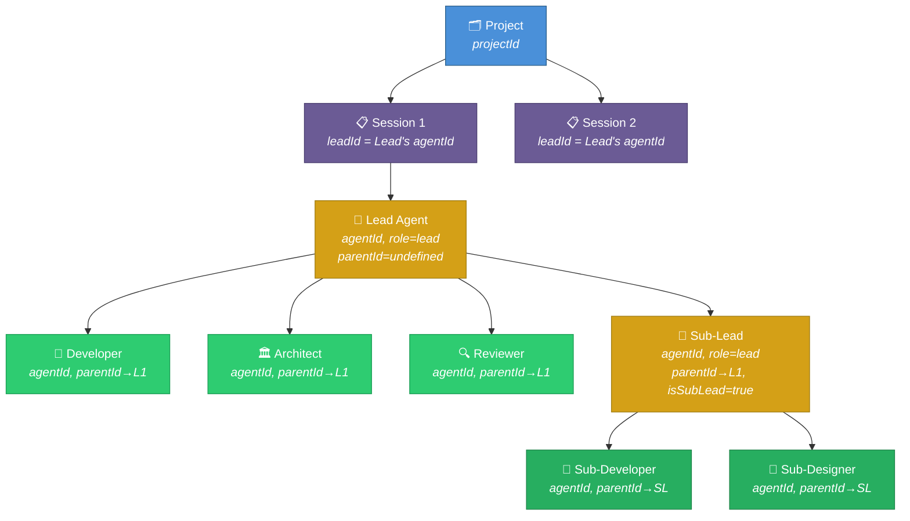
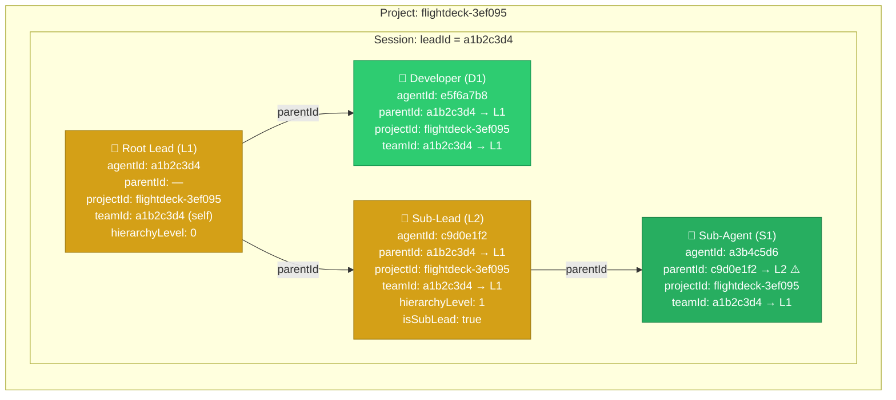
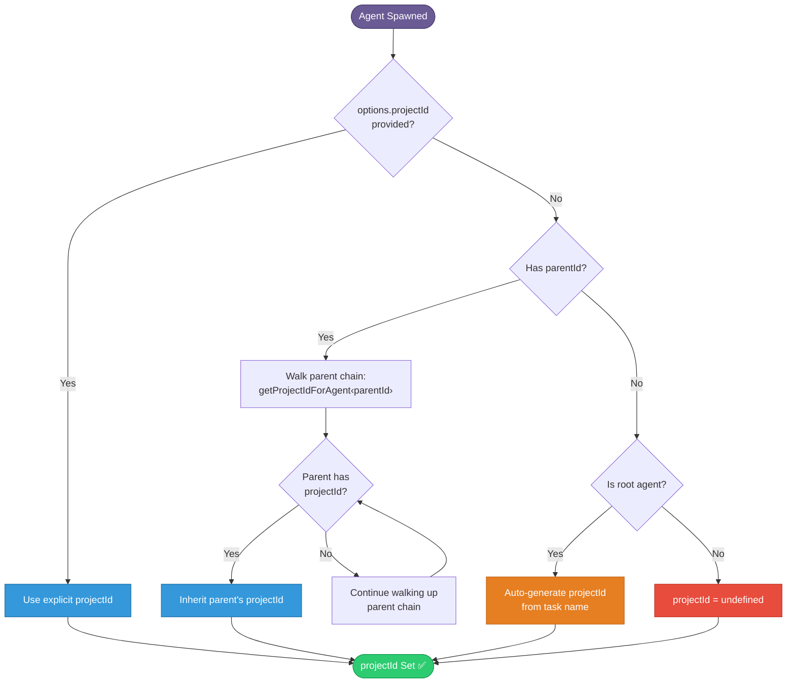
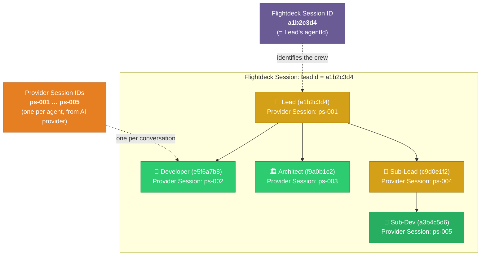

# Agent Hierarchy Architecture

> **How projects, sessions, leads, and agents relate to each other in Flightdeck.**

## Overview

Flightdeck organizes work into a four-level hierarchy:



Each level has a unique identifier and specific relationships to the levels above and below it.

## Concepts

### Project

A **project** represents a long-lived workspace (e.g., a GitHub repo, a product). Projects persist across sessions.

- **ID:** `projectId` — a slugified identifier derived from the project name (e.g., `flightdeck-3ef095`)
- **Storage:** `projects` table in SQLite, managed by `ProjectRegistry`
- **Relationship:** One project → many sessions

### Session

A **session** is a single run of an agent crew within a project. Each session has a lead agent that orchestrates the work.

- **ID:** The lead agent's `agentId` serves as the session identifier (called `leadId` throughout the codebase)
- **Important distinction:** This is the *Flightdeck session ID*, which is the lead agent's UUID. It is NOT the same as the *provider session ID* (the ID assigned by the AI provider like Claude or GPT)
- **Storage:** `project_sessions` table, keyed by `(projectId, leadId)`
- **Relationship:** One session → one lead + many agents

### Lead Agent

The **lead** is the root agent of a session. It orchestrates the crew, makes decisions, delegates tasks, and manages the session lifecycle.

- **Properties:** `role.id === 'lead'`, `parentId === undefined`, `hierarchyLevel === 0`
- **Capabilities:** Can create agents (via `CREATE_AGENT`), delegate tasks, manage the DAG
- **Session binding:** The lead's `agentId` IS the session ID

### Agent

An **agent** is a worker within a session, created by the lead. Agents have specific roles (developer, architect, reviewer, etc.) and execute delegated tasks.

- **Properties:** `parentId === leadId`, `projectId` inherited from lead
- **Capabilities:** Determined by role. Only leads can create agents by default (other roles can acquire the capability via `ACQUIRE_CAPABILITY`)

### Sub-Lead

A **sub-lead** is a lead agent created by another lead. It manages its own sub-crew for a delegated sub-project.

- **Properties:** `role.id === 'lead'`, `parentId === parentLeadId`, `hierarchyLevel === parentLevel + 1`
- **Detection:** `isSubLead = (role === 'lead') && (parentId !== undefined)`
- **Budget:** Shares the global concurrency budget with the root lead (not a separate budget)

### Sub-Agent

A **sub-agent** is an agent created by a sub-lead. Its `parentId` points to the sub-lead, NOT the root lead.

- **Properties:** `parentId === subLeadId`, `projectId` inherited from sub-lead (which inherited from root lead)
- **Team assignment:** `teamId` is set to the root lead's ID (via `getRootLeadId()` recursive walk)

## ID Relationships



> ⚠️ Note that S1's `parentId` points to L2 (the sub-lead), **not** L1 (the root lead). This is the source of the shallow filtering bug — code checking `parentId === L1` will miss S1.

## How IDs Propagate

### projectId

Resolved at spawn time via a three-stage fallback:

1. **Explicit:** If `options.projectId` is provided, use it
2. **Inherited:** Walk the parent chain via `getProjectIdForAgent(parentId)` — recursive, no depth limit
3. **Generated:** Root agents with no projectId auto-generate one from the task name



**Implementation:** `AgentManager.spawn()` at `packages/server/src/agents/AgentManager.ts:390-492`

### teamId (Crew Roster)

The `teamId` determines which crew an agent belongs to in the roster database. It is always the **root lead's ID**, resolved by walking the parent chain to the top.

**Implementation:** `AgentManager.getRootLeadId()` at `packages/server/src/agents/AgentManager.ts:1006-1011`

```typescript
private getRootLeadId(agentId: string, visited = new Set<string>()): string {
  if (visited.has(agentId)) return agentId; // cycle guard
  visited.add(agentId);
  const agent = this.agents.get(agentId);
  if (!agent || !agent.parentId) return agentId;
  return this.getRootLeadId(agent.parentId, visited);
}
```

### parentId

Set once at spawn time to the creating agent's ID. Never changes.

- Lead creates Developer → `developer.parentId = lead.id`
- Lead creates Sub-Lead → `subLead.parentId = lead.id`
- Sub-Lead creates Sub-Agent → `subAgent.parentId = subLead.id` (NOT lead.id)

## Provider Session ID vs Flightdeck Session ID

These are two different concepts:

| Concept | What It Is | Where It Lives |
|---------|-----------|---------------|
| **Flightdeck Session ID** | The root lead agent's UUID (`leadId`) | `project_sessions.lead_id`, URL params |
| **Provider Session ID** | The AI provider's conversation ID (e.g., Claude session) | `agent.sessionId`, set when adapter starts |



- The root lead's provider session ID may be reused as the Flightdeck session ID in some contexts
- Each agent has its own provider session ID, independent of other agents
- Sub-leads get their own provider session ID, independent of the root lead

## Key Implementation Files

| File | Role |
|------|------|
| `packages/server/src/agents/Agent.ts` | Agent class with parentId, projectId, hierarchyLevel |
| `packages/server/src/agents/AgentManager.ts` | spawn(), getProjectIdForAgent(), getRootLeadId() |
| `packages/server/src/agents/commands/AgentLifecycle.ts` | CREATE_AGENT command, sub-lead spawning |
| `packages/server/src/db/AgentRosterRepository.ts` | Crew roster persistence with teamId |
| `packages/server/src/routes/crew.ts` | Crew roster API endpoints |
| `packages/server/src/routes/lead.ts` | Lead/session API endpoints |
| `packages/shared/src/domain/agent.ts` | Shared AgentStatus, AgentPhase types |
| `packages/web/src/components/CrewRoster/` | Crew roster UI |
| `packages/web/src/components/OrgChart/` | Visual hierarchy display |

## Known Issue: Shallow parentId Filtering

> ⚠️ **Bug:** Many code paths filter agents using `parentId === leadId` (direct children only), which misses sub-agents under sub-leads. See [hierarchy-audit-findings.md](./hierarchy-audit-findings.md) for the full list of affected locations.

The crew roster API (`/crews/:crewId/agents`) correctly uses `teamId` to include ALL descendants. But most other code paths — including the LeadDashboard, WebSocket handlers, coordination views, and comms routing — only check one level deep.
