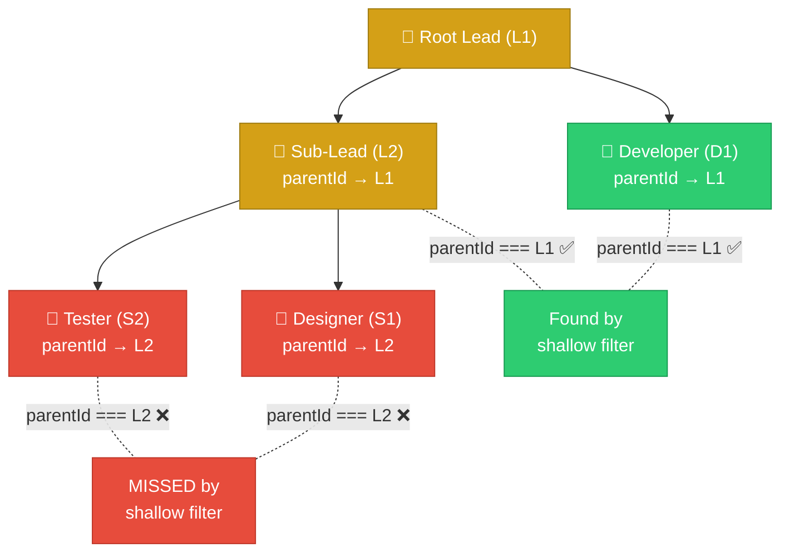

# Hierarchy Audit: Shallow parentId Filtering Bug

> **Finding:** 14 code locations filter crew membership using `parentId === leadId`, which only finds direct children of the lead. Sub-agents created by sub-leads have `parentId === subLeadId`, so they are invisible in these views.

## The Problem

When a sub-lead creates agents, those agents have `parentId` pointing to the sub-lead, not the root lead:



The crew roster API (`/crews/:crewId/agents`) handles this correctly because it queries by `teamId` (the root lead's ID, resolved by walking the full parent chain). But most other code paths use the shallow `parentId === leadId` check.

## Affected Locations

### Server-Side (5 locations)

| # | File | Line | Code | Impact |
|---|------|------|------|--------|
| 1 | `routes/lead.ts` | 419 | `.filter((a) => a.parentId === leadId)` | `GET /lead/:id/progress` — sub-agents missing from progress view |
| 2 | `routes/lead.ts` | 438 | `meta.parentId === leadId` | Roster fallback — sub-agents missing from historical view |
| 3 | `routes/services.ts` | 380 | `a.parentId === lead.id` | Session export — sub-agents excluded from exported data |
| 4 | `routes/coordination.ts` | 132 | `agent.parentId === leadId` | Coordination scope — sub-agents excluded from coordination view |
| 5 | `routes/comms.ts` | 52 | `agent.parentId === leadId` | `getCrewIds()` — sub-agent comms not routed/visible |
| 6 | `routes/projects.ts` | 153 | `meta.parentId === session.leadId` | Session detail — sub-agents excluded from session agent list |

### Frontend (8 locations)

| # | File | Line | Code | Impact |
|---|------|------|------|--------|
| 7 | `LeadDashboard.tsx` | 217 | `a.parentId === selectedLeadId` | Dashboard team list — sub-agents not shown |
| 8 | `useLeadWebSocket.ts` | 149 | `a.parentId === leadId` | Tool call handler — sub-agent tool calls dropped |
| 9 | `useLeadWebSocket.ts` | 253 | `fromAgent?.parentId === leadId` | Message handler — sub-agent messages dropped |
| 10 | `FleetOverview.tsx` | 60 | `a.parentId === effectiveLeadId` | Fleet overview — sub-agents not shown |
| 11 | `useCatchUpSummary.ts` | 43 | `a.parentId === selectedLeadId` | Catch-up summary — sub-agent completions missed |
| 12 | `GroupChat.tsx` | 470 | `a.parentId === newGroupLeadId` | Group creation — sub-agents not available to add |
| 13 | `AlertsPanel.tsx` | 122 | `a.parentId === leadId` | Alert scope — sub-agent alerts not shown |
| 14 | `CommFlowGraph.tsx` | 199 | `a.parentId === leadId` | Comm flow — sub-agent communications invisible |

### Partially Correct (1 location)

| # | File | Line | Code | Note |
|---|------|------|------|------|
| 15 | `OrgChart.tsx` | 376-378 | Checks direct children + grandchildren | Handles 2 levels but NOT deeper hierarchies |

### Correct (3 locations)

| # | Code | Why It Works |
|---|------|-------------|
| `AgentManager.getRootLeadId()` | Recursive parent walk to root |
| `AgentManager.getProjectIdForAgent()` | Recursive parent walk |
| `AgentRosterRepository.getByProject()` | Queries by `projectId`, not `parentId` |
| `GET /crews/:crewId/agents` | Filters by `teamId` (root lead), not `parentId` |

## Root Cause

There is no shared utility function for "get all agents in this crew" that handles the full hierarchy. Each location implements its own filtering, and most take the simplest approach (`parentId === leadId`).

The server has `getRootLeadId()` (which walks up) but nothing that walks DOWN from a lead to collect all descendants. The web has no hierarchy-aware utility at all.

## Recommended Fix

### Option A: Walk-Down Utility (Server + Web)

Create a `getCrewDescendants(leadId, agents)` utility that collects ALL agents in the hierarchy:

```typescript
// Shared utility — works on both server (Agent[]) and web (AgentInfo[])
function getCrewDescendants<T extends { id: string; parentId?: string | null }>(
  leadId: string,
  agents: T[],
): T[] {
  const result: T[] = [];
  const queue = [leadId];
  const visited = new Set<string>();

  while (queue.length > 0) {
    const current = queue.shift()!;
    if (visited.has(current)) continue;
    visited.add(current);

    const agent = agents.find(a => a.id === current);
    if (agent) result.push(agent);

    // Find all agents whose parentId is the current agent
    for (const a of agents) {
      if (a.parentId === current && !visited.has(a.id)) {
        queue.push(a.id);
      }
    }
  }

  return result;
}
```

**Pros:** Simple, works everywhere, no new queries needed.
**Cons:** Requires full agent list to be in memory (already true for most call sites).

### Option B: projectId-Based Filtering

Since all agents in a hierarchy share the same `projectId`, filter by `projectId` instead of `parentId`:

```typescript
const crewAgents = agents.filter(a => a.projectId === leadAgent.projectId);
```

**Pros:** Single field check, no tree walk needed.
**Cons:** Would include agents from OTHER sessions of the same project (need to also check that they're in the current agent manager / roster).

### Recommendation

**Use Option A** (walk-down utility) as the primary fix. It's explicit about hierarchy, works with the existing data model, and can be placed in `@flightdeck/shared` for use by both server and web.

```mermaid
flowchart TD
    subgraph "Correct: getCrewDescendants(L1, agents)"
        Start([Start with leadId = L1]) --> Q1[Queue: L1]
        Q1 --> Visit1[Visit L1 → add to result]
        Visit1 --> Find1[Find children: parentId === L1]
        Find1 --> Q2[Queue: D1, L2]
        Q2 --> Visit2[Visit D1 → add to result]
        Visit2 --> Visit3[Visit L2 → add to result]
        Visit3 --> Find2[Find children: parentId === L2]
        Find2 --> Q3[Queue: S1, S2]
        Q3 --> Visit4[Visit S1 → add to result]
        Visit4 --> Visit5[Visit S2 → add to result]
        Visit5 --> Done([Result: L1, D1, L2, S1, S2 ✅])
    end

    style Start fill:#6b5b95,stroke:#4a3d6e,color:#fff
    style Done fill:#2ecc71,stroke:#1a9c54,color:#fff
    style Visit1 fill:#d4a017,stroke:#a07d12,color:#fff
    style Visit2 fill:#3498db,stroke:#2471a3,color:#fff
    style Visit3 fill:#d4a017,stroke:#a07d12,color:#fff
    style Visit4 fill:#27ae60,stroke:#1e8449,color:#fff
    style Visit5 fill:#27ae60,stroke:#1e8449,color:#fff
```



Replace all 14 affected locations with calls to `getCrewDescendants()`.

## Impact Assessment

This bug only manifests when sub-leads create their own agents (multi-level hierarchy). In typical usage with a single lead and flat crew, `parentId === leadId` works correctly. The bug becomes visible when:

1. A lead delegates a sub-project to a sub-lead
2. The sub-lead spawns its own specialist agents
3. The user views the LeadDashboard, coordination, comms, or fleet views
4. Sub-agents are invisible in those views (but visible in the Crew Roster page)

As Flightdeck grows to support deeper hierarchies and sub-project delegation, this will become increasingly problematic.
