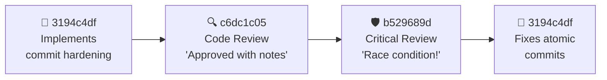

layout: center
---

<div class="text-center max-w-3xl mx-auto">

<div class="text-xl text-gray-300 leading-relaxed">

*"Wouldn't it be nice if AIs could work together — define their own goals, collaborate, and run for hours... instead of needing you every 5 minutes?"*

</div>

<br/>

<div class="text-lg text-blue-400 font-bold">We built the answer.</div>

</div>

<!--
Let this question hang for 2-3 seconds. Everyone in the room using
Copilot CLI has felt this pain — you start a task, the context fills up,
you lose momentum, you have to re-explain everything. What if the AI
could just... keep going? With a team? That's what we built.
-->

---
layout: center
---

<div class="text-center">

# What if you could do this?

<br/>

<div class="bg-gray-800 rounded-lg p-6 border border-gray-700 text-left max-w-lg mx-auto">

<span class="text-gray-500">You:</span> <span class="text-green-400">"Here are 10 things from our retrospective. Fix them all."</span>

<br/><br/>

<span class="text-gray-500">30 minutes later:</span>

- ✅ 10 features implemented
- ✅ Every feature code-reviewed
- ✅ Security vulnerability caught and fixed
- ✅ 1,752 tests passing
- ✅ Documentation updated

</div>

</div>

<!--
Imagine this scenario. You paste a GitHub issue into a chat — a retro with
10 things to fix. You type one sentence: "Fix these." Half an hour later,
everything is done. Not just coded — reviewed, tested, documented. That's
not hypothetical. That's what happened.
-->


---

# Here's what actually happened

<br/>

<div class="space-y-4">

<div class="flex items-start gap-3">
<div class="text-lg">📋</div>
<div><strong class="text-blue-400">The Lead read the issue</strong> — 10 work items across 3 priority levels</div>
</div>

<div class="flex items-start gap-3">
<div class="text-lg">🧠</div>
<div><strong class="text-blue-400">It made a plan</strong> — broke the work into 19 tasks with dependencies</div>
</div>

<div class="flex items-start gap-3">
<div class="text-lg">👥</div>
<div><strong class="text-blue-400">It hired a team</strong> — 7 devs, 1 architect, 4 reviewers, 1 secretary</div>
</div>

<div class="flex items-start gap-3">
<div class="text-lg">⚡</div>
<div><strong class="text-blue-400">They all started at once</strong> — each with their own terminal, their own files, their own job</div>
</div>

<div class="flex items-start gap-3">
<div class="text-lg">🔄</div>
<div><strong class="text-blue-400">They coordinated in real-time</strong> — messaging each other, reviewing each other's work, flagging problems</div>
</div>

</div>

<!--
Walk through the sequence crisply. The lead AI read the GitHub issue.
Analyzed 10 items. Built a dependency graph — like a project manager
mapping out "this blocks that." Then it started hiring. Not random
generalists — specific specialists for specific tasks. Within 2 minutes,
13 agents were running simultaneously, each with its own terminal. Think
of it as spinning up an entire engineering team in the time it takes to
make coffee.
-->


---
layout: center
---

<div class="text-center">

# How was this built?

<br/>

<div class="text-xl text-gray-400">With itself.</div>

</div>

<!--
Pause after "With itself." Let it land. Then say: "Let me tell you the
origin story — because it's the best proof of concept I can give you."
-->


---

# Built by the thing it builds

<div class="space-y-3 mt-2">

<div class="bg-gray-800 rounded-lg p-3 border border-gray-700">

### 🌱 Day 1: One human, one AI
A single Copilot CLI agent got one prompt: *"Build a system where multiple AI agents can work together."* That one agent wrote the first prototype.

</div>

<div class="bg-gray-800 rounded-lg p-3 border border-blue-500">

### 🔄 Then it got recursive
Use **version N** of AI Crew → to build **version N+1**. Each generation is built by the previous generation's team of agents. Each version is better at building the next one.

</div>

<div class="bg-gray-800 rounded-lg p-3 border border-green-500">

### ⚡ This session — right now
The 13 agents you're about to meet? They're building the **next version** of the system they're running on. New features, bug fixes, even this presentation — all produced by the tool itself.

</div>

</div>

<div class="text-center mt-3">
<span class="text-yellow-400 font-bold">You're not watching a demo. You're watching a system evolving in real time.</span>
</div>

<!--
This is the origin story. A single Copilot CLI agent — the same tool you
already use — got one prompt and wrote the first prototype. Then we used
version 1 to build version 2. Version 2 had more features, so it built
version 3 faster. Each generation improves the next.

This session? The 13 agents are building the next version of the system
they're running on. They found bugs in their own infrastructure and fixed
them. One agent found a race condition in the commit system all the agents
use to save their work.

The tool is improving itself. That's not a demo — that's a feedback loop.

[Transition: "Now let's talk about what this means for engineering teams..."]
-->


---

# Meet the crew

<div class="grid grid-cols-3 gap-3 mt-2">
<div class="bg-gray-800 rounded-lg p-3 border border-blue-500">

### 🎯 The Lead
<span class="text-sm text-gray-400">Think: senior engineering manager</span><br/>
Plans the work, hires the team, makes decisions — never writes a line of code

</div>
<div class="bg-gray-800 rounded-lg p-3 border border-green-500">

### 👷 The Developers
<span class="text-sm text-gray-400">Think: your best IC engineers</span><br/>
Write code and tests. Each one owns specific files — no stepping on toes

</div>
<div class="bg-gray-800 rounded-lg p-3 border border-yellow-500">

### 🔍 The Reviewers
<span class="text-sm text-gray-400">Think: that colleague who always finds the bug</span><br/>
Read every line. Only flag real problems — zero style nits

</div>
<div class="bg-gray-800 rounded-lg p-3 border border-red-500">

### 🛡️ The Security Reviewer
<span class="text-sm text-gray-400">Think: a paranoid pen-tester</span><br/>
Hunts for vulnerabilities and failure modes. Found a real one this session.

</div>
<div class="bg-gray-800 rounded-lg p-3 border border-purple-500">

### 🏗️ The Architect
<span class="text-sm text-gray-400">Think: the person who draws on whiteboards</span><br/>
Designs the structure so agents can work in parallel without blocking each other

</div>
<div class="bg-gray-800 rounded-lg p-3 border border-gray-500">

### 📝 The Secretary
<span class="text-sm text-gray-400">Think: a project manager who reads every ticket</span><br/>
Tracks every task. Caught a major data discrepancy this session.

</div>
</div>

<p class="text-sm text-gray-500 mt-2">Each agent is a real Copilot CLI session — the same tool you already use. Full terminal, file editing, everything.</p>

<!--
Spend a moment on this slide — let the audience absorb the roles. The key
comparison: this is like a real engineering team. The lead is like a senior
EM who never opens an IDE. The developers are ICs who own their code. The
reviewers are that teammate who always finds the edge case. The secretary
is a project manager who reads every status update. The difference? They
all start working in the same minute. No onboarding, no standups, no
context switching. Point out that each agent is the exact same Copilot CLI
the audience already uses — this isn't sci-fi, it's a multiplier.

[Transition: "Now that you know the team, let me show you the technology
that connects them — starting with the communication protocol."]
-->


---

# The Foundation: ACP (Agent Communication Protocol)

<div class="bg-gray-800 rounded-lg p-3 border border-blue-500 mt-2">

**ACP** is an open protocol for programmatically controlling AI coding agents.

</div>

<div class="bg-gray-900 rounded-lg p-3 mt-3 text-sm font-mono">

<div class="grid grid-cols-2 gap-4">
<div class="text-center">

**AI Crew Server**
<div class="text-xs text-gray-500">Sends prompts, receives output</div>

</div>
<div class="text-center">

**Copilot CLI (Agent)**
<div class="text-xs text-gray-500">Thinks, edits, searches, commits</div>

</div>
</div>

<div class="text-center text-blue-400 my-2">◄═══ ACP (NDJSON / stdio) ═══►</div>

<div class="text-xs text-gray-400 space-y-1">
<div><code>prompt()</code> → Server sends task to agent</div>
<div><code>text()</code> ← Agent streams back response (with embedded commands)</div>
<div><code>tool_call()</code> ← Agent uses bash, file edit, grep, git</div>
<div><code>usage()</code> ← Token counts flow back for cost tracking</div>
</div>

</div>

<div class="grid grid-cols-3 gap-2 mt-3 text-sm">
<div class="bg-gray-800 rounded-lg p-2 border border-gray-700">

**Model-agnostic** — Claude, GPT, Gemini. Same protocol.

</div>
<div class="bg-gray-800 rounded-lg p-2 border border-gray-700">

**Tool-rich** — bash, file edit, grep, git, web search

</div>
<div class="bg-gray-800 rounded-lg p-2 border border-gray-700">

**12 agents = 12 processes** — each a real Copilot CLI session

</div>
</div>

<!--
ACP is the key enabler. Without it, each agent would need custom
integration. With ACP, we spawn a Copilot CLI process per agent
(copilot-cli --acp --stdio --model claude-sonnet-4), and communicate via
structured JSON over stdin/stdout. The agent gets the full Copilot CLI
toolset — bash, file editing, grep, git, web search. 12 agents = 12
processes, each with their own terminal and context. ACP handles streaming,
tool execution, permissions, and token tracking.
-->

---

# Built with

<div class="grid grid-cols-3 gap-3 mt-3 text-sm">
<div class="bg-gray-800 rounded-lg p-3 border border-blue-500 text-center">

### 🧠 Agents
Copilot CLI + ACP
<div class="text-xs text-gray-400">stdio pipes, NDJSON streaming</div>

</div>
<div class="bg-gray-800 rounded-lg p-3 border border-green-500 text-center">

### 💾 Database
SQLite + better-sqlite3
<div class="text-xs text-gray-400">WAL mode, 5 registries, zero ops</div>

</div>
<div class="bg-gray-800 rounded-lg p-3 border border-yellow-500 text-center">

### 🔧 Server
Node.js + TypeScript
<div class="text-xs text-gray-400">Event-driven orchestration</div>

</div>
</div>

<div class="grid grid-cols-2 gap-3 mt-3 text-sm">
<div class="bg-gray-800 rounded-lg p-3 border border-purple-500 text-center">

### 📡 Messaging
ACP protocol + agent routing
<div class="text-xs text-gray-400">Direct, group, broadcast channels</div>

</div>
<div class="bg-gray-800 rounded-lg p-3 border border-cyan-500 text-center">

### 🧠 Context Management
Content-hashed status updates
<div class="text-xs text-gray-400">40-60% token savings on unchanged state</div>

</div>
</div>

<p class="text-sm text-gray-500 mt-2">Intentionally simple — single Node.js process + N Copilot CLI child processes. SQLite handles all state.</p>

<!--
Focus: agent coordination infrastructure. Each agent is a Copilot CLI
process connected via ACP (stdio pipes, NDJSON protocol). SQLite in WAL
mode handles all persistence — agent state, task DAG, file locks, group
chats, activity logs. Content-hashed status updates save 40-60% of
context tokens. The messaging layer routes between agents via three
channels. No complex infrastructure needed.
-->

---

# How agents interact with the system

<div class="text-sm mt-1">

Agents embed **structured commands** in their natural language output:

</div>

<div class="bg-gray-900 rounded-lg p-3 mt-2 text-xs font-mono space-y-2">

<div><span class="text-blue-400"> DELEGATE</span> {"role": "developer", "task": "Fix the login bug", "model": "claude-sonnet-4.5"} <span class="text-blue-400"></span></div>
<div><span class="text-green-400"> COMMIT</span> {"message": "Fix null check in auth handler"} <span class="text-green-400"></span></div>
<div><span class="text-yellow-400"> LOCK_FILE</span> {"filePath": "src/auth.ts"} <span class="text-yellow-400"></span></div>
<div><span class="text-purple-400"> AGENT_MESSAGE</span> {"to": "b529689d", "content": "Found the bug — race condition in git index"} <span class="text-purple-400"></span></div>
<div><span class="text-red-400"> COMPLETE_TASK</span> {"taskId": "fix-login", "summary": "Added null check and auth guard"} <span class="text-red-400"></span></div>

</div>

<div class="bg-gray-800 rounded-lg p-3 border border-gray-700 mt-3 text-sm">

**Real exchange from this session:**

<div class="text-xs space-y-1 mt-1">
<div><span class="text-blue-400">Lead →</span> <code> DELEGATE {"role": "developer", "task": "Harden the commit system"} </code></div>
<div><span class="text-green-400">Dev 3194c4df →</span> *"Done. Added 4 safety features."* <code> COMMIT {"message": "scoped commit hardening"} </code></div>
<div><span class="text-blue-400">Lead →</span> <code> DELEGATE {"role": "critical-reviewer", "task": "Review commit de3e414"} </code></div>
<div><span class="text-red-400">Reviewer b529689d →</span> *"Found race condition in git index sharing."*</div>
</div>

</div>

<p class="text-sm text-gray-500 mt-2">50+ commands across 13 modules. Unicode <code> </code> delimiters — zero false positives. All Zod-validated.</p>

<!--
The command system is the core primitive. Agents embed structured commands
in their natural language output using Unicode mathematical brackets —
these never appear in code or JSON, so there are zero false positives.
The system scans the agent's stream in real-time and extracts commands as
they arrive. Show the real exchange: the lead delegated commit hardening,
the developer built it and committed, the lead sent it for critical
review, and the reviewer found a race condition. This is the command
system enabling autonomous coordination.
-->

---
layout: center
---

<div class="text-center text-xl text-gray-400">

That's how agents talk to the system.

Now let's see how the lead **keeps it all running**.

</div>

---

# Parallel workstreams, one lead

<div class="bg-gray-800 rounded-lg p-4 border border-blue-500 mt-2">

**Right now**, in this session, the lead is coordinating simultaneously:

</div>

<div class="grid grid-cols-3 gap-2 mt-3 text-sm">
<div class="bg-gray-800 rounded-lg p-2 border border-purple-500">

### 🎬 Presentation
5 agents writing, reviewing, and polishing these slides

</div>
<div class="bg-gray-800 rounded-lg p-2 border border-green-500">

### 💻 Code
8 developers implementing features, fixing bugs, writing tests

</div>
<div class="bg-gray-800 rounded-lg p-2 border border-yellow-500">

### 🔍 Reviews
Code reviewers and critical reviewers auditing every commit

</div>
</div>

<div class="bg-gray-800 rounded-lg p-3 border border-gray-700 mt-3 text-sm">

The lead doesn't context-switch — it holds **all workstreams in parallel**. When a developer finishes a feature, the lead assigns a reviewer. When a reviewer finds a bug, the lead assigns a fix. Meanwhile, the presentation team keeps iterating. **13 agents, multiple domains, one coordinator.**

</div>

<!--
This is a key emergent capability. The lead agent doesn't do one thing at a
time — it orchestrates parallel workstreams across completely different
domains. While we were building this presentation, developers were
implementing features, reviewers were auditing code, and the architect was
designing new capabilities. The lead coordinates all of it concurrently,
routing messages, assigning tasks, and resolving conflicts in real-time.
-->

---

# Three communication channels

<div class="grid grid-cols-3 gap-3 mt-2 text-sm">
<div class="bg-gray-800 rounded-lg p-3 border border-blue-500">

### 💬 Direct Messages

<div class="bg-gray-900 rounded p-2 mt-1 text-xs font-mono">
 AGENT_MESSAGE {"to": "437a822b",<br/>
&nbsp; "content": "Spec is ready"} 
</div>

<div class="text-sm text-gray-400 mt-2">

- Point-to-point, async
- Resolves by ID prefix or role

</div>
</div>
<div class="bg-gray-800 rounded-lg p-3 border border-green-500">

### 👥 Group Chat

<div class="bg-gray-900 rounded p-2 mt-1 text-xs font-mono">
 GROUP_MESSAGE {"group":<br/>
&nbsp; "presentation-team", ...} 
</div>

<div class="text-sm text-gray-400 mt-2">

- Persistent, SQLite-backed
- 5 agents coordinated this deck

</div>
</div>
<div class="bg-gray-800 rounded-lg p-3 border border-yellow-500">

### 📢 Broadcast

<div class="bg-gray-900 rounded p-2 mt-1 text-xs font-mono">
 BROADCAST {"content":<br/>
&nbsp; "Never use git add -A"} 
</div>

<div class="text-sm text-gray-400 mt-2">

- One-to-all, urgent
- All 13 agents received it

</div>
</div>
</div>

<p class="text-sm text-gray-500 mt-2">This presentation was coordinated via group chat — 5 agents discussing slides in real-time.</p>

<!--
Three channels, each for a different purpose. Direct messages for
point-to-point coordination — the architect sends specs to the developer
who needs them. Group chat for team coordination — our presentation-team
group had 5 agents (lead, architect, developer, radical thinker, tech
writer) all collaborating on these slides in real-time. And broadcast
for urgent announcements — when the lead discovered the git add -A
problem, it broadcast a warning to all 13 agents simultaneously. The
agents self-organize: they create groups, message peers directly, and
escalate through broadcast when needed.
-->

---

# What agents see: context management

<div class="bg-gray-900 rounded-lg p-3 mt-2 text-xs font-mono">

<span class="text-gray-500">// Injected every 60s or on significant events</span>
<br/> CREW_UPDATE
<br/>== CURRENT CREW STATUS ==
<br/>- Agent 2cf55f61 (Developer) — <span class="text-green-400">running</span>, Files locked: AgentLifecycle.ts
<br/>- Agent 0b85de78 (Developer) — <span class="text-green-400">running</span>, Files locked: AutoDAG.test.ts
<br/>- Agent b529689d (Critical Reviewer) — <span class="text-gray-500">idle</span>
<br/>== AGENT BUDGET == Running: 12 / 20 | Available: 8
<br/>CREW_UPDATE 

</div>

<div class="grid grid-cols-2 gap-2 mt-3 text-sm">
<div class="bg-gray-800 rounded-lg p-2 border border-gray-700">

**Content-hashed** — unchanged updates are suppressed, saving 40-60% of context tokens

</div>
<div class="bg-gray-800 rounded-lg p-2 border border-gray-700">

**Lock-visible** — agents see who owns which file before trying to edit

</div>
</div>

<!--
This is what keeps agents coordinated. Every 60 seconds (or on significant
events), each agent receives a CREW_UPDATE showing the full crew status,
budget, and recent activity. They can see who's working on what, which
files are locked, and how many agent slots are left. The update is
content-hashed — if nothing changed, it's not re-sent, saving 40-60% of
update tokens. Each agent also has a role-specific system prompt that
defines their personality, capabilities, and instructions.
-->

---

# Five registries, one source of truth

<div class="grid grid-cols-3 gap-2 mt-2 text-sm">
<div class="bg-gray-800 rounded-lg p-2 border border-blue-500 text-center">

### 🤖 Agent Manager
<div class="text-xs text-gray-400">Lifecycle, status, model, parent</div>

</div>
<div class="bg-gray-800 rounded-lg p-2 border border-green-500 text-center">

### 📋 Task DAG
<div class="text-xs text-gray-400">Dependencies, states, progress</div>

</div>
<div class="bg-gray-800 rounded-lg p-2 border border-yellow-500 text-center">

### 🔒 File Locks
<div class="text-xs text-gray-400">Who owns which file</div>

</div>
</div>

<div class="grid grid-cols-2 gap-2 mt-2 text-sm">
<div class="bg-gray-800 rounded-lg p-2 border border-purple-500 text-center">

### 💬 Chat Groups
<div class="text-xs text-gray-400">Members, messages, history</div>

</div>
<div class="bg-gray-800 rounded-lg p-2 border border-red-500 text-center">

### 📊 Activity Ledger
<div class="text-xs text-gray-400">Every action, logged</div>

</div>
</div>

<div class="bg-gray-800 rounded-lg p-3 border border-gray-700 mt-3 text-sm">

All backed by **SQLite** — state survives restarts, one file, zero ops. The Task DAG **auto-creates** tasks from delegations and **auto-completes** them when agents report done. File locks are the coordination primitive: 8 developers editing different files simultaneously, zero conflicts.

</div>

<!--
Five registries track everything. AgentManager handles lifecycle — who's
running, what model, who's their parent. TaskDAG tracks the dependency
graph — tasks auto-promote when dependencies complete. FileLockRegistry
prevents concurrent edits. ChatGroupRegistry manages persistent group
conversations. ActivityLedger logs every action for the timeline and
audit trail. Everything is SQLite via Drizzle ORM — survives restarts,
zero operational overhead.
-->

---

# Task DAG: Plan, track, auto-schedule

<div class="grid grid-cols-2 gap-4 mt-2">
<div>

**Directed Acyclic Graph** of task dependencies

```
 DECLARE_TASKS {
  "tasks": [
    {"id": "api",  "depends_on": []},
    {"id": "ui",   "depends_on": ["api"]},
    {"id": "test", "depends_on": ["api","ui"]}
  ]
} 
```

When `api` completes → `ui` auto-starts
When `api` + `ui` complete → `test` auto-starts

</div>
<div>

<div class="bg-gray-800 rounded-lg p-3 border border-gray-700">

**Auto-DAG** — no planning required

When agents use ` DELEGATE ` without a plan, the system **auto-creates DAG nodes** from each delegation.

- Near-duplicate detection prevents redundant tasks
- Secretary agent infers dependencies between related work
- Review tasks auto-link to their parent feature

</div>

<div class="text-sm text-gray-400 mt-2">

📊 **UI visualization**: task nodes with dependency arrows, color-coded by status (pending → running → done)

</div>
</div>
</div>

<!--
The DAG is a core differentiator. Most multi-agent systems fire-and-forget
delegations. AI Crew PLANS and TRACKS. DECLARE_TASKS creates explicit
dependency graphs. Auto-DAG creates them implicitly from DELEGATE commands.
Tasks auto-start when their dependencies resolve — no polling, no manual
scheduling. The UI shows this as a live graph with nodes and arrows.

[Transition: "That's how the system works under the hood. Now let me show
you what happens when real agents use these capabilities — starting with
two stories from this session."]
-->

---

# Story 1: The Security Bug

<div class="bg-gray-800 rounded-lg p-4 border border-red-500 mt-2">

A developer built a feature called COMPLETE_TASK — it lets agents mark their work as done.

The security reviewer read every line and found this:

<div class="bg-gray-900 rounded p-3 mt-2 text-sm">

⚠️ <span class="text-red-400">"Any agent can complete any other agent's task. Agent A could mark Agent B's task as done without doing the work."</span>

</div>

</div>

<div class="bg-gray-800 rounded-lg p-3 border border-gray-700 mt-3">

### What happened next

1. Security reviewer sent a detailed report to the developer
2. Developer added authentication — agents can only complete *their own* tasks
3. Added input length limits to prevent abuse
4. Reviewer verified the fix

<span class="text-green-400">Time from discovery to fix: ~4 minutes</span>

</div>

<!--
The developer built COMPLETE_TASK — a command that lets agents mark their
work as done. Seems straightforward. But the security reviewer — whose
only job is finding vulnerabilities — read every line and realized: there's
no authentication. Any agent could complete any other agent's task. In a
multi-agent system, that's like giving every employee the ability to sign
off on anyone else's work. The developer fixed it in minutes. This is why
you want specialists — a generalist might have missed this.
-->


---

# Story 2: The Commit Catastrophe

<div class="bg-gray-800 rounded-lg p-4 border border-yellow-500 mt-2">

All 7 developers are editing files in the same codebase, at the same time.

Developer A finishes and commits. But the commit includes Developer B's half-finished changes.

<div class="bg-gray-900 rounded p-3 mt-2 text-sm">

🔀 <span class="text-yellow-400">"5 files were never committed. 1 commit included another agent's code. The git history is a mess."</span>

</div>

</div>

<div class="bg-gray-800 rounded-lg p-3 border border-gray-700 mt-3">

### How the system responded

1. **Code reviewer** caught the missing files immediately
2. **Lead** broadcast a warning to all 13 agents: *"Never use git add -A"*
3. **Architect** audited the commit system and found 4 gaps
4. **Developer** hardened the commit command — now only stages files you've locked

</div>

<div class="bg-gray-800 rounded-lg p-2 border border-green-500 mt-2">

🔒 **The fix: file locking.** 8 developers, 15+ files, zero conflicts. Each agent claims files before editing — no merge conflicts, no overwrites.

</div>

<!--
This is the messy reality of multiple agents sharing one repo. Developer A
commits and accidentally grabs Developer B's uncommitted changes. The code
reviewer caught it. The lead broadcast a warning. The architect audited
the system. They built file locking — each developer claims files like
checking out a library book. 8 developers, 15+ files, zero conflicts.
-->


---

# The Review Chain: From Code to Bulletproof

<div class="bg-gray-800 rounded-lg p-3 border border-gray-700 mt-2">



</div>

<div class="grid grid-cols-3 gap-2 mt-3 text-sm">
<div class="bg-gray-800 rounded-lg p-2 border border-gray-700">

**Code Reviewer** found:
- Missing test for dirty-file check
- Suggested scoping improvements

</div>
<div class="bg-gray-800 rounded-lg p-2 border border-red-500">

**Critical Reviewer** found:
- ⚠️ **Race condition**: two agents committing simultaneously share a git index — cross-contamination possible
- Fix: atomic `git commit -- files`

</div>
<div class="bg-gray-800 rounded-lg p-2 border border-green-500">

**Developer** fixed all 3 issues in commit `de3e414`. Tests pass.

</div>
</div>

<!--
Watch how a real review chain works. Developer 3194c4df built the scoped
commit hardening — 4 safety features. Code reviewer c6dc1c05 approved it
but noted a missing test. Then the critical reviewer — whose job is
finding things that can go wrong — found a race condition. Two agents
committing at the same time share a git index file. That means Agent A's
"git add" could include Agent B's files before "git commit" runs. The fix:
pass files directly to git commit with the double-dash syntax. One line
change, but it prevents a class of bugs that only exist in multi-agent
environments. Three passes, three different perspectives, bulletproof result.
-->


---

# The Bug That Only Exists in Multi-Agent Systems

<div class="bg-gray-800 rounded-lg p-4 border border-red-500 mt-2">

### Critical reviewer b529689d discovered:

<div class="bg-gray-900 rounded p-3 mt-2 text-sm font-mono">
<div class="text-gray-500"># Agent A (17:23:01)</div>
<div>git add CoordCommands.ts</div>
<div class="text-gray-500"># Agent B (17:23:01) — same millisecond!</div>
<div>git add AgentLifecycle.ts</div>
<div class="text-gray-500"># Agent A (17:23:02)</div>
<div>git commit -m "hardening"</div>
<div class="text-red-400"># ⚠️ Agent A's commit now contains Agent B's file!</div>
</div>

</div>

<div class="bg-gray-800 rounded-lg p-3 border border-gray-700 mt-3">

**Why this matters:** This bug is *invisible* in single-agent systems. It only appears when multiple agents share a git working directory. The critical reviewer — who never wrote a line of code — found it by reasoning about what happens at the millisecond level.

</div>

<div class="bg-gray-800 rounded-lg p-3 border border-green-500 mt-2">

**The fix:** <code>git commit -m "msg" -- file1 file2</code> — bypass the shared index entirely. Atomic and clean.

</div>

<!--
This is the "aha" moment. Pause and let the audience absorb it. Git's staging
area — the index — is a single file on disk. When Agent A runs "git add" and
then "git commit", there's a tiny window where Agent B's "git add" can slip in.
Agent A's commit now includes Agent B's files. No single-developer workflow
would EVER hit this bug. It only exists because multiple agents share one
working directory. The critical reviewer found it just by thinking — not by
running code, not by testing, but by reasoning about concurrent execution.
The fix is one line: pass files directly to git commit, skipping the index.
This is why you want specialists who think about failure modes for a living.
-->


---
layout: center
---

# The final tally

<div class="grid grid-cols-2 gap-6 mt-4 max-w-2xl mx-auto">
<div class="text-right space-y-3">
<div class="text-3xl font-bold text-blue-400">13</div>
<div class="text-3xl font-bold text-green-400">10</div>
<div class="text-3xl font-bold text-yellow-400">52</div>
<div class="text-3xl font-bold text-purple-400">6,155</div>
<div class="text-3xl font-bold text-red-400">3</div>
<div class="text-3xl font-bold text-orange-400">1</div>
<div class="text-3xl font-bold text-blue-300">1,752</div>
</div>
<div class="text-left space-y-3">
<div class="text-base text-gray-300 leading-10">AI agents working in parallel</div>
<div class="text-base text-gray-300 leading-10">features shipped</div>
<div class="text-base text-gray-300 leading-10">files changed</div>
<div class="text-base text-gray-300 leading-10">lines of code</div>
<div class="text-base text-gray-300 leading-10">bugs caught in code review</div>
<div class="text-base text-gray-300 leading-10">security vulnerability fixed</div>
<div class="text-base text-gray-300 leading-10">tests passing</div>
</div>
</div>

<div class="text-center text-gray-500 mt-4">~30 minutes of wall clock time.</div>

<!--
Let this sink in. Read the numbers slowly. 13 agents. 10 features. Over
6,000 lines. Three bugs caught in review. A security vulnerability
discovered and patched. All in 30 minutes.
[Pause.] And it didn't just write code — it caught bugs in its own
infrastructure, improved its own processes, and debugged its own
coordination system. That's the power of a team.
-->

---
layout: center
---

<div class="text-center">

<div class="text-lg text-gray-400 mt-4">Oh, and one more thing.</div>

<br/>

<div class="text-xl text-gray-300">This presentation was built by the agents you just heard about.</div>

<div class="text-sm text-gray-500 mt-4">Written, reviewed, expanded, and rewritten — by the system we're describing.</div>
<div class="text-sm text-gray-500">You've been looking at their work product for the last 30 minutes.</div>

</div>

<!--
PAUSE. Let this land. Count to three in your head before speaking.
The silence IS the presentation. Then say: "Every slide, every speaker
note, every story — agents wrote it, a tech writer polished it, and a
radical thinker challenged the framing. You've been watching their work
product this entire time." This is the mic drop moment.
-->

---

# Every engineer gets a crew

<div class="bg-gray-800 rounded-lg p-3 border border-blue-500 mb-3">

**This becomes your personal engineering team.** You set the direction. You make the creative calls — architecture, design, priorities. Your AI crew handles the rest at machine speed.

</div>

<div class="grid grid-cols-2 gap-3">
<div class="bg-gray-800 rounded-lg p-3 border border-gray-700">

### One Copilot agent
<div class="text-sm">

- One thing at a time
- Context fills up on big tasks
- No one checks its work
- You manage everything

</div>
</div>
<div class="bg-gray-800 rounded-lg p-3 border border-green-500">

### Your AI Crew
<div class="text-sm">

- 13 agents in parallel
- Fresh, focused context per agent
- Built-in code review on every change
- The Lead manages the team for you

</div>
</div>
</div>

<!--
This is what it means for YOU. Every engineer in this room gets a crew.
You set the direction — architecture, product decisions, design choices.
Your AI crew handles the execution: coding, testing, reviewing,
coordinating. A single Copilot is a contractor. An AI Crew is your
personal engineering team. You go from writing every line yourself to
directing a team that handles the rest.
-->


---

# These agents don't just write code — they ship it

<div class="grid grid-cols-4 gap-3 mt-2">
<div class="bg-gray-800 rounded-lg p-3 border border-blue-500">

### 🔀 Commits
<div class="text-sm">

Each agent commits only its own files. **15+ scoped commits** this session, zero cross-contamination.

</div>
</div>
<div class="bg-gray-800 rounded-lg p-3 border border-green-500">

### 📋 Pull Requests
<div class="text-sm">

Creates PRs with full context — what changed, why, which agent did it. **Ready for your review.**

</div>
</div>
<div class="bg-gray-800 rounded-lg p-3 border border-yellow-500">

### 🎫 Issues
<div class="text-sm">

Found a bug during development? The crew **files a GitHub issue** and keeps working. No manual triage.

</div>
</div>
<div class="bg-gray-800 rounded-lg p-3 border border-purple-500">

### 📊 Analysis
<div class="text-sm">

Architecture audits, security reviews, cost breakdowns — **produced while you do other work.**

</div>
</div>
</div>

<p class="text-sm text-gray-500 mt-2">The boring parts of your workflow? They're handled. You review the output and decide what ships.</p>

<!--
This slide is about production credibility. The audience needs to know
this isn't a demo toy — it actually ships artifacts. Commits are scoped
and atomic. PRs get opened. Issues get filed. Analysis reports appear.
Everything the audience does manually today? The crew handles it. Point
at each column briefly: "15 scoped commits, zero conflicts. PRs created
with context. Issues filed automatically when bugs are found. Architecture
audits and cost analysis produced in the background." Then: "The boring
parts of your workflow? Handled."
-->


---

# Real-time visibility into everything

<div class="grid grid-cols-2 gap-3 mt-2">
<div class="bg-gray-800 rounded-lg p-3 border border-blue-500">

### 📊 Timeline Visualization
<div class="text-sm text-gray-400">

Swim lanes per agent showing activity over time. Communication links drawn between agents. Zoom, brush select, minimap navigation.

</div>
</div>
<div class="bg-gray-800 rounded-lg p-3 border border-green-500">

### 🏢 Org Chart
<div class="text-sm text-gray-400">

Hierarchical view: Lead → Agents. Shows role, status, model, current task. Real-time WebSocket updates.

</div>
</div>
<div class="bg-gray-800 rounded-lg p-3 border border-yellow-500">

### 🔥 Communication Heatmap
<div class="text-sm text-gray-400">

Matrix showing message frequency between agent pairs. Hot spots reveal collaboration patterns. SSE-powered real-time updates.

</div>
</div>
<div class="bg-gray-800 rounded-lg p-3 border border-purple-500">

### 🔗 DAG Task Graph
<div class="text-sm text-gray-400">

Interactive dependency graph. Color-coded: green (done), blue (running), gray (pending). Shows which agent is assigned to each task.

</div>
</div>
</div>

<p class="text-sm text-gray-500 mt-2">All views update in real-time. You can message any agent, pause the system, or just watch. Like mission control for your AI team.</p>

<!--
You're not flying blind. Eight live panels — timeline, org chart, heatmap,
DAG graph, activity feed, agent fleet, token costs, and alerts. The
timeline is powerful for post-mortem: see exactly when agents communicated,
who was blocked, where bottlenecks formed. The heatmap reveals
collaboration patterns you didn't design — agents naturally cluster around
problems. All of this updates via WebSocket push. You'll see it in the
live demo.
-->

---

# Where this goes next

<div class="grid grid-cols-2 gap-3 mt-1">
<div class="bg-gradient-to-br from-gray-800 to-gray-900 rounded-lg p-3 border border-blue-500">

### 🧠 Institutional Memory
<div class="text-sm">

Imagine an agent that's reviewed **500 PRs** in YOUR codebase. It knows your patterns, your conventions, your common mistakes. Every session, it gets smarter.

</div>
</div>
<div class="bg-gradient-to-br from-gray-800 to-gray-900 rounded-lg p-3 border border-yellow-500">

### ⚡ Smart Model Routing
<div class="text-sm">

Opus writes the architecture. Haiku writes the unit tests. **Your bill drops 80%.** The system picks the right brain for each task, automatically.

</div>
</div>
<div class="bg-gradient-to-br from-gray-800 to-gray-900 rounded-lg p-3 border border-purple-500">

### 🌙 Overnight Autonomy
<div class="text-sm">

Describe Monday's sprint on Friday evening. **Monday morning: done.** Reviewed, tested, documented, waiting for your approval.

</div>
</div>
<div class="bg-gradient-to-br from-gray-800 to-gray-900 rounded-lg p-3 border border-green-500">

### 🤝 Your AI Engineering Crew
<div class="text-sm">

Your own AI engineering crew. You make the creative calls — architecture, design, priorities. **They handle the rest at machine speed.**

</div>
</div>
</div>

<!--
Every one of these is a world you can picture yourself in. Institutional
memory: an agent that's reviewed 500 PRs in YOUR codebase — it knows your
patterns better than a new hire ever could. Smart model routing: Opus
handles architecture, Haiku handles boilerplate — your bill drops 80%.
Overnight autonomy: describe the sprint Friday evening, wake up Monday to
reviewed, tested, documented code. Your own AI crew: you make the creative
calls, they execute at machine speed. Don't linger — let the audience
picture themselves in each scenario.
-->


---

# Let me show you

<div class="bg-gray-800 rounded-lg p-4 border border-gray-700">

### Live Demo (~7 minutes)

<div class="space-y-2 mt-2">

1. **Start** — Give the lead a task: *"Add a /health endpoint with uptime and agent count"*
2. **Watch the plan** — Lead creates a task graph and picks roles
3. **Watch them work** — Multiple agents coding simultaneously, in real time
4. **See the communication** — Agents messaging each other, reporting progress
5. **See the review** — Code reviewer reads the developer's work
6. **See the dashboard** — Timeline, heatmap, and task graph update live

</div>

</div>

<div class="bg-gray-800 rounded-lg p-3 border border-gray-700 mt-3">

```bash
# To run it yourself:
git clone https://github.com/justinchuby/ai-crew.git
cd ai-crew && npm install && npm run dev
```

</div>

<!--
Let's see it live. I'll give the lead a small, real task and we'll watch
the full cycle: planning, hiring, parallel coding, communication, and
review. If anything goes wrong during the demo — that's actually fine,
I can hit System Pause, which freezes everything. Pro tip: that pause
feature IS a demo in itself. After the demo, take a breath and
transition into the closing slide.
-->


---
layout: center
---

<div class="text-center">

# <span class="text-blue-400">Every engineer gets a crew.</span>

<br/>

<div class="text-xl text-gray-300">AI specialists that work in parallel, review each other's code,</div>
<div class="text-xl text-gray-300">and coordinate automatically — directed by you.</div>

<br/>

<div class="text-base text-gray-500">This will be available to you. It becomes your personal engineering team.</div>

<br/>

<div class="text-sm text-gray-400">

```bash
git clone https://github.com/justinchuby/ai-crew.git
cd ai-crew && npm install && npm run dev
# Requires: Node.js 20+, GitHub Copilot CLI
```

</div>

<br/>

<div class="text-lg text-gray-500">github.com/justinchuby/ai-crew</div>

<br/>

# Questions?

</div>

<!--
Let this breathe. Read it slowly. "Every engineer gets a crew. AI
specialists that work in parallel, catch each other's bugs, and manage
themselves — directed by you." Pause. "This will be available to you.
It becomes your personal engineering team." Then: "I'm happy to take
questions — architecture, coordination, cost, how to set this up,
anything you're curious about."
-->


---
layout: center
---

# Appendix: Deep Dive

<div class="text-gray-500">Reference slides for technical questions</div>

<!--
The following slides are reference material for technical deep-dive
questions. Skip these during the main presentation.
-->


---

# Appendix: Architecture

<div class="grid grid-cols-2 gap-3 text-sm">
<div>

<div class="bg-gray-800 rounded-lg p-3 border border-gray-700 mb-2">

### 🖥️ Web UI <span class="text-gray-500 text-xs">Dashboard</span>
Real-time dashboard, timeline, org chart, DAG, token economics

</div>
<div class="bg-gray-800 rounded-lg p-3 border border-gray-700 mb-2">

### ⚡ Server <span class="text-gray-500 text-xs">Express + WebSocket + SSE</span>
Agent lifecycle, command dispatch, coordination, file locks, persistence

</div>
<div class="bg-gray-800 rounded-lg p-3 border border-gray-700">

### 🔌 ACP Bridge <span class="text-gray-500 text-xs">Agent Communication Protocol</span>
Bidirectional connection to each Copilot CLI session

</div>

</div>
<div>

<div class="bg-gray-800 rounded-lg p-3 border border-gray-700 mb-2">

### 📦 Monorepo
- `packages/server` — Node.js backend
- `packages/web` — Web dashboard
- `packages/docs` — Documentation

</div>
<div class="bg-gray-800 rounded-lg p-3 border border-gray-700">

### 🗄️ Storage
- SQLite (Drizzle ORM) for persistence
- In-memory state for real-time ops
- WebSocket + SSE for live updates

</div>

</div>
</div>

<!--
Architecture reference. Monorepo with three packages. Web dashboard,
Express backend, SQLite for persistence, WebSocket and SSE for streaming.
Each agent connects via ACP — the Agent Communication Protocol.
-->


---

# Appendix: Task DAG & Coordination

<div class="text-sm">

```ts
DECLARE_TASKS {"tasks": [
  {"id": "design",    "role": "architect",   "description": "Design API schema"},
  {"id": "implement", "role": "developer",   "description": "Build endpoints",   "depends_on": ["design"]},
  {"id": "test",      "role": "qa-tester",   "description": "Write E2E tests",   "depends_on": ["implement"]},
  {"id": "review",    "role": "code-review", "description": "Review changes",    "depends_on": ["implement"]}
]}
```

</div>

<div class="grid grid-cols-3 gap-2 mt-2 text-sm">
<div class="bg-gray-800 rounded-lg p-2 border border-gray-700">

**Task States:** pending → ready → running → done (+ failed, blocked, paused, skipped)

</div>
<div class="bg-gray-800 rounded-lg p-2 border border-gray-700">

**File Locking:** pessimistic locks with TTL, glob patterns. Scoped COMMIT only stages locked files.

</div>
<div class="bg-gray-800 rounded-lg p-2 border border-gray-700">

**Communication:** direct messages, broadcasts, group chats, CREW_UPDATE (content-hashed, deduplicated)

</div>
</div>

<!--
DAG reference. Tasks have dependencies. States auto-promote when deps
complete. File locking prevents concurrent edits. COMMIT is scoped to
locked files. Communication is structured: direct, broadcast, group, and
periodic CREW_UPDATEs that are content-hashed to skip duplicates.
-->


---

# Appendix: Token Economics

<div class="grid grid-cols-2 gap-3 text-sm">
<div class="bg-gray-800 rounded-lg p-3 border border-gray-700">

### Cost Profile
- 10 agents × 200K context = ~2M tokens/session
- Per-agent token tracking and cost attribution
- Context pressure bars: 80% yellow, 90% red

</div>
<div class="bg-gray-800 rounded-lg p-3 border border-gray-700">

### Optimizations Built In
- Content-hashed CREW_UPDATEs save 40-60% of update tokens
- Debounced status notifications reduce churn
- Sliding window caps: 500 comms, 200 tool calls
- Context compaction detection + auto re-injection

</div>
</div>

<!--
Token cost reference. A 10-agent session uses roughly 2M tokens. Built-in
optimizations: content hashing saves 40-60% on context updates, debounced
notifications, sliding window caps, and automatic context re-injection
after compaction.
-->


---

# Appendix: All 13 Roles

<div class="grid grid-cols-2 gap-2 text-sm">
<div class="bg-gray-800 rounded-lg p-2 border border-gray-700">

- 🎯 **Project Lead** — Orchestrates the team
- 🏗️ **Architect** — System design & decomposition
- 👷 **Developer** — Code + tests (quality is their job)
- 🔍 **Code Reviewer** — Only real bugs, no style nits
- 🛡️ **Critical Reviewer** — Security & edge cases
- 🧪 **QA Tester** — End-to-end verification
- 📝 **Secretary** — Progress tracking & anomaly detection

</div>
<div class="bg-gray-800 rounded-lg p-2 border border-gray-700">

- 🎨 **Designer** — UX/UI patterns
- 📚 **Tech Writer** — Documentation
- 💡 **Radical Thinker** — First-principles challenges
- 📦 **Product Manager** — Requirements & user needs
- 🔧 **Generalist** — Cross-domain tasks
- 🤖 **Agent** — General purpose

<p class="text-xs text-gray-500 mt-2">Each has a tailored system prompt. Custom roles can also be defined.</p>

</div>
</div>

<!--
All 13 roles reference. Each has a purpose-built system prompt with
specific instructions, behavioral guidelines, and model preferences.
Custom roles can be defined for specialized needs.
-->

---

# Appendix: Full Tech Stack

<div class="grid grid-cols-2 gap-3 text-sm">
<div>

### Agent Coordination (main deck)
<div class="bg-gray-800 rounded-lg p-2 border border-blue-500 mt-1">

- **Agents**: Copilot CLI + ACP (stdio, NDJSON)
- **Database**: SQLite + better-sqlite3 (WAL mode)
- **Server**: Node.js + TypeScript
- **Messaging**: ACP protocol + agent routing
- **Context**: Content-hashed status updates

</div>
</div>
<div>

### Front-end & Tooling
<div class="bg-gray-800 rounded-lg p-2 border border-gray-700 mt-1">

- **Dashboard**: React + Vite (real-time via WebSocket + SSE)
- **Documentation**: VitePress
- **Presentation**: Slidev
- **Models**: Claude, GPT, Gemini
- **ORM**: Drizzle ORM
- **Testing**: Vitest + Playwright

</div>
</div>
</div>

<p class="text-sm text-gray-500 mt-2">Monorepo: packages/server (orchestration), packages/web (dashboard), packages/docs (documentation).</p>

<!--
Full tech stack reference. The main deck focuses on coordination
infrastructure. This appendix covers the complete stack including
front-end tooling, testing, and documentation.
-->
