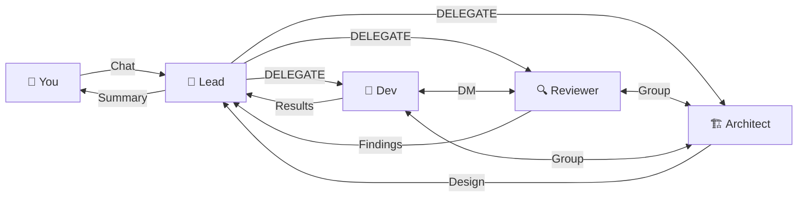
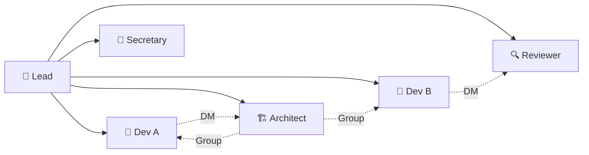
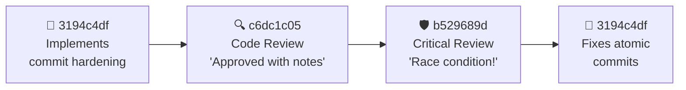

<div class="text-center max-w-3xl mx-auto">

<div class="text-xl text-gray-300 leading-relaxed">

*"Wouldn't it be nice if AIs could work together — define their own goals, collaborate, and run for hours... instead of needing you every 5 minutes?"*

</div>

<br/>

<div class="text-lg text-blue-400 font-bold">We built the answer.</div>

</div>

<!--
Let this question hang for 2-3 seconds. Everyone in the room using
Copilot CLI has felt this pain — you start a task, the context fills up,
you lose momentum, you have to re-explain everything. What if the AI
could just... keep going? With a team? That's what we built.
-->

---
layout: center
---

<div class="text-center">

# What if you could do this?

<br/>

<div class="bg-gray-800 rounded-lg p-6 border border-gray-700 text-left max-w-lg mx-auto">

<span class="text-gray-500">You:</span> <span class="text-green-400">"Here are 10 things from our retrospective. Fix them all."</span>

<br/><br/>

<span class="text-gray-500">30 minutes later:</span>

- ✅ 10 features implemented
- ✅ Every feature code-reviewed
- ✅ Security vulnerability caught and fixed
- ✅ All tests passing
- ✅ Documentation updated

</div>

</div>

<!--
Imagine this scenario. You paste a GitHub issue into a chat — a retro with
10 things to fix. You type one sentence: "Fix these." Half an hour later,
everything is done. Not just coded — reviewed, tested, documented. That's
not hypothetical. That's what happened.
-->


---

# Here's what actually happened

<br/>

<div class="space-y-4">

<div class="flex items-start gap-3">
<div class="text-lg">📋</div>
<div><strong class="text-blue-400">The Lead read the issue</strong> — 10 work items across 3 priority levels</div>
</div>

<div class="flex items-start gap-3">
<div class="text-lg">🧠</div>
<div><strong class="text-blue-400">It made a plan</strong> — broke the work into 19 tasks with dependencies</div>
</div>

<div class="flex items-start gap-3">
<div class="text-lg">👥</div>
<div><strong class="text-blue-400">It hired a team</strong> — 7 devs, 1 architect, 4 reviewers, 1 secretary</div>
</div>

<div class="flex items-start gap-3">
<div class="text-lg">⚡</div>
<div><strong class="text-blue-400">They all started at once</strong> — each with their own terminal, their own files, their own job</div>
</div>

<div class="flex items-start gap-3">
<div class="text-lg">🔄</div>
<div><strong class="text-blue-400">They coordinated in real-time</strong> — messaging each other, reviewing each other's work, flagging problems</div>
</div>

</div>

<!--
Walk through the sequence crisply. The lead AI read the GitHub issue.
Analyzed 10 items. Built a dependency graph — like a project manager
mapping out "this blocks that." Then it started hiring. Not random
generalists — specific specialists for specific tasks. Within 2 minutes,
Agents were running simultaneously, each with its own terminal. Think
of it as spinning up an entire engineering team in the time it takes to
make coffee.
-->


---
layout: center
---

<div class="text-center">

# How was this built?

<br/>

<div class="text-xl text-gray-400">With itself.</div>

</div>

<!--
Pause after "With itself." Let it land. Then say: "Let me tell you the
origin story — because it's the best proof of concept I can give you."
-->


---

# Built by the thing it builds

<div class="space-y-2 mt-2">

<div class="bg-gray-800 rounded-lg p-2 border border-gray-700">

### 🌱 Day 1: One human, one AI
A single Copilot CLI agent got one prompt: *"Build a system where multiple AI agents can work together."*

</div>

<div class="bg-gray-800 rounded-lg p-2 border border-blue-500">

### 🔄 Then it got recursive
Use **version N** of Flightdeck → to build **version N+1**. Each generation is built by the previous generation's team.

</div>

<div class="bg-gray-800 rounded-lg p-2 border border-green-500">

### ⚡ This session — right now
The agents you're about to meet? They're building the **next version** of the system they're running on.

</div>

</div>

<div class="text-center mt-2">
<span class="text-yellow-400 font-bold">You're not watching a demo. You're watching a system evolving in real time.</span>
</div>

<!--
This is the origin story. A single Copilot CLI agent — the same tool you
already use — got one prompt and wrote the first prototype. Then we used
version 1 to build version 2. Version 2 had more features, so it built
version 3 faster. Each generation improves the next.

This session? The agents are building the next version of the system
they're running on. They found bugs in their own infrastructure and fixed
them. One agent found a race condition in the commit system all the agents
use to save their work.

The tool is improving itself. That's not a demo — that's a feedback loop.

[Transition: "Now let's talk about what this means for engineering teams..."]
-->


---

# Meet the crew — 13 built-in roles

<div class="grid grid-cols-4 gap-1.5 mt-1 text-xs">
<div class="bg-gray-800 rounded p-1.5 border border-blue-500">
<span class="font-bold">🎯 Project Lead</span><br/>Plans work, hires the team, delegates — never writes code
</div>
<div class="bg-gray-800 rounded p-1.5 border border-purple-500">
<span class="font-bold">🏗️ Architect</span><br/>Designs system structure so agents work in parallel
</div>
<div class="bg-gray-800 rounded p-1.5 border border-green-500">
<span class="font-bold">👷 Developer</span><br/>Writes code and tests. Owns specific files — no conflicts
</div>
<div class="bg-gray-800 rounded p-1.5 border border-yellow-500">
<span class="font-bold">🔍 Code Reviewer</span><br/>Reads every line. Only flags real problems — zero style nits
</div>
<div class="bg-gray-800 rounded p-1.5 border border-red-500">
<span class="font-bold">🛡️ Critical Reviewer</span><br/>Hunts security vulnerabilities, failure modes, edge cases
</div>
<div class="bg-gray-800 rounded p-1.5 border border-cyan-500">
<span class="font-bold">🧪 QA Tester</span><br/>Runs code end-to-end, catches runtime failures reviews miss
</div>
<div class="bg-gray-800 rounded p-1.5 border border-orange-500">
<span class="font-bold">📖 Technical Writer</span><br/>Documentation, API design, examples, developer experience
</div>
<div class="bg-gray-800 rounded p-1.5 border border-gray-500">
<span class="font-bold">📝 Secretary</span><br/>Tracks tasks, maintains checklists, provides status reports
</div>
<div class="bg-gray-800 rounded p-1.5 border border-pink-500">
<span class="font-bold">💡 Radical Thinker</span><br/>Challenges assumptions, shifts perspective, sparks innovation
</div>
<div class="bg-gray-800 rounded p-1.5 border border-teal-500">
<span class="font-bold">📋 Product Manager</span><br/>Anticipates user needs, defines quality bar, shapes product
</div>
<div class="bg-gray-800 rounded p-1.5 border border-indigo-500">
<span class="font-bold">🎨 Designer</span><br/>UX/UI design, interaction patterns, human-agent interfaces
</div>
<div class="bg-gray-800 rounded p-1.5 border border-amber-500">
<span class="font-bold">🔧 Generalist</span><br/>Cross-disciplinary: mechanical eng, 3D modeling, research
</div>
<div class="bg-gray-800 rounded p-1.5 border border-slate-500">
<span class="font-bold">⚙️ Agent</span><br/>Neutral general-purpose — no role-specific instructions
</div>
</div>

<p class="text-xs text-gray-500 mt-1">Each agent is a real Copilot CLI session — same tool you already use. Define as many as you need.</p>

<!--
All 13 built-in roles from RoleRegistry. Each is a real Copilot CLI
session with full tool access. The key insight: it's a real
engineering org. Lead manages, developers code, reviewers catch bugs,
architect designs, secretary tracks progress, radical thinker challenges
assumptions. Users pick which roles they need — and can define custom
roles too. No onboarding, no standups — everyone starts in the same
minute.

[Transition: "Now that you know the team, let me show you how YOU
interact with this system."]
-->


---

# How you interact with the system

<div class="bg-gray-800 rounded-lg p-2 border border-blue-500 mt-1 text-sm">

You talk to the **lead agent** through a chat interface — just like chatting with Copilot. The lead reads your request, makes a plan, and delegates to specialists.

</div>



<div class="grid grid-cols-3 gap-2 mt-1 text-xs">
<div class="bg-gray-800 rounded-lg p-2 border border-green-500">

**Interrupt anytime** — priority messages redirect the lead

</div>
<div class="bg-gray-800 rounded-lg p-2 border border-purple-500">

**Agents collaborate** — direct messages & chat groups for lateral coordination

</div>
<div class="bg-gray-800 rounded-lg p-2 border border-yellow-500">

**Full visibility** — watch every agent in real-time

</div>
</div>

<!--
The human interaction model is simple: you type a message, just like
chatting with Copilot. The lead agent reads it, breaks it into tasks,
and delegates to the right specialists. But it's not just top-down —
agents actively collaborate laterally: direct messages for point-to-point
coordination, chat groups for team discussions (e.g., a presentation-team
group where dev, writer, and reviewer all sync). The lead can also
broadcast to everyone. You see all of this in real-time. If you want to
redirect, priority messages interrupt the lead immediately.
-->


---

# The delegation loop

<div class="grid grid-cols-2 gap-3 mt-2 text-sm">
<div>

<div class="bg-gray-800 rounded-lg p-2 border border-blue-500">

### Creating agents

```
 CREATE_AGENT {
  "role": "developer",
  "model": "claude-sonnet-4.5",
  "task": "Build the login feature"
} 
```

The lead picks the **role** and **model** for each agent.

</div>

</div>
<div>

<div class="bg-gray-800 rounded-lg p-2 border border-green-500">

### Delegating work

```
 DELEGATE {
  "to": "3194c4df",
  "task": "Harden the commit system"
} 
```

Reuse existing agents for new tasks.

</div>

</div>
</div>

<div class="bg-gray-800 rounded-lg p-2 border border-gray-700 mt-2 text-sm">

**The cycle:** You describe what you want → Lead plans → Lead creates/delegates → Agents work in parallel → Lead reviews → Lead assigns reviewers → Results flow back to you

</div>

<!--
The lead is like a senior engineering manager. It reads your request,
decides the team composition, creates agents with the right roles and
models, then delegates tasks. Agents report back when done. The lead
reviews the results, assigns follow-up work or code reviews, and
coordinates the next phase. Multiple workstreams run in parallel —
the lead doesn't context-switch, it holds everything at once.
-->


---

# The Foundation: ACP (Agent Communication Protocol)

<div class="bg-gray-800 rounded-lg p-3 border border-blue-500 mt-2">

**ACP** is an open protocol for programmatically controlling AI coding agents.

</div>

<div class="bg-gray-900 rounded-lg p-3 mt-3 text-sm font-mono">

<div class="grid grid-cols-2 gap-4">
<div class="text-center">

**Flightdeck Server**
<div class="text-xs text-gray-500">Sends prompts, receives output</div>

</div>
<div class="text-center">

**Copilot CLI (Agent)**
<div class="text-xs text-gray-500">Thinks, edits, searches, commits</div>

</div>
</div>

<div class="text-center text-blue-400 my-2">◄═══ ACP (NDJSON / stdio) ═══►</div>

<div class="text-xs text-gray-400 space-y-1">
<div><code>prompt()</code> → Server sends task to agent</div>
<div><code>text()</code> ← Agent streams back response (with embedded commands)</div>
<div><code>tool_call()</code> ← Agent uses bash, file edit, grep, git</div>
<div><code>usage()</code> ← Token counts flow back for cost tracking</div>
</div>

</div>

<div class="grid grid-cols-3 gap-2 mt-3 text-sm">
<div class="bg-gray-800 rounded-lg p-2 border border-gray-700">

**Model-agnostic** — Claude, GPT, Gemini. Same protocol.

</div>
<div class="bg-gray-800 rounded-lg p-2 border border-gray-700">

**Tool-rich** — bash, file edit, grep, git, web search

</div>
<div class="bg-gray-800 rounded-lg p-2 border border-gray-700">

**12 agents = 12 processes** — each a real Copilot CLI session

</div>
</div>

<!--
ACP is the key enabler. Without it, each agent would need custom
integration. With ACP, we spawn a Copilot CLI process per agent
(copilot-cli --acp --stdio --model claude-sonnet-4), and communicate via
structured JSON over stdin/stdout. The agent gets the full Copilot CLI
toolset — bash, file editing, grep, git, web search. Each agent is a separate
processes, each with their own terminal and context. ACP handles streaming,
tool execution, permissions, and token tracking.
-->

---

# Built with

<div class="grid grid-cols-3 gap-3 mt-3 text-sm">
<div class="bg-gray-800 rounded-lg p-3 border border-blue-500 text-center">

### 🧠 Agents
Copilot CLI + ACP
<div class="text-xs text-gray-400">stdio pipes, NDJSON streaming</div>

</div>
<div class="bg-gray-800 rounded-lg p-3 border border-green-500 text-center">

### 💾 Database
SQLite + better-sqlite3
<div class="text-xs text-gray-400">WAL mode, 5 registries, zero ops</div>

</div>
<div class="bg-gray-800 rounded-lg p-3 border border-yellow-500 text-center">

### 🔧 Server
Node.js + TypeScript
<div class="text-xs text-gray-400">Event-driven orchestration</div>

</div>
</div>

<div class="grid grid-cols-2 gap-3 mt-3 text-sm">
<div class="bg-gray-800 rounded-lg p-3 border border-purple-500 text-center">

### 📡 Messaging
ACP protocol + agent routing
<div class="text-xs text-gray-400">Direct, group, broadcast channels</div>

</div>
<div class="bg-gray-800 rounded-lg p-3 border border-cyan-500 text-center">

### 🧠 Context Management
Content-hashed status updates
<div class="text-xs text-gray-400">40-60% token savings on unchanged state</div>

</div>
</div>

<p class="text-sm text-gray-500 mt-2">Intentionally simple — single Node.js process + N Copilot CLI child processes. SQLite handles all state.</p>

<!--
Focus: agent coordination infrastructure. Each agent is a Copilot CLI
process connected via ACP (stdio pipes, NDJSON protocol). SQLite in WAL
mode handles all persistence — agent state, task DAG, file locks, group
chats, activity logs. Content-hashed status updates save 40-60% of
context tokens. The messaging layer routes between agents via three
channels. No complex infrastructure needed.
-->

---

# How agents interact with the system

<div class="text-sm mt-1">

Agents embed **structured commands** in their natural language output:

</div>

<div class="bg-gray-900 rounded-lg p-3 mt-2 text-xs font-mono space-y-2">

<div><span class="text-blue-400"> DELEGATE</span> {"role": "developer", "task": "Fix the login bug", "model": "claude-sonnet-4.5"} <span class="text-blue-400"></span></div>
<div><span class="text-green-400"> COMMIT</span> {"message": "Fix null check in auth handler"} <span class="text-green-400"></span></div>
<div><span class="text-yellow-400"> LOCK_FILE</span> {"filePath": "src/auth.ts"} <span class="text-yellow-400"></span></div>
<div><span class="text-purple-400"> AGENT_MESSAGE</span> {"to": "b529689d", "content": "Found the bug — race condition in git index"} <span class="text-purple-400"></span></div>
<div><span class="text-red-400"> COMPLETE_TASK</span> {"taskId": "fix-login", "summary": "Added null check and auth guard"} <span class="text-red-400"></span></div>

</div>

<div class="bg-gray-800 rounded-lg p-3 border border-gray-700 mt-3 text-sm">

**Real exchange from this session:**

<div class="text-xs space-y-1 mt-1">
<div><span class="text-blue-400">Lead →</span> <code> DELEGATE {"role": "developer", "task": "Harden the commit system"} </code></div>
<div><span class="text-green-400">Dev 3194c4df →</span> *"Done. Added 4 safety features."* <code> COMMIT {"message": "scoped commit hardening"} </code></div>
<div><span class="text-blue-400">Lead →</span> <code> DELEGATE {"role": "critical-reviewer", "task": "Review commit de3e414"} </code></div>
<div><span class="text-red-400">Reviewer b529689d →</span> *"Found race condition in git index sharing."*</div>
</div>

</div>

<p class="text-sm text-gray-500 mt-2">50+ commands across 13 modules. Unicode <code> </code> delimiters — zero false positives. All Zod-validated.</p>

<!--
The command system is the core primitive. Agents embed structured commands
in their natural language output using Unicode mathematical brackets —
these never appear in code or JSON, so there are zero false positives.
The system scans the agent's stream in real-time and extracts commands as
they arrive. Show the real exchange: the lead delegated commit hardening,
the developer built it and committed, the lead sent it for critical
review, and the reviewer found a race condition. This is the command
system enabling autonomous coordination.
-->

---
layout: center
---

<div class="text-center text-xl text-gray-400">

That commit system was born from **pain**.

Here's the incident that created it.

</div>
---

# The Commit Catastrophe

<div class="bg-gray-800 rounded-lg p-3 border border-yellow-500 mt-2 text-sm">

Multiple developers editing the same codebase, at the same time. Developer A commits — but the commit includes Developer B's half-finished changes.

<div class="bg-gray-900 rounded p-2 mt-2">

🔀 <span class="text-yellow-400">"5 files never committed. 1 commit included another agent's code."</span>

</div>

</div>

<div class="bg-gray-800 rounded-lg p-3 border border-gray-700 mt-2 text-sm">

**How the system responded:** Code reviewer caught it → Lead broadcast warning → Architect audited and found 4 gaps → Developer hardened the commit command to only stage locked files

</div>

<div class="bg-gray-800 rounded-lg p-2 border border-green-500 mt-2 text-sm">

🔒 **The fix: file locking.** Each agent claims files before editing — no merge conflicts, no overwrites.

</div>

<!--
This is the messy reality of multiple agents sharing one repo. Developer A
commits and accidentally grabs Developer B's uncommitted changes. The code
reviewer caught it. The lead broadcast a warning. The architect audited
the system. They built file locking — each developer claims files like
checking out a library book. Multiple developers, 15+ files, zero conflicts.
-->

---
layout: center
---

<div class="text-center text-xl text-gray-400">

That's what happens when things go wrong.

Now let's see how the lead **keeps it from happening again**.

</div>

---
layout: center
---

# Parallel workstreams, one lead

<div class="bg-gray-800 rounded-lg p-4 border border-blue-500 mt-2">

**Right now**, in this session, the lead is coordinating simultaneously:

</div>

<div class="grid grid-cols-3 gap-2 mt-3 text-sm">
<div class="bg-gray-800 rounded-lg p-2 border border-purple-500">

### 🎬 Presentation
5 agents writing, reviewing, and polishing these slides

</div>
<div class="bg-gray-800 rounded-lg p-2 border border-green-500">

### 💻 Code
Multiple developers implementing features, fixing bugs, writing tests

</div>
<div class="bg-gray-800 rounded-lg p-2 border border-yellow-500">

### 🔍 Reviews
Code reviewers and critical reviewers auditing every commit

</div>
</div>

<div class="bg-gray-800 rounded-lg p-3 border border-gray-700 mt-3 text-sm">

The lead doesn't context-switch — it holds **all workstreams in parallel**. When a developer finishes a feature, the lead assigns a reviewer. When a reviewer finds a bug, the lead assigns a fix. Meanwhile, the presentation team keeps iterating. **As many agents as you need, multiple domains, one coordinator.**

</div>

<!--
This is a key emergent capability. The lead agent doesn't do one thing at a
time — it orchestrates parallel workstreams across completely different
domains. While we were building this presentation, developers were
implementing features, reviewers were auditing code, and the architect was
designing new capabilities. The lead coordinates all of it concurrently,
routing messages, assigning tasks, and resolving conflicts in real-time.
-->

---

# Organizational structure

<div class="bg-gray-800 rounded-lg p-2 border border-blue-500 mt-1 text-sm">

**Parent-child hierarchy** — the lead creates agents, agents report to the lead. No agent can control a sibling.

</div>



<div class="grid grid-cols-2 gap-2 mt-1 text-sm">
<div class="bg-gray-800 rounded-lg p-2 border border-green-500">

**Lead → Agents**: CREATE, DELEGATE, INTERRUPT, TERMINATE

</div>
<div class="bg-gray-800 rounded-lg p-2 border border-yellow-500">

**Agents ↔ Agents**: AGENT_MESSAGE, GROUP_MESSAGE (async)

</div>
</div>

<!--
The organizational structure is a tree rooted at the lead. The lead
creates all agents and can delegate, interrupt, or terminate any of them.
Agents can communicate with each other via direct messages or groups,
but they can't control siblings — only the lead has authority. This
prevents cascading chaos. The lead can also INTERRUPT an agent to
redirect their work immediately.
-->

---
layout: center
---

<div class="text-center text-xl text-gray-400">

That organizational structure sounds nice in theory.

Here's what it looks like when a **real vulnerability** hits.

</div>
---

# The Security Bug

<div class="bg-gray-800 rounded-lg p-4 border border-red-500 mt-2">

A developer built a feature called COMPLETE_TASK — it lets agents mark their work as done.

The security reviewer read every line and found this:

<div class="bg-gray-900 rounded p-3 mt-2 text-sm">

⚠️ <span class="text-red-400">"Any agent can complete any other agent's task. Agent A could mark Agent B's task as done without doing the work."</span>

</div>

</div>

<div class="bg-gray-800 rounded-lg p-3 border border-gray-700 mt-3">

### What happened next

1. Security reviewer sent a detailed report to the developer
2. Developer added authentication — agents can only complete *their own* tasks
3. Added input length limits to prevent abuse
4. Reviewer verified the fix

<span class="text-green-400">Time from discovery to fix: ~4 minutes</span>

</div>

<!--
The developer built COMPLETE_TASK — a command that lets agents mark their
work as done. Seems straightforward. But the security reviewer — whose
only job is finding vulnerabilities — read every line and realized: there's
no authentication. Any agent could complete any other agent's task. In a
multi-agent system, that's like giving every employee the ability to sign
off on anyone else's work. The developer fixed it in minutes. This is why
you want specialists — a generalist might have missed this.
-->

---
layout: center
---

<div class="text-center text-xl text-gray-400">

That bug was caught because agents **talk to each other**.

Here's how.

</div>

---

# How agents communicate

<div class="grid grid-cols-3 gap-2 mt-2 text-sm">
<div class="bg-gray-800 rounded-lg p-2 border border-blue-500">

### 💬 Direct Messages

<div class="bg-gray-900 rounded p-1 mt-1 text-xs font-mono">
 AGENT_MESSAGE {"to": "437a",<br/>
&nbsp; "content": "Spec ready"} 
</div>

- Point-to-point, async
- Resolve by ID or role

</div>
<div class="bg-gray-800 rounded-lg p-2 border border-green-500">

### 👥 Group Chat

<div class="bg-gray-900 rounded p-1 mt-1 text-xs font-mono">
 CREATE_GROUP {<br/>
&nbsp; "name": "pres-team",<br/>
&nbsp; "members": ["dev","arch"]} 
</div>

- Persistent, SQLite-backed
- **This deck**: 5 agents collaborating

</div>
<div class="bg-gray-800 rounded-lg p-2 border border-yellow-500">

### 📢 Broadcast + Interrupt

<div class="bg-gray-900 rounded p-1 mt-1 text-xs font-mono">
 BROADCAST {"content":<br/>
&nbsp; "Never use git add -A"} 
</div>

- Broadcast: one-to-all
- Interrupt: redirect mid-task

</div>
</div>

<p class="text-sm text-gray-500 mt-1">Agents self-organize: create groups, query peers, message directly, escalate via broadcast.</p>

<!--
Three communication channels plus interrupt. Direct messages are
point-to-point — an agent messages any other by ID or role. Group chat
creates persistent discussions — our presentation-team group had 5 agents
debating slide content. Broadcast is for system-wide announcements.
INTERRUPT lets the lead stop an agent mid-task and redirect them
immediately.
-->

---

# What agents see: context management

<div class="bg-gray-900 rounded-lg p-3 mt-2 text-xs font-mono">

<span class="text-gray-500">// Injected every 60s or on significant events</span>
<br/> CREW_UPDATE
<br/>== CURRENT CREW STATUS ==
<br/>- Agent 2cf55f61 (Developer) — <span class="text-green-400">running</span>, Files locked: AgentLifecycle.ts
<br/>- Agent 0b85de78 (Developer) — <span class="text-green-400">running</span>, Files locked: AutoDAG.test.ts
<br/>- Agent b529689d (Critical Reviewer) — <span class="text-gray-500">idle</span>
<br/>== AGENT BUDGET == Running: 12 / 20 | Available: 8
<br/>CREW_UPDATE 

</div>

<div class="grid grid-cols-2 gap-2 mt-3 text-sm">
<div class="bg-gray-800 rounded-lg p-2 border border-gray-700">

**Content-hashed** — unchanged updates are suppressed, saving 40-60% of context tokens

</div>
<div class="bg-gray-800 rounded-lg p-2 border border-gray-700">

**Lock-visible** — agents see who owns which file before trying to edit

</div>
</div>

<!--
This is what keeps agents coordinated. Every 60 seconds (or on significant
events), each agent receives a CREW_UPDATE showing the full crew status,
budget, and recent activity. They can see who's working on what, which
files are locked, and how many agent slots are left. The update is
content-hashed — if nothing changed, it's not re-sent, saving 40-60% of
update tokens. Each agent also has a role-specific system prompt that
defines their personality, capabilities, and instructions.
-->

---

# Five registries, one source of truth

<div class="grid grid-cols-3 gap-2 mt-2 text-sm">
<div class="bg-gray-800 rounded-lg p-2 border border-blue-500 text-center">

### 🤖 Agent Manager
<div class="text-xs text-gray-400">Lifecycle, status, model, parent</div>

</div>
<div class="bg-gray-800 rounded-lg p-2 border border-green-500 text-center">

### 📋 Task DAG
<div class="text-xs text-gray-400">Dependencies, states, progress</div>

</div>
<div class="bg-gray-800 rounded-lg p-2 border border-yellow-500 text-center">

### 🔒 File Locks
<div class="text-xs text-gray-400">Who owns which file</div>

</div>
</div>

<div class="grid grid-cols-2 gap-2 mt-2 text-sm">
<div class="bg-gray-800 rounded-lg p-2 border border-purple-500 text-center">

### 💬 Chat Groups
<div class="text-xs text-gray-400">Members, messages, history</div>

</div>
<div class="bg-gray-800 rounded-lg p-2 border border-red-500 text-center">

### 📊 Activity Ledger
<div class="text-xs text-gray-400">Every action, logged</div>

</div>
</div>

<div class="bg-gray-800 rounded-lg p-3 border border-gray-700 mt-3 text-sm">

All backed by **SQLite** — state survives restarts, one file, zero ops. The Task DAG **auto-creates** tasks from delegations and **auto-completes** them when agents report done. File locks are the coordination primitive: multiple developers editing different files simultaneously, zero conflicts.

</div>

<!--
Five registries track everything. AgentManager handles lifecycle — who's
running, what model, who's their parent. TaskDAG tracks the dependency
graph — tasks auto-promote when dependencies complete. FileLockRegistry
prevents concurrent edits. ChatGroupRegistry manages persistent group
conversations. ActivityLedger logs every action for the timeline and
audit trail. Everything is SQLite via Drizzle ORM — survives restarts,
zero operational overhead.
-->

---

# Task DAG: Plan, track, auto-schedule

<div class="grid grid-cols-2 gap-3 mt-2">
<div>

**Explicit planning** with DECLARE_TASKS:

```
 DECLARE_TASKS {
  "tasks": [
    {"id": "api",  "depends_on": []},
    {"id": "ui",   "depends_on": ["api"]},
    {"id": "test", "depends_on": ["api","ui"]}
  ]
} 
```

`api` completes → `ui` auto-starts
`api` + `ui` complete → `test` auto-starts

</div>
<div>

<div class="bg-gray-800 rounded-lg p-2 border border-gray-700 text-sm">

**Task states:** ⬜ pending → 🟦 ready → 🟢 in_progress → ✅ done (or 🔴 blocked/failed)

</div>

<div class="bg-gray-800 rounded-lg p-2 border border-green-500 mt-2 text-sm">

**Runtime adjustments:**

```
 ADD_DEPENDENCY {
  "task": "deploy",
  "depends_on": "security-review"} 

 COMPLETE_TASK {
  "taskId": "api",
  "summary": "Built 5 endpoints"} 
```

</div>

</div>
</div>

<!--
The Task DAG is the planning backbone. DECLARE_TASKS creates an explicit
dependency graph upfront. Tasks auto-promote through states as dependencies
complete. ADD_DEPENDENCY lets you adjust the graph at runtime — discovered
a new requirement? Add it. COMPLETE_TASK lets agents signal they're done,
triggering dependent tasks to auto-start.
-->

---

# Auto-DAG: Planning without planning

<div class="bg-gray-800 rounded-lg p-3 border border-blue-500 mt-2">

When the lead uses ` DELEGATE ` without a DECLARE_TASKS plan, the system **auto-creates DAG nodes** from each delegation.

</div>

<div class="grid grid-cols-3 gap-2 mt-3 text-sm">
<div class="bg-gray-800 rounded-lg p-2 border border-green-500">

### Tier 1: Explicit
`depends_on` field in DECLARE_TASKS — you specify the graph directly

</div>
<div class="bg-gray-800 rounded-lg p-2 border border-yellow-500">

### Tier 2: Role-based
Reviews auto-depend on implementations. Tests auto-depend on features. The system infers from role types.

</div>
<div class="bg-gray-800 rounded-lg p-2 border border-purple-500">

### Tier 3: Secretary LLM
The Secretary agent analyzes task descriptions and infers semantic dependencies that role-based rules miss.

</div>
</div>

<div class="bg-gray-800 rounded-lg p-3 border border-gray-700 mt-3 text-sm">

**Near-duplicate detection** prevents redundant tasks. If the lead delegates "Fix login" and then "Fix the login bug", the system detects the overlap and links them instead of creating two tasks. The DAG visualization shows the full graph: nodes are tasks, arrows are dependencies, colors indicate status.

</div>

<!--
Auto-DAG is the magic that makes the system feel intelligent. Most
multi-agent systems fire-and-forget delegations. Flightdeck builds a
dependency graph automatically. Three tiers of inference: explicit
deps you specify, role-based rules (reviews depend on implementations),
and LLM-based semantic analysis by the Secretary. Near-duplicate
detection prevents the same work from being done twice. The UI shows
this as a live graph — you can see the critical path, bottlenecks,
and progress at a glance.
-->

---
layout: center
---

<div class="text-center text-xl text-gray-400">

That's the infrastructure. Now watch it handle a **real problem** —

a task that flowed through the DAG from delegation to review to fix.

</div>
---

# The Review Chain: From Code to Bulletproof

<div class="bg-gray-800 rounded-lg p-3 border border-gray-700 mt-2">



</div>

<div class="grid grid-cols-3 gap-2 mt-3 text-sm">
<div class="bg-gray-800 rounded-lg p-2 border border-gray-700">

**Code Reviewer** found:
- Missing test for dirty-file check
- Suggested scoping improvements

</div>
<div class="bg-gray-800 rounded-lg p-2 border border-red-500">

**Critical Reviewer** found:
- ⚠️ **Race condition**: two agents committing simultaneously share a git index — cross-contamination possible
- Fix: atomic `git commit -- files`

</div>
<div class="bg-gray-800 rounded-lg p-2 border border-green-500">

**Developer** fixed all 3 issues in commit `de3e414`. Tests pass.

</div>
</div>

<!--
Watch how a real review chain works. Developer 3194c4df built the scoped
commit hardening — 4 safety features. Code reviewer c6dc1c05 approved it
but noted a missing test. Then the critical reviewer — whose job is
finding things that can go wrong — found a race condition. Two agents
committing at the same time share a git index file. That means Agent A's
"git add" could include Agent B's files before "git commit" runs. The fix:
pass files directly to git commit with the double-dash syntax. One line
change, but it prevents a class of bugs that only exist in multi-agent
environments. Three passes, three different perspectives, bulletproof result.
-->


---

# The system improves itself

<div class="bg-gray-800 rounded-lg p-3 border border-green-500 mt-2">

At the end of every session, the crew writes its own **retrospective** — what worked, what broke, what to improve next time.

</div>

<div class="grid grid-cols-3 gap-2 mt-3 text-sm">
<div class="bg-gray-800 rounded-lg p-2 border border-blue-500 text-center">

### 📝 Session ends
Crew writes retrospective: bugs found, process gaps, improvement ideas

</div>
<div class="bg-gray-800 rounded-lg p-2 border border-purple-500 text-center">

### 🎫 Auto-filed
Retrospective becomes a GitHub issue — prioritized, tracked, assigned

</div>
<div class="bg-gray-800 rounded-lg p-2 border border-yellow-500 text-center">

### 🔄 Next session
Crew implements its own fixes — the system literally improves itself

</div>
</div>

<div class="bg-gray-800 rounded-lg p-3 border border-gray-700 mt-3 text-sm">

**This session is proof.** We started by implementing improvements from our last retrospective ([issue #49](https://github.com/justinchuby/flightdeck/issues/49)). We just filed a new one ([issue #52](https://github.com/justinchuby/flightdeck/issues/52)) for next time. The system that builds software is building *itself*.

</div>

<!--
This is recursive self-improvement in action. At the end of each session,
the crew reflects on what worked and what didn't — then files it as a
GitHub issue. Next session, the crew reads that issue and implements the
fixes. Today we started by fixing bugs from issue #49 (our last retro),
and we just filed issue #52 with new improvements for next time. The
system doesn't just build software — it builds a better version of itself.
-->


---

# Bottlenecks we've hit (and how we're solving them)

<div class="grid grid-cols-2 gap-2 mt-1 text-xs">
<div class="bg-gray-800 rounded-lg p-2 border border-green-500">

### ✅ Context window limits
Each agent has finite context — long tasks degrade quality.

**Solved:** Content-hashed status updates (40-60% token savings), session checkpointing, smart context pruning.

</div>
<div class="bg-gray-800 rounded-lg p-2 border border-green-500">

### ✅ Git conflicts with parallel work
Multiple agents editing the same codebase → merge conflicts and cross-contamination.

**Solved:** File locking + scoped `git commit -- file1 file2` bypasses shared index. Zero conflicts.

</div>
<div class="bg-gray-800 rounded-lg p-2 border border-green-500">

### ✅ Stuck or hallucinating agents
Agents can get stuck in loops or produce incorrect work.

**Solved:** Heartbeat monitoring, mandatory code reviews, INTERRUPT command to redirect mid-task.

</div>
<div class="bg-gray-800 rounded-lg p-2 border border-yellow-500">

### ⚠️ Agent context loss on termination
When you terminate an agent, their accumulated context is gone.

**Partial:** Session resume implemented — agents checkpoint and resume. Full persistent memory is future work.

</div>
</div>

<!--
Be honest about challenges. Context limits are solved by content hashing
and checkpointing. Git conflicts solved by file locking. Stuck agents
solved by reviews and interrupt. Context loss is partially solved —
session resume works but isn't seamless yet.
-->
---

# Remaining challenges

<div class="grid grid-cols-2 gap-3 mt-2 text-sm">
<div class="bg-gray-800 rounded-lg p-3 border border-green-500">

### ✅ Sequential lead bottleneck
The lead processes one message at a time. If many agents report simultaneously, there's a queue.

**Solved:** Hierarchical delegation — the lead can `CREATE_AGENT` with role `"lead"` to spawn **sub-leads** who manage their own workstreams independently.

</div>
<div class="bg-gray-800 rounded-lg p-3 border border-yellow-500">

### ⚠️ Model cost vs quality tradeoff
Opus for architecture, Sonnet for code, Haiku for simple tasks. Choosing the right model matters.

**Proposal:** Smart model routing based on task complexity. Auto-detect when a task needs a more capable model.

</div>
<div class="bg-gray-800 rounded-lg p-3 border border-yellow-500">

### ⚠️ Coordination overhead
More agents = more communication = more tokens on coordination vs actual work.

**Partial:** DAG-based auto-scheduling and sub-leads reduce manual coordination. Chat groups reduce broadcast noise. Optimization is ongoing.

</div>
<div class="bg-gray-800 rounded-lg p-3 border border-gray-700">

### 💡 The meta-lesson
Multi-agent systems have the **same problems** as human teams — communication overhead, context loss, coordination bottlenecks. The solutions are similar too: structure, tooling, and clear ownership.

</div>
</div>

<!--
The open challenges are real. The lead is a sequential bottleneck — it
can only process one message at a time. Model routing is manual today.
Coordination overhead grows with team size. But the meta-lesson is
important: these are the SAME problems human engineering teams face.
The solutions look similar too — better structure, better tooling,
clear ownership. This isn't a unique AI problem, it's an organizational
design problem.
-->

---
layout: center
---

<div class="text-center">

<div class="text-lg text-gray-400 mt-4">Oh, and one more thing.</div>

<br/>

<div class="text-xl text-gray-300">This presentation was built by the agents you just heard about.</div>

<div class="text-sm text-gray-500 mt-4">Written, reviewed, expanded, and rewritten — by the system we're describing.</div>
<div class="text-sm text-gray-500">You've been looking at their work product for the last 30 minutes.</div>

</div>

<!--
PAUSE. Let this land. Count to three in your head before speaking.
The silence IS the presentation. Then say: "Every slide, every speaker
note, every story — agents wrote it, a tech writer polished it, and a
radical thinker challenged the framing. You've been watching their work
product this entire time." This is the mic drop moment.
-->

---

# Every engineer gets a crew

<div class="bg-gray-800 rounded-lg p-3 border border-blue-500 mb-3">

**This becomes your personal engineering team.** You set the direction. You make the creative calls — architecture, design, priorities. Your AI crew handles the rest at machine speed.

</div>

<div class="grid grid-cols-2 gap-3">
<div class="bg-gray-800 rounded-lg p-3 border border-gray-700">

### One Copilot agent
<div class="text-sm">

- One thing at a time
- Context fills up on big tasks
- No one checks its work
- You manage everything

</div>
</div>
<div class="bg-gray-800 rounded-lg p-3 border border-green-500">

### Your Flightdeck
<div class="text-sm">

- Agents in parallel (as many as you need)
- Fresh, focused context per agent
- Built-in code review on every change
- The Lead manages the team for you

</div>
</div>
</div>

<!--
This is what it means for YOU. Every engineer in this room gets a crew.
You set the direction — architecture, product decisions, design choices.
Your Flightdeck handles the execution: coding, testing, reviewing,
coordinating. A single Copilot is a contractor. A Flightdeck is your
personal engineering team. You go from writing every line yourself to
directing a team that handles the rest.
-->


---

# These agents don't just write code — they ship it

<div class="grid grid-cols-4 gap-3 mt-2">
<div class="bg-gray-800 rounded-lg p-3 border border-blue-500">

### 🔀 Commits
<div class="text-sm">

Each agent commits only its own files. **15+ scoped commits** this session, zero cross-contamination.

</div>
</div>
<div class="bg-gray-800 rounded-lg p-3 border border-green-500">

### 📋 Pull Requests
<div class="text-sm">

Creates PRs with full context — what changed, why, which agent did it. **Ready for your review.**

</div>
</div>
<div class="bg-gray-800 rounded-lg p-3 border border-yellow-500">

### 🎫 Issues
<div class="text-sm">

Found a bug during development? The crew **files a GitHub issue** and keeps working. No manual triage.

</div>
</div>
<div class="bg-gray-800 rounded-lg p-3 border border-purple-500">

### 📊 Analysis
<div class="text-sm">

Architecture audits, security reviews, cost breakdowns — **produced while you do other work.**

</div>
</div>
</div>

<p class="text-sm text-gray-500 mt-2">The boring parts of your workflow? They're handled. You review the output and decide what ships.</p>

<!--
This slide is about production credibility. The audience needs to know
this isn't a demo toy — it actually ships artifacts. Commits are scoped
and atomic. PRs get opened. Issues get filed. Analysis reports appear.
Everything the audience does manually today? The crew handles it. Point
at each column briefly: "15 scoped commits, zero conflicts. PRs created
with context. Issues filed automatically when bugs are found. Architecture
audits and cost analysis produced in the background." Then: "The boring
parts of your workflow? Handled."
-->


---

# The dashboard: your mission control

<div class="bg-gray-800 rounded-lg p-3 border border-blue-500 mt-2">

**Main chat panel** — talk to the lead agent directly. Type a message, get a response. See the lead's thinking and delegations in real-time.

</div>

<div class="grid grid-cols-3 gap-2 mt-3 text-sm">
<div class="bg-gray-800 rounded-lg p-2 border border-green-500">

### 🤖 Agent Roster
Every agent's status: idle, running, busy. Their current task, model, locked files. Click to see their full conversation.

</div>
<div class="bg-gray-800 rounded-lg p-2 border border-yellow-500">

### 📊 Timeline
Swim lanes per agent showing activity over time. Communication links drawn between agents. Zoom, brush select, minimap.

</div>
<div class="bg-gray-800 rounded-lg p-2 border border-purple-500">

### 🔗 DAG Visualization
Interactive task dependency graph. Color-coded: green (done), blue (running), gray (pending). See the critical path.

</div>
</div>

<div class="grid grid-cols-2 gap-2 mt-2 text-sm">
<div class="bg-gray-800 rounded-lg p-2 border border-red-500">

### 🔥 Communication Heatmap
Matrix showing message frequency between agent pairs. Hot spots reveal collaboration patterns. SSE-powered real-time updates.

</div>
<div class="bg-gray-800 rounded-lg p-2 border border-cyan-500">

### 📈 Cost & Token Tracking
Per-agent and total token usage. See which agents cost most. Budget limits configurable.

</div>
</div>

<p class="text-sm text-gray-500 mt-2">All views update in real-time via WebSocket + SSE. You can message any agent, pause the system, or just watch.</p>

<!--
The dashboard gives you full visibility. The main panel is a chat
interface — you talk to the lead just like chatting with Copilot. The
agent roster shows every agent: their status, current task, which
files they own. The timeline shows swim lanes of activity over time —
great for post-mortems. The DAG visualization shows task progress as a
live graph. The heatmap reveals communication patterns. Cost tracking
shows token usage per agent. Everything updates in real-time. You can
pause the entire system with one click if anything looks wrong.
-->

---

# The timeline: your session history

<div class="bg-gray-800 rounded-lg p-3 border border-blue-500 mt-2">

**Real-time visualization** of every agent's activity across time — a swim lane diagram that builds itself as agents work.

</div>

<div class="grid grid-cols-2 gap-3 mt-3 text-sm">
<div class="bg-gray-800 rounded-lg p-3 border border-green-500">

### What you see
- Each agent gets a **horizontal swim lane**
- Activity blocks show start/end of work periods
- **Communication arcs** drawn between agents when they message each other
- Color-coded: delegations, commits, reviews, messages

</div>
<div class="bg-gray-800 rounded-lg p-3 border border-yellow-500">

### Why it matters
- Spot **bottlenecks**: agents idle too long waiting for dependencies
- See **parallel work**: multiple lanes active simultaneously
- Trace the **delegation chain**: who asked whom to do what
- **Post-mortem**: understand exactly how a session unfolded

</div>
</div>

<div class="bg-gray-800 rounded-lg p-2 border border-gray-700 mt-2 text-sm">

**Interactive**: zoom in on any time range, brush-select to filter, minimap for navigation, keyboard accessible. Updates live via SSE as agents work.

</div>

<!--
The timeline is the most powerful diagnostic tool. It shows you the full
history of agent activity as swim lanes. You can see parallel work happening,
idle gaps where agents waited for dependencies, and communication patterns.
The minimap gives you the big picture while you zoom into details. This is
how you understand what actually happened in a session — not just the
results, but the process.
-->

---

# Where this goes next

<div class="grid grid-cols-2 gap-3 mt-1">
<div class="bg-gradient-to-br from-gray-800 to-gray-900 rounded-lg p-3 border border-blue-500">

### 🧠 Institutional Memory
<div class="text-sm">

Imagine an agent that's reviewed **500 PRs** in YOUR codebase. It knows your patterns, your conventions, your common mistakes. Every session, it gets smarter.

</div>
</div>
<div class="bg-gradient-to-br from-gray-800 to-gray-900 rounded-lg p-3 border border-yellow-500">

### ⚡ Smart Model Routing
<div class="text-sm">

Opus writes the architecture. Haiku writes the unit tests. **Your bill drops 80%.** The system picks the right brain for each task, automatically.

</div>
</div>
<div class="bg-gradient-to-br from-gray-800 to-gray-900 rounded-lg p-3 border border-purple-500">

### 🌙 Overnight Autonomy
<div class="text-sm">

Describe Monday's sprint on Friday evening. **Monday morning: done.** Reviewed, tested, documented, waiting for your approval.

</div>
</div>
<div class="bg-gradient-to-br from-gray-800 to-gray-900 rounded-lg p-3 border border-green-500">

### 🌐 Cross-Repo Coordination
<div class="text-sm">

Agents working across multiple repositories simultaneously — frontend, backend, infrastructure, docs — all coordinated through the same DAG.

</div>
</div>
</div>

<!--
Every one of these is a world you can picture yourself in. Institutional
memory: an agent that's reviewed 500 PRs in YOUR codebase — it knows your
patterns better than a new hire ever could. Smart model routing: Opus
handles architecture, Haiku handles boilerplate — your bill drops 80%.
Overnight autonomy: describe the sprint Friday evening, wake up Monday to
reviewed, tested, documented code. Your own AI crew: you make the creative
calls, they execute at machine speed. Don't linger — let the audience
picture themselves in each scenario.
-->


---

# Let me show you

<div class="bg-gray-800 rounded-lg p-4 border border-gray-700">

### Live Demo (~7 minutes)

<div class="space-y-2 mt-2">

1. **Start** — Give the lead a task: *"Add a /health endpoint with uptime and agent count"*
2. **Watch the plan** — Lead creates a task graph and picks roles
3. **Watch them work** — Multiple agents coding simultaneously, in real time
4. **See the communication** — Agents messaging each other, reporting progress
5. **See the review** — Code reviewer reads the developer's work
6. **See the dashboard** — Timeline, heatmap, and task graph update live

</div>

</div>

<div class="bg-gray-800 rounded-lg p-3 border border-gray-700 mt-3">

```bash
# Install and run:
npm install -g @flightdeck-ai/flightdeck
flightdeck

# Or from source:
git clone https://github.com/justinchuby/flightdeck.git
cd flightdeck && npm install && npm run dev
```

</div>

<!--
Let's see it live. I'll give the lead a small, real task and we'll watch
the full cycle: planning, hiring, parallel coding, communication, and
review. If anything goes wrong during the demo — that's actually fine,
I can hit System Pause, which freezes everything. Pro tip: that pause
feature IS a demo in itself. After the demo, take a breath and
transition into the closing slide.
-->


---
layout: center
---

<div class="text-center">

# <span class="text-blue-400">Every engineer gets a crew.</span>

<br/>

<div class="text-xl text-gray-300">AI specialists that work in parallel, review each other's code,</div>
<div class="text-xl text-gray-300">and coordinate automatically — directed by you.</div>

<br/>

<div class="text-base text-gray-500">This will be available to you. It becomes your personal engineering team.</div>

<br/>

<div class="text-sm text-gray-400">

```bash
npm install -g @flightdeck-ai/flightdeck
flightdeck
# Requires: Node.js 20+, GitHub Copilot CLI

# Or from source:
git clone https://github.com/justinchuby/flightdeck.git
cd flightdeck && npm install && npm run dev
```

</div>

<br/>

<div class="text-lg text-gray-500">github.com/justinchuby/flightdeck</div>

<br/>

# Questions?

</div>

<!--
Let this breathe. Read it slowly. "Every engineer gets a crew. AI
specialists that work in parallel, catch each other's bugs, and manage
themselves — directed by you." Pause. "This will be available to you.
It becomes your personal engineering team." Then: "I'm happy to take
questions — architecture, coordination, cost, how to set this up,
anything you're curious about."
-->


---
layout: center
---

# Appendix: Deep Dive

<div class="text-gray-500">Reference slides for technical questions</div>

<!--
The following slides are reference material for technical deep-dive
questions. Skip these during the main presentation.
-->


---

# Appendix: Architecture

<div class="grid grid-cols-2 gap-3 text-sm">
<div>

<div class="bg-gray-800 rounded-lg p-3 border border-gray-700 mb-2">

### 🖥️ Web UI <span class="text-gray-500 text-xs">Dashboard</span>
Real-time dashboard, timeline, org chart, DAG, token economics

</div>
<div class="bg-gray-800 rounded-lg p-3 border border-gray-700 mb-2">

### ⚡ Server <span class="text-gray-500 text-xs">Express + WebSocket + SSE</span>
Agent lifecycle, command dispatch, coordination, file locks, persistence

</div>
<div class="bg-gray-800 rounded-lg p-3 border border-gray-700">

### 🔌 ACP Bridge <span class="text-gray-500 text-xs">Agent Communication Protocol</span>
Bidirectional connection to each Copilot CLI session

</div>

</div>
<div>

<div class="bg-gray-800 rounded-lg p-3 border border-gray-700 mb-2">

### 📦 Monorepo
- `packages/server` — Node.js backend
- `packages/web` — Web dashboard
- `packages/docs` — Documentation

</div>
<div class="bg-gray-800 rounded-lg p-3 border border-gray-700">

### 🗄️ Storage
- SQLite (Drizzle ORM) for persistence
- In-memory state for real-time ops
- WebSocket + SSE for live updates

</div>

</div>
</div>

<!--
Architecture reference. Monorepo with three packages. Web dashboard,
Express backend, SQLite for persistence, WebSocket and SSE for streaming.
Each agent connects via ACP — the Agent Communication Protocol.
-->


---

# Appendix: Task DAG & Coordination

<div class="text-sm">

```ts
DECLARE_TASKS {"tasks": [
  {"id": "design",    "role": "architect",   "description": "Design API schema"},
  {"id": "implement", "role": "developer",   "description": "Build endpoints",   "depends_on": ["design"]},
  {"id": "test",      "role": "qa-tester",   "description": "Write E2E tests",   "depends_on": ["implement"]},
  {"id": "review",    "role": "code-review", "description": "Review changes",    "depends_on": ["implement"]}
]}
```

</div>

<div class="grid grid-cols-3 gap-2 mt-2 text-sm">
<div class="bg-gray-800 rounded-lg p-2 border border-gray-700">

**Task States:** pending → ready → running → done (+ failed, blocked, paused, skipped)

</div>
<div class="bg-gray-800 rounded-lg p-2 border border-gray-700">

**File Locking:** pessimistic locks with TTL, glob patterns. Scoped COMMIT only stages locked files.

</div>
<div class="bg-gray-800 rounded-lg p-2 border border-gray-700">

**Communication:** direct messages, broadcasts, group chats, CREW_UPDATE (content-hashed, deduplicated)

</div>
</div>

<!--
DAG reference. Tasks have dependencies. States auto-promote when deps
complete. File locking prevents concurrent edits. COMMIT is scoped to
locked files. Communication is structured: direct, broadcast, group, and
periodic CREW_UPDATEs that are content-hashed to skip duplicates.
-->


---

# Appendix: Token Economics

<div class="grid grid-cols-2 gap-3 text-sm">
<div class="bg-gray-800 rounded-lg p-3 border border-gray-700">

### Cost Profile
- 10 agents × 200K context = ~2M tokens/session
- Per-agent token tracking and cost attribution
- Context pressure bars: 80% yellow, 90% red

</div>
<div class="bg-gray-800 rounded-lg p-3 border border-gray-700">

### Optimizations Built In
- Content-hashed CREW_UPDATEs save 40-60% of update tokens
- Debounced status notifications reduce churn
- Sliding window caps: 500 comms, 200 tool calls
- Context compaction detection + auto re-injection

</div>
</div>

<!--
Token cost reference. A 10-agent session uses roughly 2M tokens. Built-in
optimizations: content hashing saves 40-60% on context updates, debounced
notifications, sliding window caps, and automatic context re-injection
after compaction.
-->


---

# Appendix: All Roles

<div class="grid grid-cols-2 gap-2 text-sm">
<div class="bg-gray-800 rounded-lg p-2 border border-gray-700">

- 🎯 **Project Lead** — Orchestrates the team
- 🏗️ **Architect** — System design & decomposition
- 👷 **Developer** — Code + tests (quality is their job)
- 🔍 **Code Reviewer** — Only real bugs, no style nits
- 🛡️ **Critical Reviewer** — Security & edge cases
- 🧪 **QA Tester** — End-to-end verification
- 📝 **Secretary** — Progress tracking & anomaly detection

</div>
<div class="bg-gray-800 rounded-lg p-2 border border-gray-700">

- 🎨 **Designer** — UX/UI patterns
- 📚 **Tech Writer** — Documentation
- 💡 **Radical Thinker** — First-principles challenges
- 📦 **Product Manager** — Requirements & user needs
- 🔧 **Generalist** — Cross-domain tasks
- 🤖 **Agent** — General purpose

<p class="text-xs text-gray-500 mt-2">Each has a tailored system prompt. Custom roles can also be defined.</p>

</div>
</div>

<!--
All roles reference. Each has a purpose-built system prompt with
specific instructions, behavioral guidelines, and model preferences.
Custom roles can be defined for specialized needs.
-->

---

# Appendix: Full Tech Stack

<div class="grid grid-cols-2 gap-3 text-sm">
<div>

### Agent Coordination (main deck)
<div class="bg-gray-800 rounded-lg p-2 border border-blue-500 mt-1">

- **Agents**: Copilot CLI + ACP (stdio, NDJSON)
- **Database**: SQLite + better-sqlite3 (WAL mode)
- **Server**: Node.js + TypeScript
- **Messaging**: ACP protocol + agent routing
- **Context**: Content-hashed status updates

</div>
</div>
<div>

### Front-end & Tooling
<div class="bg-gray-800 rounded-lg p-2 border border-gray-700 mt-1">

- **Dashboard**: React + Vite (real-time via WebSocket + SSE)
- **Documentation**: VitePress
- **Presentation**: Slidev
- **Models**: Claude, GPT, Gemini
- **ORM**: Drizzle ORM
- **Testing**: Vitest + Playwright

</div>
</div>
</div>

<p class="text-sm text-gray-500 mt-2">Monorepo: packages/server (orchestration), packages/web (dashboard), packages/docs (documentation).</p>

<!--
Full tech stack reference. The main deck focuses on coordination
infrastructure. This appendix covers the complete stack including
front-end tooling, testing, and documentation.
-->
