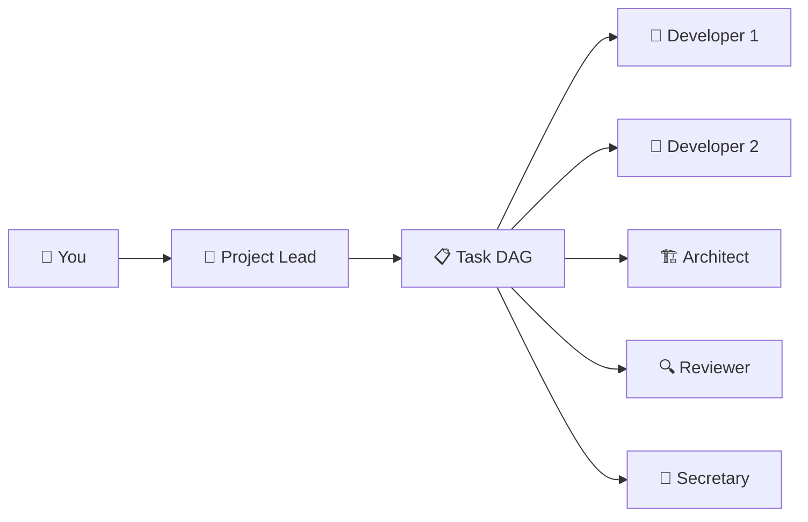

# 🤖 AI Crew

## Multi-Agent Copilot CLI Orchestrator

<br/>

Parallel AI agents that collaborate like a real engineering team

<style>
h1 { color: #58a6ff; font-size: 3em !important; }
h2 { color: #8b949e !important; font-size: 1.4em !important; }
</style>

<!--
Welcome everyone. Today I'll introduce AI Crew — a system that orchestrates
multiple Copilot CLI agents working in parallel, each with a specialized role.
Think of it as having an entire engineering team of AI agents that communicate,
coordinate, and build software together. Let's dive in.
-->

---

# The Problem

<div class="grid grid-cols-1 gap-4">
<div class="bg-gray-800 rounded-lg p-4 border border-gray-700">

### ⏳ Single-agent AI coding is **sequential**

- → One agent does everything: design → code → test → review
- → Context window fills up fast on large tasks
- → No checks and balances — one perspective
- → Long tasks block progress on other fronts
- → No specialization — jack of all trades, master of none

</div>
</div>

<br/>

<p class="text-sm text-gray-500">Real engineering teams don't work this way. Why should AI?</p>

<!--
The core problem is that current AI coding assistants work sequentially.
One agent has to do everything — and its context window is a hard ceiling.
Real engineering teams parallelize work: an architect designs while developers
code, reviewers check work, and a project lead coordinates. AI Crew brings
that same structure to AI-assisted development.
-->

---

# The Solution: AI Crew

<div class="grid grid-cols-3 gap-4 mt-4">
<div class="bg-gray-800 rounded-lg p-4 border border-gray-700">

### <span class="text-green-400">Parallel Agents</span>

Multiple Copilot CLI agents running simultaneously, each focused on what they do best

</div>
<div class="bg-gray-800 rounded-lg p-4 border border-gray-700">

### <span class="text-green-400">Specialized Roles</span>

13 purpose-built roles: lead, architect, developer, reviewer, tester, designer, and more

</div>
<div class="bg-gray-800 rounded-lg p-4 border border-gray-700">

### <span class="text-green-400">Structured Coordination</span>

Task DAGs, file locking, messaging, and real-time monitoring keep the team in sync

</div>
</div>

<!--
AI Crew solves this with three key ideas. First, parallel agents — up to 20
Copilot CLI sessions running at once. Second, specialized roles — each agent
has a distinct system prompt optimized for its job. Third, structured
coordination — a task DAG ensures work happens in the right order, file locks
prevent conflicts, and messaging keeps everyone informed.
-->

---

# How It Works



<div class="bg-gray-800 rounded-lg p-4 border border-gray-700 mt-4">

1. You describe your goal to the Project Lead
2. Lead creates a task DAG with dependencies
3. Lead spawns agents and delegates tasks
4. Agents work in parallel, communicate, and report back
5. You monitor progress and intervene when needed

</div>

<!--
Here's the flow. You give a high-level goal to the Project Lead agent.
The lead breaks it into a task DAG — a directed acyclic graph of dependent
tasks. Then it spawns specialized agents: developers to code, an architect
for design, reviewers for quality, testers for verification. Each agent
works independently within its own Copilot CLI session. You can watch
everything happen in real time through the web UI.
-->

---

# Architecture

<div class="grid grid-cols-2 gap-4">
<div>

<div class="bg-gray-800 rounded-lg p-3 border border-gray-700 mb-3">

### 🖥️ Web UI <span class="text-gray-500 text-sm">React + Vite</span>
Real-time dashboard, timeline, org chart, DAG visualization, token economics

</div>
<div class="bg-gray-800 rounded-lg p-3 border border-gray-700 mb-3">

### ⚡ Server <span class="text-gray-500 text-sm">Express + WebSocket + SSE</span>
Agent lifecycle, command dispatch, coordination, file locks, persistence

</div>
<div class="bg-gray-800 rounded-lg p-3 border border-gray-700">

### 🔌 ACP Bridge <span class="text-gray-500 text-sm">Agent Communication Protocol</span>
Bidirectional connection to each Copilot CLI session

</div>

</div>
<div>

<div class="bg-gray-800 rounded-lg p-3 border border-gray-700 mb-3">

### 📦 Packages
- `packages/server` — Node.js backend
- `packages/web` — React frontend
- `packages/docs` — Documentation

</div>
<div class="bg-gray-800 rounded-lg p-3 border border-gray-700">

### 🗄️ Storage
- SQLite (Drizzle ORM) for persistence
- In-memory state for real-time ops
- WebSocket + SSE for live updates

</div>

</div>
</div>

<!--
The architecture is a monorepo with three packages. The web UI is React
with Vite — it gives you real-time visibility into everything. The server
is Express with WebSocket and SSE for streaming updates. Under the hood,
each agent is a Copilot CLI session connected via the Agent Communication
Protocol. State is persisted in SQLite via Drizzle ORM, with hot data
kept in memory for speed.
-->

---

# 13 Specialized Agent Roles

<div class="grid grid-cols-2 gap-4">
<div class="bg-gray-800 rounded-lg p-3 border border-gray-700">

- 🎯 **Project Lead** — Orchestrates team
- 🏗️ **Architect** — System design
- 👷 **Developer** — Writes code + tests
- 🔍 **Code Reviewer** — Quality gates
- 🛡️ **Critical Reviewer** — Security & edge cases
- 🧪 **QA Tester** — End-to-end verification
- 📝 **Secretary** — Tracks progress

</div>
<div class="bg-gray-800 rounded-lg p-3 border border-gray-700">

- 🎨 **Designer** — UX/UI patterns
- 📚 **Tech Writer** — Documentation
- 💡 **Radical Thinker** — First-principles
- 📦 **Product Manager** — Requirements
- 🔧 **Generalist** — Cross-domain tasks
- 🤖 **Agent** — General purpose

<p class="text-sm text-gray-500 mt-4">Each role has a purpose-built system prompt with role-specific instructions, model preferences, and behavioral guidelines.</p>

</div>
</div>

<!--
There are 13 built-in roles, each with a tailored system prompt. The Project
Lead is the orchestrator — it breaks down work, spawns agents, and manages
the team. Developers write code AND tests — quality is their responsibility.
Code Reviewers only surface issues that truly matter — no style nits. Critical
Reviewers focus on security, performance, and failure modes. The Secretary
tracks progress and provides status reports. You can also define custom roles.
-->

---

# Task DAG — Declarative Work Planning

```ts
DECLARE_TASKS {"tasks": [
  {"id": "design",    "role": "architect",   "description": "Design API schema"},
  {"id": "implement", "role": "developer",   "description": "Build endpoints",   "deps": ["design"]},
  {"id": "test",      "role": "qa-tester",   "description": "Write E2E tests",   "deps": ["implement"]},
  {"id": "review",    "role": "code-review", "description": "Review changes",    "deps": ["implement"]},
  {"id": "docs",      "role": "tech-writer", "description": "Update API docs",   "deps": ["review", "test"]}
]}
```

<div class="grid grid-cols-3 gap-3 mt-4">
<div class="bg-gray-800 rounded-lg p-3 border border-gray-700">

### Auto-Linking
Tasks auto-link to agents when delegated — no manual tracking

</div>
<div class="bg-gray-800 rounded-lg p-3 border border-gray-700">

### Dependency Resolution
Blocked tasks auto-promote to "ready" when deps complete

</div>
<div class="bg-gray-800 rounded-lg p-3 border border-gray-700">

### Task States
<span class="text-green-400">pending → ready → running → done</span><br/>
<span class="text-sm text-gray-500">Also: failed, blocked, paused, skipped</span>

</div>
</div>

<!--
The task DAG is the brain of work coordination. The lead declares tasks with
dependencies — like a build system for work items. Tasks auto-link to agents
when delegated, and blocked tasks automatically become ready when their
dependencies complete. The system supports 9 task states with validated
transitions. This eliminates the need for manual progress tracking — the
DAG IS the source of truth.
-->

---

# Agent Communication

<div class="grid grid-cols-2 gap-4">
<div>

<div class="bg-gray-800 rounded-lg p-3 border border-gray-700 mb-3">

### 💬 Direct Messages
`AGENT_MESSAGE` — Point-to-point communication between agents by ID

</div>
<div class="bg-gray-800 rounded-lg p-3 border border-gray-700 mb-3">

### 📢 Broadcasts
`BROADCAST` — Send to all active agents at once (learnings, warnings)

</div>
<div class="bg-gray-800 rounded-lg p-3 border border-gray-700">

### 👥 Group Chat
`CREATE_GROUP` — Topic-based channels, auto-created when 3+ agents share a feature

</div>

</div>
<div>

<div class="bg-gray-800 rounded-lg p-3 border border-gray-700 mb-3">

### 📊 CREW_UPDATE
Periodic context refresh with agent status, recent activity, and budget info. Content-hashed to skip duplicates.

</div>
<div class="bg-gray-800 rounded-lg p-3 border border-gray-700">

### 🧑 Human-in-the-Loop
Message any agent directly. @mention to route messages. Queued messages show as pending bubbles.

</div>

</div>
</div>

<!--
Communication is structured, not ad-hoc. Agents send direct messages by ID,
broadcast learnings to the whole team, or create group chats for feature
coordination. CREW_UPDATE is a periodic context refresh that keeps everyone
informed — it's content-hashed so duplicates are suppressed, saving tokens.
And you're always in the loop — you can message any agent, @mention them,
or pause the entire system to review progress.
-->

---

# Coordination & Safety

<div class="grid grid-cols-2 gap-4">
<div>

<div class="bg-gray-800 rounded-lg p-3 border border-gray-700 mb-3">

### 🔒 File Locking
Pessimistic locks with TTL and glob patterns prevent concurrent edits

</div>
<div class="bg-gray-800 rounded-lg p-3 border border-gray-700">

### 📌 Scoped Commits
`COMMIT` only stages files the agent has locked — prevents cross-contamination

</div>

</div>
<div>

<div class="bg-gray-800 rounded-lg p-3 border border-gray-700 mb-3">

### ⏸️ System Pause/Resume
Halt all message delivery system-wide. Agents hold; messages queue until resumed.

</div>
<div class="bg-gray-800 rounded-lg p-3 border border-gray-700">

### 🛡️ Input Validation
Zod schemas validate every command. Clear error messages — no silent failures.

</div>

</div>
</div>

<p class="text-sm text-gray-500 mt-2">Security: auto-generated auth tokens, CORS lockdown, rate limiting, path traversal protection</p>

<!--
Coordination and safety are critical when multiple agents edit the same
codebase. File locking prevents concurrent edits — agents must lock files
before editing. The COMMIT command only stages locked files, preventing
the classic "git add -A picks up other agents' work" problem. System pause
lets you freeze everything to review state. And every command is validated
with Zod schemas — bad input gets a clear error, not silent corruption.
-->

---

# Mission Control Dashboard

<div class="grid grid-cols-3 gap-4 text-center mt-4">
<div class="bg-gray-800 rounded-lg p-4 border border-gray-700">
<div class="text-4xl font-bold text-blue-400">8</div>
<div class="text-sm text-gray-500">Configurable Panels</div>
</div>
<div class="bg-gray-800 rounded-lg p-4 border border-gray-700">
<div class="text-4xl">⚡</div>
<div class="text-sm text-gray-500">Real-time Updates</div>
</div>
<div class="bg-gray-800 rounded-lg p-4 border border-gray-700">
<div class="text-4xl">🎛️</div>
<div class="text-sm text-gray-500">Drag & Drop Layout</div>
</div>
</div>

<div class="grid grid-cols-2 gap-4 mt-4">
<div class="bg-gray-800 rounded-lg p-3 border border-gray-700">

- Health summary with completion %
- Agent fleet status overview
- Token economics per agent
- Alert feed (context pressure, idle agents)

</div>
<div class="bg-gray-800 rounded-lg p-3 border border-gray-700">

- Live activity feed
- DAG progress minimap
- Communication heatmap (real-time SSE)
- Performance scorecards

</div>
</div>

<!--
Mission Control is the single-screen overview. Eight configurable panels:
health summary, agent fleet, token economics, alerts, activity feed, DAG
minimap, communication heatmap, and performance scorecards. Everything
updates in real time via WebSocket and SSE. You can drag and drop panels
to customize your layout. The comm heatmap shows who's talking to whom —
it updates live via Server-Sent Events.
-->

---

# Timeline & Visualization

<div class="bg-gray-800 rounded-lg p-4 border border-gray-700">

### 📊 Swim-Lane Timeline

Each agent gets a lane showing activity over time. Filter by role, status, or comm type.

<div class="mt-2 space-y-1">
<div class="flex items-center gap-2"><span class="text-xs text-gray-500 w-16">Lead</span><div class="h-2 rounded bg-blue-500" style="width: 40%"></div><div class="h-2 rounded bg-yellow-500" style="width: 10%"></div><div class="h-2 rounded bg-blue-500" style="width: 30%"></div></div>
<div class="flex items-center gap-2"><span class="text-xs text-gray-500 w-16">Dev 1</span><div class="h-2 rounded bg-transparent" style="width: 15%"></div><div class="h-2 rounded bg-green-500" style="width: 55%"></div><div class="h-2 rounded bg-gray-600" style="width: 10%"></div></div>
<div class="flex items-center gap-2"><span class="text-xs text-gray-500 w-16">Reviewer</span><div class="h-2 rounded bg-transparent" style="width: 45%"></div><div class="h-2 rounded bg-yellow-500" style="width: 35%"></div></div>
</div>

<p class="text-sm text-gray-500 mt-2">Features: brush time selector, keyboard nav, auto-scroll, idle hatch patterns, hover tooltips</p>

</div>

<div class="grid grid-cols-2 gap-3 mt-3">
<div class="bg-gray-800 rounded-lg p-3 border border-gray-700">

### 🏗️ Org Chart
Hierarchical team view with project tabs
</div>
<div class="bg-gray-800 rounded-lg p-3 border border-gray-700">

### 📈 Gantt Chart
Scrollable/zoomable DAG with critical path highlighting
</div>
</div>

<!--
The timeline gives you a swim-lane view of all agent activity over time.
Each agent gets a row — blue for running, green for completed work, gray
for idle periods. You can filter by role, zoom with a brush selector, and
hover for details. The org chart shows team hierarchy. The Gantt chart
visualizes the task DAG with critical path highlighting and elapsed time
tracking.
-->

---

# Token Economics & Cost Tracking

<div class="grid grid-cols-2 gap-4">
<div class="bg-gray-800 rounded-lg p-3 border border-gray-700">

### 📊 Per-Agent Breakdown
- Input/output token counts per agent
- Context window pressure bars
- 80% yellow / 90% red thresholds
- Cost attribution per DAG task

</div>
<div class="bg-gray-800 rounded-lg p-3 border border-gray-700">

### 🧠 Smart Optimizations
- Content-hashed CREW_UPDATEs skip duplicates
- Debounced status notifications reduce churn
- Sliding window caps (500 comms, 200 tool calls)
- Context compaction detection and recovery

</div>
</div>

<div class="bg-gray-800 rounded-lg p-3 border border-gray-700 mt-3">

💡 **Why it matters:** 10 agents × 200K context = 2M tokens/session. Every optimization reduces cost and improves quality by keeping agents focused on relevant context.

</div>

<!--
With up to 20 agents, token management is crucial. The Token Economics panel
shows per-agent usage with context pressure indicators. We've built several
optimizations: content hashing skips duplicate context updates, saving 40-60%
of CREW_UPDATE tokens. Status notifications are debounced. Communication and
tool call arrays have sliding window caps. And when context compaction happens,
the system automatically re-injects crew context so agents don't lose their
bearings.
-->

---
layout: center
---

# Case Study: This Session

### Using AI Crew to improve AI Crew 🔄

<!--
Let me show you a real case study — this actual session. We started with
GitHub Issue 49, a retrospective listing 10 work items from the previous
session. The user gave a single instruction to the Project Lead. What
happened next demonstrates everything AI Crew can do.
-->

---

# Case Study: The Task

<div class="bg-gray-800 rounded-lg p-4 border border-gray-700">

**Input:** GitHub Issue #49 — retrospective with 10 work items

- <span class="text-red-400">P0</span> Auto-link accuracy fix + COMPLETE_TASK from agents
- <span class="text-yellow-400">P1</span> Smarter status updates + agent session resume
- <span class="text-green-400">P2</span> Real-time heatmap, DAG viz, input validation, cost tracking

</div>

<div class="bg-gray-800 rounded-lg p-3 border border-gray-700 mt-3">
<p class="text-sm text-gray-500">One human user. One command: "Validate that issues are fixed, and act on the proposed work." The system did the rest.</p>
</div>

<!--
We started with GitHub Issue 49, a retrospective listing 10 work items across
three priority levels. The user gave a single instruction to the Project Lead.
From there, the lead analyzed the issue, created a task DAG, and started
spawning specialists.
-->

---

# Case Study: DAG Declaration

```
DECLARE_TASKS: 19 tasks across 4 priority levels
├── validate-fixes (architect)
├── p0-2-autolink (developer)       ──┐
├── p0-3-complete-task (developer)   ──┤── code-review ──┐
├── p1-4-status-updates (developer)  ──┤                 ├── critical-review
├── p1-5-session-resume (developer)  ──┤── code-review ──┘
├── p2-7-heatmap-realtime (developer)
├── p2-8-dag-viz (developer)         [blocked on P0 tasks]
├── p2-9-input-validation (developer)
└── p2-10-cost-tracking (developer)
```

<div class="grid grid-cols-3 gap-3 mt-3 text-center">
<div class="bg-gray-800 rounded-lg p-3 border border-gray-700">
<div class="text-3xl font-bold text-blue-400">19</div>
<div class="text-sm text-gray-500">Tasks Declared</div>
</div>
<div class="bg-gray-800 rounded-lg p-3 border border-gray-700">
<div class="text-3xl font-bold text-blue-400">13</div>
<div class="text-sm text-gray-500">Agents Spawned</div>
</div>
<div class="bg-gray-800 rounded-lg p-3 border border-gray-700">
<div class="text-3xl font-bold text-blue-400">< 2 min</div>
<div class="text-sm text-gray-500">To Full Parallelism</div>
</div>
</div>

<!--
Within seconds, the lead analyzed all 10 items and created a 19-task DAG.
Implementation tasks, code reviews, and critical reviews — all with proper
dependencies. Within 2 minutes, 13 agents were running in parallel: 7
developers, an architect, a secretary, 2 code reviewers, and 2 critical
reviewers. All working simultaneously on different aspects of the project.
-->

---

# Case Study: Parallel Execution

<div class="bg-gray-800 rounded-lg p-4 border border-gray-700">

### Simultaneous Work Streams

<div class="mt-2 space-y-2">
<div class="flex items-center gap-2"><span class="text-xs text-gray-500 w-20">Dev 0b85de</span><div class="h-2 rounded bg-green-500" style="width: 60%"></div><span class="text-xs text-gray-400">P0-2: Auto-link fix</span></div>
<div class="flex items-center gap-2"><span class="text-xs text-gray-500 w-20">Dev 2cf55f</span><div class="h-2 rounded bg-green-500" style="width: 55%"></div><span class="text-xs text-gray-400">P0-3: COMPLETE_TASK</span></div>
<div class="flex items-center gap-2"><span class="text-xs text-gray-500 w-20">Dev f026d3</span><div class="h-2 rounded bg-blue-500" style="width: 50%"></div><span class="text-xs text-gray-400">P1-4: Status updates</span></div>
<div class="flex items-center gap-2"><span class="text-xs text-gray-500 w-20">Dev bf1ec2</span><div class="h-2 rounded bg-blue-500" style="width: 45%"></div><span class="text-xs text-gray-400">P2-7: Real-time heatmap</span></div>
<div class="flex items-center gap-2"><span class="text-xs text-gray-500 w-20">Reviewer</span><div class="h-2 rounded bg-transparent" style="width: 20%"></div><div class="h-2 rounded bg-yellow-500" style="width: 40%"></div><span class="text-xs text-gray-400">Reviewing P0-2, P0-3</span></div>
<div class="flex items-center gap-2"><span class="text-xs text-gray-500 w-20">Critical Rev</span><div class="h-2 rounded bg-transparent" style="width: 30%"></div><div class="h-2 rounded bg-red-400" style="width: 35%"></div><span class="text-xs text-gray-400">Security review</span></div>
</div>

</div>

<p class="text-sm text-gray-500 mt-2">Each developer locked specific files, worked independently, and committed their own changes.</p>

<!--
Here's what parallel execution looked like. Six work streams running
simultaneously — each developer editing different files, locked to prevent
conflicts. Reviewers started as soon as implementations were committed.
The critical reviewer found a security issue in COMPLETE_TASK — any agent
could complete any other agent's task. That was fixed within minutes.
-->

---

# Case Study: When Things Go Wrong

<div class="bg-gray-800 rounded-lg p-4 border border-red-500">

### <span class="text-red-400">Bug: 7 False Task Completions</span>

The auto-linker matched wrong tasks when multiple tasks shared the same role. DAG showed 86% complete when actual progress was ~40%.

</div>

<div class="grid grid-cols-2 gap-3 mt-3">
<div class="bg-gray-800 rounded-lg p-3 border border-gray-700">

### Root Cause
Fuzzy matching returned the *first* candidate instead of `null` when scores were ambiguous

</div>
<div class="bg-gray-800 rounded-lg p-3 border border-gray-700">

### Fix
Return null when score gap < 0.15 between candidates. Force explicit `dagTaskId` when ambiguous.

</div>
</div>

<div class="bg-gray-800 rounded-lg p-3 border border-gray-700 mt-3">
<p class="text-sm"><span class="text-green-400">Discovered by:</span> Secretary flagged anomaly → Architect investigated → Developer fixed → 107 tests pass</p>
</div>

<!--
Not everything went smoothly. The auto-linking system had a subtle bug:
when 7 developer tasks all had the same role, fuzzy matching returned the
first candidate instead of null when it was uncertain. This caused 7 false
task completions — the DAG looked 86% done when it was really 40%. The
secretary flagged the anomaly, the architect analyzed it, the developer
fixed it, and 107 tests confirmed the fix. The agents debugged their own
orchestration system — while running on it.
-->

---

# Case Study: Cross-Contamination

<div class="bg-gray-800 rounded-lg p-4 border border-yellow-500">

### <span class="text-yellow-400">Challenge: Agents Committing Each Other's Code</span>

When one agent ran `git add -A`, it picked up uncommitted changes from other agents working in the same repo.

</div>

<div class="bg-gray-800 rounded-lg p-3 border border-gray-700 mt-3">

### Real Example
- Agent A's commit included Agent B's `api.ts` changes
- Agent C's `CommEventExtractor.ts` was never committed (only `FleetOverview.tsx` was locked)
- 5 files from P2-7 needed a second commit to be properly tracked

</div>

<div class="bg-gray-800 rounded-lg p-3 border border-gray-700 mt-3">

### <span class="text-green-400">Solution: Defense in Depth</span>
- Scoped `COMMIT` only stages locked files
- Code reviewer caught untracked files immediately
- Lead broadcast a process warning to all 13 agents

</div>

<!--
Cross-contamination was our biggest coordination challenge. When one agent
committed, it accidentally included another agent's uncommitted changes.
We solved this with scoped commits that only stage locked files, plus
code reviewers who caught untracked files immediately. The lead even
broadcast a process warning to all 13 agents. This is a distributed
systems problem — and we're solving it with distributed systems patterns.
-->

---

# Case Study: Eliminating Bottlenecks

<div class="bg-gray-800 rounded-lg p-4 border border-gray-700">

### Problem: Monolithic Files Block Parallel Work

<div class="grid grid-cols-3 gap-3 mt-2">
<div>

`api.ts` — **1,945 lines**
<span class="text-xs text-gray-500">3 agents needed it simultaneously</span>

</div>
<div>

`Agent.ts` — **767 lines**
<span class="text-xs text-gray-500">2 agents editing different concerns</span>

</div>
<div>

`AgentCommands.ts` — **662 lines**
<span class="text-xs text-gray-500">P0-2 and P0-3 blocked each other</span>

</div>
</div>
</div>

<div class="bg-gray-800 rounded-lg p-3 border border-gray-700 mt-3">

### <span class="text-green-400">Solution: Architect-Planned Decomposition</span>
- `api.ts` → 12 Express sub-router modules
- `Agent.ts` → Agent (core) + AgentAcpBridge + AgentEvents
- `AgentCommands.ts` → AgentLifecycle + CompletionTracking

<p class="text-sm text-gray-500 mt-1">Thin re-export wrappers preserved all existing imports. Zero breaking changes.</p>

</div>

<!--
Three monolithic files caused lock contention — multiple agents needed the
same file at the same time. The architect designed a decomposition plan,
and developers split each file into focused modules. api.ts went from
1,945 lines to 12 route modules. Agent.ts split into core, ACP bridge,
and event emitter. All existing imports kept working through re-export
wrappers. This eliminated the bottleneck for future sessions.
-->

---
layout: center
---

# Case Study: Results

<div class="grid grid-cols-4 gap-4 text-center mt-4">
<div class="bg-gray-800 rounded-lg p-4 border border-gray-700">
<div class="text-4xl font-bold text-blue-400">13</div>
<div class="text-sm text-gray-500">Parallel Agents</div>
</div>
<div class="bg-gray-800 rounded-lg p-4 border border-gray-700">
<div class="text-4xl font-bold text-blue-400">10</div>
<div class="text-sm text-gray-500">Features Shipped</div>
</div>
<div class="bg-gray-800 rounded-lg p-4 border border-gray-700">
<div class="text-4xl font-bold text-blue-400">1,752</div>
<div class="text-sm text-gray-500">Tests Passing</div>
</div>
<div class="bg-gray-800 rounded-lg p-4 border border-gray-700">
<div class="text-4xl font-bold text-blue-400">~40min</div>
<div class="text-sm text-gray-500">Wall Clock Time</div>
</div>
</div>

<div class="bg-gray-800 rounded-lg p-3 border border-gray-700 mt-4 text-left">

Plus: 6 code reviews, 6 critical reviews, 1 security fix, 3 file decompositions, docs consolidation, and this presentation.

<p class="text-sm text-gray-500 mt-1">The agents improved the system they were running on — fixing bugs in their own orchestration layer while it coordinated them.</p>

</div>

<!--
The final tally: 13 agents, 10 features, 1,752 tests, in about 40 minutes.
That includes code reviews and critical reviews for every feature. The
system discovered and fixed bugs in its own orchestration layer —
including the false-completion bug and a security vulnerability in
COMPLETE_TASK. Meta-debugging: agents debugging the system that coordinates
them.
-->

---

# What Makes AI Crew Different

<div class="grid grid-cols-2 gap-4">
<div class="bg-gray-800 rounded-lg p-4 border border-gray-700">

### 🔄 vs. Single Agent
- 10x parallelism on large tasks
- Built-in peer review catches bugs
- Each agent has focused context
- Human stays in control

</div>
<div class="bg-gray-800 rounded-lg p-4 border border-gray-700">

### 🔄 vs. Other Multi-Agent
- Real Copilot CLI sessions (full tool access)
- Persistent state across sessions
- Production-grade coordination (DAG, locks, validation)
- Rich real-time observability

</div>
</div>

<!--
Compared to single-agent approaches, AI Crew offers real parallelism
with built-in quality gates. Compared to other multi-agent frameworks,
the key difference is that each agent is a real Copilot CLI session with
full tool access — file editing, terminal commands, web search, everything.
The coordination layer is production-grade with dependency resolution,
file locking, input validation, and rich observability.
-->

---

# Design Philosophy

<div class="bg-gray-800 rounded-lg p-4 border border-blue-500 mb-4">

### <span class="text-blue-400">"Fail-safe over clever"</span>

In multi-agent systems, a wrong answer is far worse than no answer.

</div>

<div class="grid grid-cols-3 gap-3">
<div class="bg-gray-800 rounded-lg p-3 border border-gray-700">

### Explicit > Implicit
- Auto-linking returns null when ambiguous
- Agents must use `dagTaskId` for certainty
- Zod validates every command input

</div>
<div class="bg-gray-800 rounded-lg p-3 border border-gray-700">

### Observe Everything
- Every action logged to ActivityLedger
- SSE streams all events to the UI
- Comm heatmap shows agent interactions

</div>
<div class="bg-gray-800 rounded-lg p-3 border border-gray-700">

### Specialize & Separate
- Roles have distinct system prompts
- Reviewers don't code; devs don't review
- Small focused files over monoliths

</div>
</div>

<!--
Our design philosophy boils down to three principles. First, fail-safe
over clever — when auto-linking is uncertain, return null instead of
guessing. Second, observe everything — every action, message, and state
change is logged and streamed to the UI. Third, specialize and separate —
each role has distinct capabilities, and code is structured in small
focused files. In multi-agent systems, 80% of bugs are coordination bugs,
not coding bugs.
-->

---

# Lessons Learned

<div class="grid grid-cols-2 gap-4">
<div class="bg-gray-800 rounded-lg p-4 border border-gray-700">

### <span class="text-yellow-400">Challenges</span>
- Cross-contamination when agents commit each other's changes
- File lock contention on monolithic files
- Token cost scales with agent count
- Context loss during compaction
- False task completions from ambiguous matching

</div>
<div class="bg-gray-800 rounded-lg p-4 border border-gray-700">

### <span class="text-green-400">Solutions</span>
- Scoped COMMIT only stages locked files
- File decomposition eliminates contention
- Content hashing reduces token waste 40-60%
- Auto re-injection after compaction
- Fail-safe: return null when uncertain

</div>
</div>

<p class="text-sm text-gray-500 mt-2"><strong>Key insight:</strong> Multi-agent coordination is a distributed systems problem. Apply distributed systems patterns: idempotency, explicit acknowledgment, pessimistic locking, observability.</p>

<!--
The biggest lesson: multi-agent coordination is a distributed systems
problem. Every challenge we faced has a parallel in distributed computing:
cross-contamination is like a dirty read, file lock contention is like
database lock contention, and false completions are like phantom reads.
The solutions are the same too: scoped transactions, decomposition,
deduplication, and fail-safe defaults.
-->

---

# Roadmap

<div class="bg-gray-800 rounded-lg p-3 border border-gray-700 mb-3">

### 🔜 Near Term
- Git worktree isolation — each agent gets its own branch, eliminating cross-contamination
- Smarter context management with priority-based trimming
- Agent skill system — persistent reusable knowledge across sessions

</div>
<div class="bg-gray-800 rounded-lg p-3 border border-gray-700 mb-3">

### 🔮 Medium Term
- Multi-repo support — agents spanning codebases
- CI/CD integration — automatic test verification after commits
- Agent memory — learned patterns and preferences persist

</div>
<div class="bg-gray-800 rounded-lg p-3 border border-gray-700">

### 🚀 Long Term
- Self-improving teams — agents create skills from experience
- Cross-team coordination — multiple AI crews on the same project
- Cost optimization — automatic model selection per task complexity

</div>

<!--
The roadmap focuses on three horizons. Near term: git worktree isolation
to eliminate file contention entirely, smarter context management, and
persistent skills. Medium term: multi-repo support and CI/CD integration.
Long term: self-improving teams where agents learn from experience and
automatically create reusable skills.
-->

---

# Live Demo

<div class="bg-gray-800 rounded-lg p-3 border border-gray-700 mb-3">

### Setup
```bash
npm install && npm run dev
# Server: http://localhost:3001  |  Web UI: http://localhost:5173
```

</div>

<div class="bg-gray-800 rounded-lg p-4 border border-gray-700">

### Demo Script (~7 minutes)

1. Show the empty dashboard — Mission Control, DAG view, agent panel
2. Give the lead a task: *"Add a /health endpoint that returns uptime and agent count"*
3. Watch the lead create a DAG and spawn agents
4. Show file locking, real-time agent output, and CREW_UPDATE injection
5. Demonstrate human-in-the-loop: message an agent mid-task
6. Show the communication heatmap and timeline after completion

</div>

<p class="text-sm text-gray-500 mt-2">💡 Backup: If demo issues arise, use System Pause — it's a feature, not a bug!</p>

<!--
Time for a live demo. I'll walk through the full cycle: giving a task,
watching the lead plan and delegate, seeing agents work in parallel, and
monitoring the results. If anything goes wrong, System Pause freezes
everything — which is itself a demo of the safety features.
-->

---

# What to Watch For

<div class="grid grid-cols-2 gap-4">
<div class="bg-gray-800 rounded-lg p-4 border border-gray-700">

### 🎯 Lead Planning
Watch the lead analyze the task, create a DAG, and choose which roles to spawn

</div>
<div class="bg-gray-800 rounded-lg p-4 border border-gray-700">

### 🔒 File Locking
See agents lock specific files — lock status updates across the dashboard

</div>
<div class="bg-gray-800 rounded-lg p-4 border border-gray-700">

### 💬 Agent Communication
Watch agents message each other with status reports, questions, and coordination

</div>
<div class="bg-gray-800 rounded-lg p-4 border border-gray-700">

### 📊 Real-Time Observability
Timeline, heatmap, and DAG all update live as agents work

</div>
</div>

<!--
Four things to watch during the demo. First, how the lead plans — it
doesn't just start coding, it creates a structured DAG. Second, file
locking — you'll see agents claim files and the dashboard update in real
time. Third, agent communication — agents send status reports and
coordinate through messages. Fourth, observability — everything updates
live.
-->

---

# Getting Started

<div class="bg-gray-800 rounded-lg p-3 border border-gray-700 mb-3">

```bash
# Clone and install
git clone https://github.com/justinchuby/ai-crew.git
cd ai-crew && npm install

# Development mode (hot reload)
npm run dev

# Production
npm run build && npm start
```

</div>

<div class="grid grid-cols-2 gap-3">
<div class="bg-gray-800 rounded-lg p-3 border border-gray-700">

### Requirements
- Node.js 18+
- GitHub Copilot CLI access
- Copilot subscription

</div>
<div class="bg-gray-800 rounded-lg p-3 border border-gray-700">

### Resources
- README.md — Full feature list
- packages/docs/ — Guides
- .github/skills/ — Reusable patterns

</div>
</div>

<!--
Getting started is straightforward — clone, install, and run. You need
Node.js 18+ and Copilot CLI access. The dev mode gives you hot reload
for the web UI.
-->

---
layout: center
---

# Questions?

<br/>

🤖 AI Crew — <span class="text-blue-400">Parallel AI agents that collaborate like a real engineering team</span>

<br/>

*"The goal isn't to replace developers — it's to give every developer a team of specialized AI agents."*

<br/>

<span class="text-sm text-gray-500">github.com/justinchuby/ai-crew</span>

<!--
That's the full overview — architecture, features, a real case study,
and a live demo. I'm happy to take questions about anything: the
architecture, coordination challenges, cost considerations, how to
adapt this for your projects, or anything else.
-->
