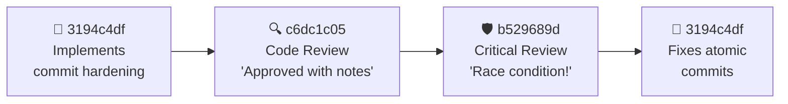
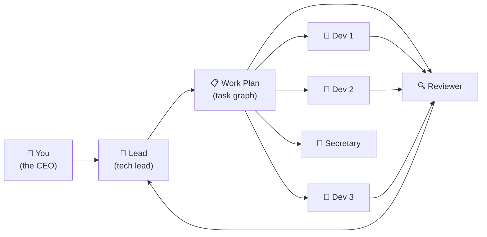

<div class="text-center">

# <span class="text-blue-400">13 AI agents.</span> <span class="text-green-400">10 features.</span> <span class="text-yellow-400">30 minutes.</span>

<br/>

<div class="text-2xl text-gray-400">We gave one AI a to-do list.</div>
<div class="text-2xl text-gray-400">It hired 12 specialists and managed them all.</div>

<br/>

<div class="text-lg text-gray-500">This is the story of that session.</div>

</div>

<style>
h1 { font-size: 2.4em !important; line-height: 1.3 !important; }
</style>

<!--
Don't start with slides. Start with this: "Yesterday, I gave an AI a to-do list
with 10 items. Within two minutes, it had hired 12 other AIs — developers,
reviewers, an architect, a secretary — and started coordinating all of them.
30 minutes later, 10 features were shipped, 3 bugs were caught in code review,
and one agent found a security vulnerability in another agent's code. I want
to tell you the story of what happened."
-->

---
layout: center
---

<div class="text-center">

# What if you could do this?

<br/>

<div class="bg-gray-800 rounded-lg p-6 border border-gray-700 text-left max-w-lg mx-auto">

<span class="text-gray-500">You:</span> <span class="text-green-400">"Here are 10 things from our retrospective. Fix them all."</span>

<br/><br/>

<span class="text-gray-500">30 minutes later:</span>

- ✅ 10 features implemented
- ✅ Every feature code-reviewed
- ✅ Security vulnerability caught and fixed
- ✅ 1,752 tests passing
- ✅ Documentation updated

</div>

</div>

<!--
Imagine this scenario. You paste a GitHub issue into a chat — a retro with
10 things to fix. You type one sentence: "Fix these." Half an hour later,
everything is done. Not just coded — reviewed, tested, documented. That's
not hypothetical. That's what happened.
-->

---

# Here's what actually happened

<br/>

<div class="space-y-4">

<div class="flex items-start gap-3">
<div class="text-2xl">📋</div>
<div><strong class="text-blue-400">The Lead read the issue</strong> — 10 work items across 3 priority levels</div>
</div>

<div class="flex items-start gap-3">
<div class="text-2xl">🧠</div>
<div><strong class="text-blue-400">It made a plan</strong> — broke the work into 19 tasks with dependencies</div>
</div>

<div class="flex items-start gap-3">
<div class="text-2xl">👥</div>
<div><strong class="text-blue-400">It hired a team</strong> — 7 developers, 1 architect, 2 code reviewers, 2 security reviewers, 1 secretary</div>
</div>

<div class="flex items-start gap-3">
<div class="text-2xl">⚡</div>
<div><strong class="text-blue-400">They all started at once</strong> — each with their own terminal, their own files, their own job</div>
</div>

<div class="flex items-start gap-3">
<div class="text-2xl">🔄</div>
<div><strong class="text-blue-400">They coordinated in real-time</strong> — messaging each other, reviewing each other's work, flagging problems</div>
</div>

</div>

<!--
Here's the sequence. The lead AI read the GitHub issue. Analyzed 10 items.
Built a dependency graph — which tasks block which. Then it started spawning
specialists. Not random agents — specific roles chosen for specific tasks.
A developer for each feature. Reviewers who'd check the work. A secretary
to track progress. Within 2 minutes, 13 agents were running simultaneously.
Each one has its own terminal session with full access to the codebase.
-->

---

# Meet the crew

<div class="grid grid-cols-3 gap-3 mt-2">
<div class="bg-gray-800 rounded-lg p-3 border border-blue-500">

### 🎯 The Lead
Reads your goal, makes the plan, hires the team, manages everything

</div>
<div class="bg-gray-800 rounded-lg p-3 border border-green-500">

### 👷 The Developers
Write the actual code. Each one owns specific files. They write their own tests — quality is their job.

</div>
<div class="bg-gray-800 rounded-lg p-3 border border-yellow-500">

### 🔍 The Reviewers
Read every line of code the developers write. Only flag real bugs — no style nits.

</div>
<div class="bg-gray-800 rounded-lg p-3 border border-red-500">

### 🛡️ The Security Reviewer
Looks for vulnerabilities, edge cases, and failure modes. Found a real one this session.

</div>
<div class="bg-gray-800 rounded-lg p-3 border border-purple-500">

### 🏗️ The Architect
Designs the system structure. Plans how to split large files so agents don't block each other.

</div>
<div class="bg-gray-800 rounded-lg p-3 border border-gray-500">

### 📝 The Secretary
Tracks every task. Flagged when the progress dashboard said 86% but reality was 40%.

</div>
</div>

<p class="text-sm text-gray-500 mt-2">Each agent is a real Copilot CLI session — same as what you use every day. Full terminal, file editing, search, everything.</p>

<!--
These aren't toy agents with limited capabilities. Each one is a full
Copilot CLI session — the same tool you use. Terminal access, file editing,
web search, everything. The Lead is like a tech lead — it doesn't code,
it manages. Developers do the work. Reviewers check it. The secretary
caught a major bug this session — we'll get to that. The key insight:
specialization makes each agent better at its job.
-->

---
layout: center
---

<div class="text-center">

# Now let's watch them work

<div class="text-xl text-gray-400 mt-4">Five stories from a single 30-minute session</div>

</div>

<!--
I want to show you five specific moments from this session. Not
architecture diagrams — actual things that happened. Behaviors that
surprised us. Things that went wrong and how the agents handled them.
-->

---

# Story 1: The Security Bug

<div class="bg-gray-800 rounded-lg p-4 border border-red-500 mt-2">

A developer built a feature called COMPLETE_TASK — it lets agents mark their work as done.

The security reviewer read every line and found this:

<div class="bg-gray-900 rounded p-3 mt-2 text-sm">

⚠️ <span class="text-red-400">"Any agent can complete any other agent's task. Agent A could mark Agent B's task as done without doing the work."</span>

</div>

</div>

<div class="bg-gray-800 rounded-lg p-3 border border-gray-700 mt-3">

### What happened next

1. Security reviewer sent a detailed report to the developer
2. Developer added authentication — agents can only complete *their own* tasks
3. Added input length limits to prevent abuse
4. Reviewer verified the fix

<span class="text-green-400">Time from discovery to fix: ~4 minutes</span>

</div>

<!--
The developer built COMPLETE_TASK — a command that lets agents mark their
work as done. Seems straightforward. But the security reviewer — whose
only job is finding vulnerabilities — read every line and realized: there's
no authentication. Any agent could complete any other agent's task. In a
multi-agent system, that's like giving every employee the ability to sign
off on anyone else's work. The developer fixed it in minutes. This is why
you want specialists — a generalist might have missed this.
-->

---

# Story 2: The Mystery of 86%

<div class="bg-gray-800 rounded-lg p-4 border border-yellow-500 mt-2">

The secretary was tracking progress. Something didn't add up.

<div class="bg-gray-900 rounded p-3 mt-2 text-sm">

📊 <span class="text-yellow-400">"The dashboard shows 86% of tasks complete. But I count only 4 of 10 features actually working. Something is wrong with the task tracking."</span>

</div>

</div>

<div class="bg-gray-800 rounded-lg p-3 border border-gray-700 mt-3">

### The detective work

- Secretary flagged the anomaly to the Lead
- Architect investigated the matching system
- Found the bug: when 7 tasks all have the role "developer," the system guessed which one was done — and guessed wrong **7 times**
- Fix: when uncertain, **say "I don't know"** instead of guessing

</div>

<p class="text-sm text-gray-500 mt-2">The agents debugged their own coordination system — while running on it.</p>

<!--
This is my favorite story. The secretary — whose job is just tracking
progress — noticed the numbers didn't add up. 86% complete, but only
4 features working? It flagged this to the lead. The architect
investigated and found a subtle bug: when multiple tasks share the same
role, the system was guessing which task was done — and guessing wrong.
Seven false completions. The fix was simple but profound: when you're not
sure, say "I don't know" instead of guessing. The agents literally
debugged the system that was coordinating them. Meta-debugging.
-->

---

# Story 3: The Commit Catastrophe

<div class="bg-gray-800 rounded-lg p-4 border border-yellow-500 mt-2">

All 7 developers are editing files in the same codebase, at the same time.

Developer A finishes and commits. But the commit includes Developer B's half-finished changes.

<div class="bg-gray-900 rounded p-3 mt-2 text-sm">

🔀 <span class="text-yellow-400">"5 files were never committed. 1 commit included another agent's code. The git history is a mess."</span>

</div>

</div>

<div class="bg-gray-800 rounded-lg p-3 border border-gray-700 mt-3">

### How the system responded

1. **Code reviewer** caught the missing files immediately
2. **Lead** broadcast a warning to all 13 agents: *"Never use git add -A"*
3. **Architect** audited the commit system and found 4 gaps
4. **Developer** hardened the commit command — it now only stages files you've explicitly claimed

</div>

<!--
This is the messy reality of multiple agents sharing one repo. Developer A
commits and accidentally grabs Developer B's uncommitted changes. Five
files from another feature never get committed because the agent only locked
one of six files. The code reviewer caught it immediately. The lead
broadcast a process warning to all 13 agents simultaneously. The architect
audited the whole commit system and found gaps. By the end of the session,
they'd built a hardened commit system. This is what I mean by agents
behaving like a real team — they don't just code, they improve their own
processes.
-->

---

# Story 4: The File Contention Problem

<div class="bg-gray-800 rounded-lg p-4 border border-gray-700 mt-2">

Three agents all needed the same file: <code>api.ts</code> — **1,945 lines**.

<div class="mt-3 space-y-1">
<div class="flex items-center gap-2">
<span class="w-4 h-4 rounded bg-red-500 inline-block"></span>
<span>Developer A needs to add an SSE endpoint</span>
</div>
<div class="flex items-center gap-2">
<span class="w-4 h-4 rounded bg-red-500 inline-block"></span>
<span>Developer B needs to add a new API route</span>
</div>
<div class="flex items-center gap-2">
<span class="w-4 h-4 rounded bg-red-500 inline-block"></span>
<span>Developer C needs to fix the WebSocket handler</span>
</div>
</div>

Only one can lock the file at a time. Two developers are **blocked**.

</div>

<div class="bg-gray-800 rounded-lg p-3 border border-green-500 mt-3">

### The architect's solution
Split `api.ts` into **12 focused modules**. Now agents lock only the routes they need. Zero contention.

<span class="text-sm text-gray-500">Same pattern: 767-line Agent.ts → 3 modules. 662-line AgentCommands.ts → 2 modules.</span>

</div>

<!--
Here's a problem nobody predicted. Three agents need the same file.
But only one can lock it at a time. Two are stuck waiting. The architect
realized this was a systemic problem — monolithic files create bottlenecks
for parallel work. So the architect designed a decomposition plan, and
developers split the biggest files into focused modules. api.ts went from
one 1,945-line file to twelve small route modules. Now agents only lock what
they need. The system evolved its own codebase to be more parallelizable.
That's emergent behavior from a multi-agent system.
-->

---

# Story 5: The Lead Managing 12 Workers

<div class="bg-gray-800 rounded-lg p-4 border border-gray-700 mt-2">

<div class="text-sm space-y-2">

<div class="flex items-start gap-2">
<span class="text-blue-400 font-mono text-xs w-14 shrink-0">17:16:16</span>
<span>Lead delegates presentation review to Code Reviewer</span>
</div>
<div class="flex items-start gap-2">
<span class="text-blue-400 font-mono text-xs w-14 shrink-0">17:18:06</span>
<span>Code Reviewer reports findings → Lead processes</span>
</div>
<div class="flex items-start gap-2">
<span class="text-blue-400 font-mono text-xs w-14 shrink-0">17:18:53</span>
<span>Developer reports UI bug fix → Lead assigns follow-up review</span>
</div>
<div class="flex items-start gap-2">
<span class="text-blue-400 font-mono text-xs w-14 shrink-0">17:21:57</span>
<span><span class="text-yellow-400">Lead broadcasts process warning to ALL 13 agents</span></span>
</div>
<div class="flex items-start gap-2">
<span class="text-blue-400 font-mono text-xs w-14 shrink-0">17:22:46</span>
<span>Developer asks about DAG bug → Lead redirects to Architect</span>
</div>
<div class="flex items-start gap-2">
<span class="text-blue-400 font-mono text-xs w-14 shrink-0">17:23:14</span>
<span>Lead delegates commit audit to Architect + safety tests to Developer</span>
</div>

</div>

</div>

<p class="text-sm text-gray-500 mt-2">In a 7-minute window: 6 decisions, 4 delegations, 1 broadcast, 1 redirect. This is what orchestration looks like.</p>

<!--
Let me zoom into a 7-minute window of the lead's activity. It's receiving
completion reports, delegating follow-up work, broadcasting warnings,
redirecting questions to the right expert. It delegated two tasks
simultaneously — a commit system audit to the architect and safety tests
to a developer. It noticed uncommitted files and assigned cleanup. This is
what managing a team looks like — and it's happening autonomously. The lead
made 6 decisions in 7 minutes, keeping 12 other agents productive.
-->

---

# How 8 Developers Shared One Codebase

<div class="bg-gray-800 rounded-lg p-4 border border-gray-700 mt-2">

<div class="text-sm space-y-1">
<div class="flex items-center gap-2"><span class="font-mono text-xs text-gray-500 w-16">0b85de</span><span class="text-green-400">→</span> <code class="text-xs">findReadyTask.ts</code> <span class="text-gray-600">🔒</span></div>
<div class="flex items-center gap-2"><span class="font-mono text-xs text-gray-500 w-16">2cf55f</span><span class="text-green-400">→</span> <code class="text-xs">AgentLifecycle.ts, TaskDAG.ts</code> <span class="text-gray-600">🔒</span></div>
<div class="flex items-center gap-2"><span class="font-mono text-xs text-gray-500 w-16">bf1ec2</span><span class="text-green-400">→</span> <code class="text-xs">CommEventExtractor.ts, useTimelineSSE.ts</code> <span class="text-gray-600">🔒</span></div>
<div class="flex items-center gap-2"><span class="font-mono text-xs text-gray-500 w-16">3194c4</span><span class="text-green-400">→</span> <code class="text-xs">CoordCommands.ts</code> <span class="text-gray-600">🔒</span></div>
<div class="flex items-center gap-2"><span class="font-mono text-xs text-gray-500 w-16">3811ed</span><span class="text-green-400">→</span> <code class="text-xs">BrushTimeSelector.tsx, LeadDashboard.tsx</code> <span class="text-gray-600">🔒</span></div>
<div class="flex items-center gap-2"><span class="font-mono text-xs text-gray-500 w-16">55753</span><span class="text-green-400">→</span> <code class="text-xs">CommandDispatcher.ts</code> <span class="text-gray-600">🔒</span></div>
<div class="flex items-center gap-2"><span class="font-mono text-xs text-gray-500 w-16">31022d</span><span class="text-green-400">→</span> <code class="text-xs">TimerDisplay/, AcpOutput.tsx</code> <span class="text-gray-600">🔒</span></div>
<div class="flex items-center gap-2"><span class="font-mono text-xs text-gray-500 w-16">f026d3</span><span class="text-green-400">→</span> <code class="text-xs">docs/guide/*.md</code> <span class="text-gray-600">🔒</span></div>
</div>

</div>

<div class="bg-gray-800 rounded-lg p-3 border border-green-500 mt-3">

🔒 **File locking** = each developer "owns" their files. Attempt to edit a locked file → blocked. No merge conflicts, no overwrites, no surprises.

</div>

<p class="text-sm text-gray-500 mt-2">8 developers, 15+ files, zero conflicts. Traditional git would have been a nightmare.</p>

<!--
Eight developers, one repo, no conflicts. How? File locking. Each developer
claims the files they need — like checking out a library book. If someone
else tries to edit a locked file, they're blocked. No merge conflicts, no
overwritten work. This is pessimistic locking — the same pattern databases
use. It's not fancy, but it works perfectly when you have 8 agents writing
code simultaneously.
-->

---

# The Review Chain: From Code to Bulletproof

<div class="bg-gray-800 rounded-lg p-3 border border-gray-700 mt-2">



</div>

<div class="grid grid-cols-3 gap-2 mt-3 text-sm">
<div class="bg-gray-800 rounded-lg p-2 border border-gray-700">

**Code Reviewer** found:
- Missing test for dirty-file check
- Suggested scoping improvements

</div>
<div class="bg-gray-800 rounded-lg p-2 border border-red-500">

**Critical Reviewer** found:
- ⚠️ **Race condition**: two agents committing simultaneously share a git index — cross-contamination possible
- Fix: atomic `git commit -- files`

</div>
<div class="bg-gray-800 rounded-lg p-2 border border-green-500">

**Developer** fixed all 3 issues in commit `de3e414`. Tests pass.

</div>
</div>

<!--
Watch how a real review chain works. Developer 3194c4df built the scoped
commit hardening — 4 safety features. Code reviewer c6dc1c05 approved it
but noted a missing test. Then the critical reviewer — whose job is
finding things that can go wrong — found a race condition. Two agents
committing at the same time share a git index file. That means Agent A's
"git add" could include Agent B's files before "git commit" runs. The fix:
pass files directly to git commit with the double-dash syntax. One line
change, but it prevents a class of bugs that only exist in multi-agent
environments. Three passes, three different perspectives, bulletproof result.
-->

---

# Agents Talking to Each Other

<div class="bg-gray-800 rounded-lg p-4 border border-gray-700 mt-2">

<div class="text-sm space-y-3">

<div class="flex items-start gap-2">
<span class="text-purple-400">🏗️ 437a822b</span>
<span>→ writes architecture design → sends to <span class="text-green-400">👷 2cf55f61</span> and <span class="text-green-400">👷 0b85de78</span></span>
</div>

<div class="flex items-start gap-2">
<span class="text-green-400">👷 f026d3d1</span>
<span>→ investigates highlight display bug → sends findings directly to <span class="text-green-400">👷 3811edef</span> who's fixing it</span>
</div>

<div class="flex items-start gap-2">
<span class="text-green-400">👷 bf1ec2c1</span>
<span>→ finishes real-time heatmap → reports to Lead → Lead assigns reviewer</span>
</div>

<div class="flex items-start gap-2">
<span class="text-yellow-400">📝 35feec68</span>
<span>→ tracks all 19 tasks → flags "86% complete" anomaly → triggers investigation</span>
</div>

</div>
</div>

<div class="bg-gray-800 rounded-lg p-3 border border-blue-500 mt-3">

💡 **Not everything goes through the Lead.** Agents message each other directly for peer coordination — the architect sends specs to developers, one developer shares investigation results with another. The lead only gets involved for decisions and delegation.

</div>

<!--
The communication patterns are fascinating. Not everything flows through
the lead — that would be a bottleneck. The architect sends design specs
directly to the developers who need them. Developer f026d3d1 investigated
a UI bug and sent the findings directly to developer 3811edef who was
assigned to fix it. The secretary tracked progress independently and
flagged anomalies. This is organic team communication — agents figuring
out who needs what information and sending it directly. The lead stays
focused on decisions, not message routing.
-->

---

# The Bug That Only Exists in Multi-Agent Systems

<div class="bg-gray-800 rounded-lg p-4 border border-red-500 mt-2">

### Critical reviewer b529689d discovered:

<div class="bg-gray-900 rounded p-3 mt-2 text-sm font-mono">
<div class="text-gray-500"># Agent A (17:23:01)</div>
<div>git add CoordCommands.ts</div>
<div class="text-gray-500"># Agent B (17:23:01) — same millisecond!</div>
<div>git add AgentLifecycle.ts</div>
<div class="text-gray-500"># Agent A (17:23:02)</div>
<div>git commit -m "hardening"</div>
<div class="text-red-400"># ⚠️ Agent A's commit now contains Agent B's file!</div>
</div>

</div>

<div class="bg-gray-800 rounded-lg p-3 border border-gray-700 mt-3">

**Why this matters:** This bug is *invisible* in single-agent systems. It only appears when multiple agents share a git working directory and commit concurrently. The critical reviewer — who never wrote any code — found it by reasoning about concurrent execution.

</div>

<div class="bg-gray-800 rounded-lg p-3 border border-green-500 mt-2">

**Fix:** <code>git commit -m "msg" -- file1 file2</code> — atomic, no shared state.

</div>

<!--
This is the most interesting bug of the session. It only exists because
multiple agents share one git working directory. Git's staging area — the
index — is a single file. When Agent A runs "git add" and then "git commit",
there's a window where Agent B's "git add" can slip in between. Agent A's
commit now includes Agent B's file. The critical reviewer found this by
thinking about what happens when two agents commit at the exact same time.
No single-agent system would ever have this bug. The fix is elegant: pass
files directly to git commit, bypassing the shared index entirely. This is
why specialized reviewers matter — they think about failure modes that
developers don't.
-->

---
layout: center
---

# The final tally

<div class="grid grid-cols-2 gap-6 mt-4 max-w-2xl mx-auto">
<div class="text-right space-y-3">
<div class="text-4xl font-bold text-blue-400">13</div>
<div class="text-4xl font-bold text-green-400">10</div>
<div class="text-4xl font-bold text-yellow-400">52</div>
<div class="text-4xl font-bold text-purple-400">6,155</div>
<div class="text-4xl font-bold text-red-400">3</div>
<div class="text-4xl font-bold text-orange-400">1</div>
<div class="text-4xl font-bold text-blue-300">1,752</div>
</div>
<div class="text-left space-y-3">
<div class="text-xl text-gray-300 leading-10">AI agents working in parallel</div>
<div class="text-xl text-gray-300 leading-10">features shipped</div>
<div class="text-xl text-gray-300 leading-10">files changed</div>
<div class="text-xl text-gray-300 leading-10">lines of code</div>
<div class="text-xl text-gray-300 leading-10">bugs caught in code review</div>
<div class="text-xl text-gray-300 leading-10">security vulnerability fixed</div>
<div class="text-xl text-gray-300 leading-10">tests passing</div>
</div>
</div>

<div class="text-center text-gray-500 mt-4">~30 minutes of wall clock time. One human. One command.</div>

<!--
Let this sink in. 13 agents. 10 features. 52 files changed. Over 6,000
lines of code. Three bugs caught by code review. A security vulnerability
discovered and patched. 1,752 tests passing. All in about 30 minutes.
One human typed one sentence. The system did the rest. And it didn't just
write code — it caught bugs in its own infrastructure, improved its own
processes, and built a presentation about itself.
-->

---

# "OK, but how does it actually work?"

<div class="mt-2">

Think of it like a company:

</div>

<br/>



<div class="bg-gray-800 rounded-lg p-3 border border-gray-700 mt-3 text-sm">

- **You** describe the goal — that's it
- **The Lead** plans the work and hires specialists
- **Developers** code in parallel, each with their own files
- **Reviewers** check everything before it ships
- Everyone communicates through structured messages — no chaos

</div>

<!--
If someone asks "how does it work" — here's the simplest explanation.
You're the CEO. You give a goal to a tech lead. The tech lead builds a
plan — which tasks need to happen, in what order, and who should do each one.
Then it hires specialists. Developers work in parallel, each with their own
files — like desks in an office. Reviewers check the work. A secretary tracks
progress. They communicate through structured channels. You can watch
everything happen in real time through a dashboard. That's it. That's the
whole model.
-->

---

# What makes this different from just "using Copilot"?

<div class="grid grid-cols-2 gap-4 mt-2">
<div class="bg-gray-800 rounded-lg p-4 border border-gray-700">

### One Copilot agent

- Works on one thing at a time
- Context window fills up on big tasks
- No one checks its work
- You manage everything manually
- One perspective on every problem

</div>
<div class="bg-gray-800 rounded-lg p-4 border border-green-500">

### An AI Crew

- 13 agents working simultaneously
- Each agent has fresh, focused context
- Built-in code review on every change
- The Lead manages the team for you
- Specialist perspectives catch more bugs

</div>
</div>

<br/>

<div class="text-center text-gray-400">

It's the difference between a freelancer and a team.

</div>

<!--
If you're thinking "I already use Copilot" — yes, and this uses the same
Copilot. Each agent IS a Copilot CLI session. The difference is between
one freelancer doing everything sequentially, versus a team where specialists
work in parallel. The freelancer's context window fills up. The team has
fresh context per agent. Nobody reviews the freelancer's work. The team has
built-in code review. You manage the freelancer. The team manages itself.
-->

---

# The behaviors that surprised us

<div class="space-y-3 mt-2">

<div class="bg-gray-800 rounded-lg p-3 border border-gray-700">
🤯 <strong>Agents debated design decisions</strong> — the architect and developer disagreed on how to split a file. They worked it out via messages.
</div>

<div class="bg-gray-800 rounded-lg p-3 border border-gray-700">
🔍 <strong>The secretary became a QA system</strong> — it wasn't told to find bugs, but it noticed the progress numbers were wrong and flagged it.
</div>

<div class="bg-gray-800 rounded-lg p-3 border border-gray-700">
🔄 <strong>The system improved itself</strong> — agents identified bottlenecks in their own coordination layer and fixed them, during the session.
</div>

<div class="bg-gray-800 rounded-lg p-3 border border-gray-700">
📢 <strong>The lead adapted to problems</strong> — when commits went wrong, it didn't just fix the one case. It broadcast a new rule to ALL agents and assigned someone to harden the system.
</div>

</div>

<!--
These behaviors weren't programmed. The secretary wasn't told to find bugs
— its job is tracking progress. But it noticed the numbers didn't add up
and spoke up. The lead wasn't told to broadcast process changes — it
decided that the commit problem was systemic and needed a team-wide fix.
Agents debated design choices through messages. This is emergent behavior
from giving specialized agents the ability to communicate and act
independently.
-->

---

# What it looks like while it's running

<div class="bg-gray-800 rounded-lg p-4 border border-gray-700">

### Mission Control — real-time dashboard

<div class="grid grid-cols-4 gap-2 mt-3 text-center text-xs">
<div class="bg-gray-900 rounded p-2 border border-gray-600">
<div class="text-blue-400 font-bold">Health</div>
<div class="text-gray-500">Completion %, active agents</div>
</div>
<div class="bg-gray-900 rounded p-2 border border-gray-600">
<div class="text-blue-400 font-bold">Agent Fleet</div>
<div class="text-gray-500">Who's doing what, live</div>
</div>
<div class="bg-gray-900 rounded p-2 border border-gray-600">
<div class="text-blue-400 font-bold">Activity Feed</div>
<div class="text-gray-500">Every action, streamed</div>
</div>
<div class="bg-gray-900 rounded p-2 border border-gray-600">
<div class="text-blue-400 font-bold">Task Graph</div>
<div class="text-gray-500">Dependencies, progress</div>
</div>
</div>

<div class="grid grid-cols-4 gap-2 mt-2 text-center text-xs">
<div class="bg-gray-900 rounded p-2 border border-gray-600">
<div class="text-blue-400 font-bold">Timeline</div>
<div class="text-gray-500">Swim lanes per agent</div>
</div>
<div class="bg-gray-900 rounded p-2 border border-gray-600">
<div class="text-blue-400 font-bold">Comm Heatmap</div>
<div class="text-gray-500">Who's talking to whom</div>
</div>
<div class="bg-gray-900 rounded p-2 border border-gray-600">
<div class="text-blue-400 font-bold">Token Costs</div>
<div class="text-gray-500">Per-agent spending</div>
</div>
<div class="bg-gray-900 rounded p-2 border border-gray-600">
<div class="text-blue-400 font-bold">Alerts</div>
<div class="text-gray-500">Problems, warnings</div>
</div>
</div>

</div>

<p class="text-sm text-gray-500 mt-2">Everything updates in real time. You can message any agent, pause the whole system, or just watch.</p>

<!--
You're not flying blind. There's a full dashboard — mission control style.
Eight panels showing: health metrics, who's doing what, a live activity
feed, the task dependency graph, swim-lane timelines, a communication
heatmap showing who's talking to whom, token costs per agent, and alerts
for problems. Everything streams in real time. You can click on any agent
and message them directly. Or hit pause and freeze the entire system to
review state. You're always in control.
-->

---

# Why this matters

<div class="space-y-4 mt-2">

<div class="bg-gray-800 rounded-lg p-4 border border-blue-500">

### 🚀 For productivity
10 tasks that would take a day of back-and-forth with a single agent? Done in 30 minutes with parallel specialists.

</div>

<div class="bg-gray-800 rounded-lg p-4 border border-green-500">

### 🛡️ For quality
Every change gets reviewed. Security gets checked. Edge cases get tested. Not because you remembered to ask — because it's built into the workflow.

</div>

<div class="bg-gray-800 rounded-lg p-4 border border-purple-500">

### 🧠 For complex work
Large refactors, multi-file changes, cross-cutting concerns — the things that are hardest for a single agent are where a team shines.

</div>

</div>

<!--
Why does this matter? Three reasons. Productivity — parallel work is
genuinely faster. Quality — every change is reviewed, not because you
remembered to ask, but because the system forces it. And complexity — the
hardest tasks for a single agent are exactly where a team excels. A
single agent struggles with a 50-file refactor. A team of 7 developers
with an architect splitting it up? That's Tuesday.
-->

---
layout: center
---

# Imagine where this goes next

<div class="text-xl text-gray-400 mt-2">Seven ideas that keep us up at night</div>

<!--
We've shown you what's possible today. Now let's talk about where this is
going. These aren't just roadmap items — they're paradigm shifts in how
software gets built. Each one of these is within reach.
-->

---

# Future Vision

<div class="grid grid-cols-2 gap-3 mt-1">
<div class="bg-gradient-to-br from-gray-800 to-gray-900 rounded-lg p-3 border border-blue-500">

### 🧠 Institutional Memory
Agents get **smarter across sessions**. "Last time we refactored api.ts, splitting by route worked best." Knowledge compounds.

</div>
<div class="bg-gradient-to-br from-gray-800 to-gray-900 rounded-lg p-3 border border-yellow-500">

### ⚡ Smart Model Routing
GPT-5 for architecture decisions. Haiku for formatting fixes. **10x cost reduction** — the system picks the right brain for each task.

</div>
<div class="bg-gradient-to-br from-gray-800 to-gray-900 rounded-lg p-3 border border-purple-500">

### 🌙 Overnight Autonomy
Push a backlog before bed. Wake up to PRs, test results, and a summary. Self-healing teams that **restart failed agents** and route around problems.

</div>
<div class="bg-gradient-to-br from-gray-800 to-gray-900 rounded-lg p-3 border border-green-500">

### 🤝 Human-AI Mixed Teams
AI handles 80% of implementation. Humans review, make judgment calls, and ship. **Your team becomes 10x larger overnight.**

</div>
</div>

<!--
Institutional memory means agents learn from past sessions — "last time
we split api.ts by route and it worked great, let's do that again." Smart
model routing matches the right model to each task — why use the most
expensive model for a formatting fix? Overnight autonomy means you push a
backlog, go home, and wake up to pull requests. Human-AI mixed teams means
your 5-person team operates like a 50-person team — AI does the bulk work,
humans make the decisions.
-->

---

# Future Vision

<div class="grid grid-cols-3 gap-3 mt-2">
<div class="bg-gradient-to-br from-gray-800 to-gray-900 rounded-lg p-4 border border-cyan-500">

### 🔮 Predictive Planning

*"This feature will take 3 agents, ~45 minutes, and cost $2.40"*

Accurate estimates **before writing a single line of code.**

</div>
<div class="bg-gradient-to-br from-gray-800 to-gray-900 rounded-lg p-4 border border-orange-500">

### 🧬 Emergent Specialization

Agents that worked well together get **paired again**. Teams evolve their own working relationships — like a real company.

</div>
<div class="bg-gradient-to-br from-gray-800 to-gray-900 rounded-lg p-4 border border-pink-500">

### 🌐 Cross-Project Intelligence

Knowledge flows between projects. A pattern discovered in Project A **automatically improves** Project B. Organizational learning at machine speed.

</div>
</div>

<br/>

<div class="text-center">

<div class="text-2xl text-gray-300">The question isn't whether AI teams will build software.</div>
<div class="text-2xl text-blue-400 font-bold mt-1">It's whether you'll be the one directing them.</div>

</div>

<!--
Predictive planning uses historical data to estimate cost, time, and
complexity before you start. Emergent specialization means agents that
collaborate well get paired together again — the system builds its own
dream teams. And cross-project intelligence means knowledge flows between
projects automatically. A pattern one team discovers improves every other
team. This is organizational learning at machine speed. The question isn't
if this is coming. It's whether you'll be leading it or following.
-->

---

# Let me show you

<div class="bg-gray-800 rounded-lg p-4 border border-gray-700">

### Live Demo (~7 minutes)

<div class="space-y-2 mt-2">

1. **Start** — Give the lead a task: *"Add a /health endpoint with uptime and agent count"*
2. **Watch the plan** — Lead creates a task graph and picks roles
3. **Watch them work** — Multiple agents coding simultaneously, in real time
4. **See the communication** — Agents messaging each other, reporting progress
5. **See the review** — Code reviewer reads the developer's work
6. **See the dashboard** — Timeline, heatmap, and task graph update live

</div>

</div>

<div class="bg-gray-800 rounded-lg p-3 border border-gray-700 mt-3">

```bash
# To run it yourself:
git clone https://github.com/justinchuby/ai-crew.git
cd ai-crew && npm install && npm run dev
```

</div>

<!--
Let's see it live. I'll give the lead a small task and we'll watch the
whole cycle: planning, delegation, parallel work, communication, review.
If anything goes wrong during the demo — that's fine, I can hit System
Pause, which freezes everything. That's actually a feature demo too.
-->

---
layout: center
---

<div class="text-center">

# <span class="text-blue-400">The goal isn't to replace developers.</span>

<br/>

<div class="text-2xl text-gray-300">It's to give every developer a team of AI specialists</div>
<div class="text-2xl text-gray-300">that work in parallel, review each other's code,</div>
<div class="text-2xl text-gray-300">and coordinate automatically.</div>

<br/>

<div class="text-lg text-gray-500">github.com/justinchuby/ai-crew</div>

<br/>

# Questions?

</div>

<!--
That's the story. Not a system that replaces you — a system that gives
you a team. Specialists that work in parallel, catch each other's bugs,
and manage themselves. You set the direction, they do the work. I'm happy
to answer questions about anything — the architecture, the coordination
challenges, cost, how to adapt it, or anything else you're curious about.
-->

---
layout: center
---

# Appendix: Deep Dive

<div class="text-gray-500">Reference slides for technical questions</div>

<!--
The following slides are reference material for technical deep-dive
questions. Skip these during the main presentation.
-->

---

# Appendix: Architecture

<div class="grid grid-cols-2 gap-3 text-sm">
<div>

<div class="bg-gray-800 rounded-lg p-3 border border-gray-700 mb-2">

### 🖥️ Web UI <span class="text-gray-500 text-xs">React + Vite</span>
Real-time dashboard, timeline, org chart, DAG, token economics

</div>
<div class="bg-gray-800 rounded-lg p-3 border border-gray-700 mb-2">

### ⚡ Server <span class="text-gray-500 text-xs">Express + WebSocket + SSE</span>
Agent lifecycle, command dispatch, coordination, file locks, persistence

</div>
<div class="bg-gray-800 rounded-lg p-3 border border-gray-700">

### 🔌 ACP Bridge <span class="text-gray-500 text-xs">Agent Communication Protocol</span>
Bidirectional connection to each Copilot CLI session

</div>

</div>
<div>

<div class="bg-gray-800 rounded-lg p-3 border border-gray-700 mb-2">

### 📦 Monorepo
- `packages/server` — Node.js backend
- `packages/web` — React frontend
- `packages/docs` — Documentation

</div>
<div class="bg-gray-800 rounded-lg p-3 border border-gray-700">

### 🗄️ Storage
- SQLite (Drizzle ORM) for persistence
- In-memory state for real-time ops
- WebSocket + SSE for live updates

</div>

</div>
</div>

<!--
Architecture reference. Monorepo with three packages. React frontend,
Express backend, SQLite for persistence, WebSocket and SSE for streaming.
Each agent connects via ACP — the Agent Communication Protocol.
-->

---

# Appendix: Task DAG & Coordination

<div class="text-sm">

```ts
DECLARE_TASKS {"tasks": [
  {"id": "design",    "role": "architect",   "description": "Design API schema"},
  {"id": "implement", "role": "developer",   "description": "Build endpoints",   "depends_on": ["design"]},
  {"id": "test",      "role": "qa-tester",   "description": "Write E2E tests",   "depends_on": ["implement"]},
  {"id": "review",    "role": "code-review", "description": "Review changes",    "depends_on": ["implement"]}
]}
```

</div>

<div class="grid grid-cols-3 gap-2 mt-2 text-sm">
<div class="bg-gray-800 rounded-lg p-2 border border-gray-700">

**Task States:** pending → ready → running → done (+ failed, blocked, paused, skipped)

</div>
<div class="bg-gray-800 rounded-lg p-2 border border-gray-700">

**File Locking:** pessimistic locks with TTL, glob patterns. Scoped COMMIT only stages locked files.

</div>
<div class="bg-gray-800 rounded-lg p-2 border border-gray-700">

**Communication:** direct messages, broadcasts, group chats, CREW_UPDATE (content-hashed, deduplicated)

</div>
</div>

<!--
DAG reference. Tasks have dependencies. States auto-promote when deps
complete. File locking prevents concurrent edits. COMMIT is scoped to
locked files. Communication is structured: direct, broadcast, group, and
periodic CREW_UPDATEs that are content-hashed to skip duplicates.
-->

---

# Appendix: Token Economics

<div class="grid grid-cols-2 gap-3 text-sm">
<div class="bg-gray-800 rounded-lg p-3 border border-gray-700">

### Cost Profile
- 10 agents × 200K context = ~2M tokens/session
- Per-agent token tracking and cost attribution
- Context pressure bars: 80% yellow, 90% red

</div>
<div class="bg-gray-800 rounded-lg p-3 border border-gray-700">

### Optimizations Built In
- Content-hashed CREW_UPDATEs save 40-60% of update tokens
- Debounced status notifications reduce churn
- Sliding window caps: 500 comms, 200 tool calls
- Context compaction detection + auto re-injection

</div>
</div>

<!--
Token cost reference. A 10-agent session uses roughly 2M tokens. Built-in
optimizations: content hashing saves 40-60% on context updates, debounced
notifications, sliding window caps, and automatic context re-injection
after compaction.
-->

---

# Appendix: All 13 Roles

<div class="grid grid-cols-2 gap-2 text-sm">
<div class="bg-gray-800 rounded-lg p-2 border border-gray-700">

- 🎯 **Project Lead** — Orchestrates the team
- 🏗️ **Architect** — System design & decomposition
- 👷 **Developer** — Code + tests (quality is their job)
- 🔍 **Code Reviewer** — Only real bugs, no style nits
- 🛡️ **Critical Reviewer** — Security & edge cases
- 🧪 **QA Tester** — End-to-end verification
- 📝 **Secretary** — Progress tracking & anomaly detection

</div>
<div class="bg-gray-800 rounded-lg p-2 border border-gray-700">

- 🎨 **Designer** — UX/UI patterns
- 📚 **Tech Writer** — Documentation
- 💡 **Radical Thinker** — First-principles challenges
- 📦 **Product Manager** — Requirements & user needs
- 🔧 **Generalist** — Cross-domain tasks
- 🤖 **Agent** — General purpose

<p class="text-xs text-gray-500 mt-2">Each has a tailored system prompt. Custom roles can also be defined.</p>

</div>
</div>

<!--
All 13 roles reference. Each has a purpose-built system prompt with
specific instructions, behavioral guidelines, and model preferences.
Custom roles can be defined for specialized needs.
-->
